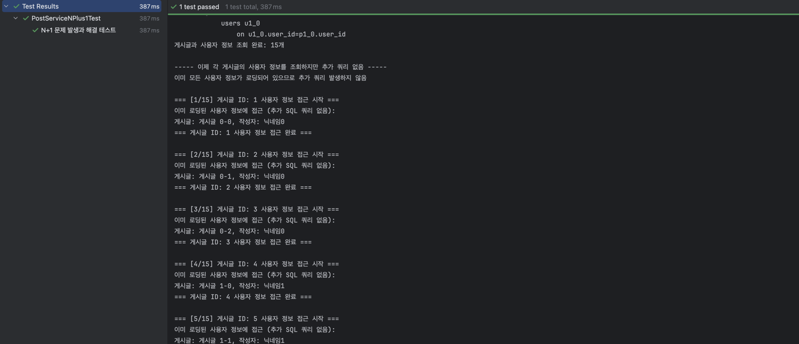

# 당근마켓 클론코딩 3주차 심화 미션

## TO DO LIST

1. **Service 계층 코드 작성**
2. **Repository 계층 테스트 작성 (연관관계 매핑 및 N+1 문제 포함)**
3. **Service 계층 단위 테스트 작성**

## 1️⃣ 당근마켓의 서비스 코드를 작성해요

#### ✅ 이전에 구현했던 모든 도메인보다는 몇개의 도메인을 복잡?하게 해보는것이 목표였습니다.

### 구현한 서비스 기능 요약

#### UserService

- `signUp(UserDto.SignUpRequest requestDto)` - 회원가입 처리 및 사용자 정보 저장 (이메일/닉네임 중복 검증 포함)
- `getUserProfile(Long userId)` - 사용자 프로필 정보 조회 (존재하지 않는 사용자 예외 처리)
- `updateUserProfile(Long userId, UserDto.UpdateRequest requestDto)` - 사용자 프로필 정보 업데이트 (닉네임 중복 검증 포함)
- `changePassword(Long userId, String currentPassword, String newPassword)` - 사용자 비밀번호 변경 (현재 비밀번호 일치 검증)
- `validateDuplicateEmail(String email)` - 이메일 중복 검증 (DB 조회를 통한 중복 체크)
- `validateDuplicateNickname(String nickname)` - 닉네임 중복 검증 (DB 조회를 통한 중복 체크)

#### PostService

- `createPost(PostDto.CreateRequest requestDto, Long userId)` - 새 게시글 생성 (사용자 존재 여부 확인)
- `getPostDetail(Long postId)` - 게시글 상세 정보 조회 (게시글 존재 여부 확인, 작성자 정보 포함)
- `updatePost(Long postId, PostDto.UpdateRequest requestDto, Long userId)` - 게시글 정보 수정 (작성자 일치 여부 검증)
- `deletePost(Long postId, Long userId)` - 게시글 삭제 (작성자 일치 여부 검증)
- `updatePostStatus(Long postId, String status, Long userId)` - 게시글 판매 상태 변경 (유효한 상태값 검증, 작성자 일치 여부 검증)
- `getAllPostsByUser(Long userId)` - 특정 사용자가 작성한 모든 게시글 조회 (페이징 처리 포함)
- `searchPostsByKeyword(String keyword)` - 키워드로 게시글 검색 (제목, 내용 포함 검색, 페이징 처리)
- `getPostsByStatus(String status)` - 판매 상태별 게시글 조회 (유효한 상태값 검증, 페이징 처리)

## 2️⃣ Repository 계층의 테스트를 진행해요

### 요구사항

- @DataJpaTest 또는 @SpringBootTest를 사용한 리포지토리 테스트 작성
- 연관관계 매핑이 제대로 동작하는지 테스트
- N+1 문제 발생 케이스와 해결 방법을 테스트로 검증
  - Fetch Join, EntityGraph 등을 활용한 해결책 제시

### N+1 테스트 설계

```java
@SpringBootTest
@Transactional
public class PostRepositoryTest {
    @Autowired
    private PostRepository postRepository;
    
    @Autowired
    private UserRepository userRepository;
    
    @Test
    @DisplayName("N+1 문제 발생 테스트")
    public void testNPlus1Problem() {
        // 테스트 데이터 준비
        // N+1 문제 발생 케이스 검증
    }
    
    @Test
    @DisplayName("Fetch Join을 통한 N+1 문제 해결 테스트")
    public void testSolveNPlus1WithFetchJoin() {
        // 테스트 데이터 준비
        // Fetch Join을 통한 N+1 문제 해결 검증
    }
    
    @Test
    @DisplayName("EntityGraph를 통한 N+1 문제 해결 테스트")
    public void testSolveNPlus1WithEntityGraph() {
        // 테스트 데이터 준비
        // EntityGraph를 통한 N+1 문제 해결 검증
    }
}
```

### N+1 테스트 결과
``` java
    // N+1 문제 확인용 메서드 추가
    @Query("SELECT p FROM Post p")
    List<Post> findAllPosts();

    // N+1 문제 해결용 메서드 추가 - Fetch Join 방식
    @Query("SELECT p FROM Post p JOIN FETCH p.user")
    List<Post> findAllPostsWithUser();

    // N+1 문제 해결용 메서드 추가 - Entity Graph 방식
    @EntityGraph(attributePaths = {"user"})
    List<Post> findAll();
```
> 1. N+1 문제 확인용 메서드 추가


> 2. N+1 문제 해결용 메서드 추가 - Fetch Join 방식



> 3. N+1 문제 해결용 메서드 추가 - Entity Graph 방식


## 3️⃣ Service 계층의 단위 테스트를 진행해요

Service 계층의 비즈니스 로직을 검증하는 단위 테스트를 작성합니다.

### 요구사항

- 각 Service 메소드에 대한 단위 테스트 작성
- 정상 케이스 및 예외 케이스 모두 테스트
- 서비스 로직의 정확성 검증

### 테스트 목록


#### UserServiceTest
- 회원가입: 성공, 중복 이메일/닉네임 실패
- 프로필 조회: 성공, 존재하지 않는 사용자 예외
- 프로필 수정: 성공, 중복 닉네임 실패
- 비밀번호 변경: 성공, 현재 비밀번호 불일치 실패

#### PostServiceTest
- 게시글 생성: 성공, 존재하지 않는 사용자 실패
- 게시글 조회: 성공, 존재하지 않는 게시글 예외
- 게시글 수정/삭제: 성공, 작성자 불일치 실패
- 게시글 상태 변경: 성공, 유효하지 않은 상태값 실패
- 목록 조회: 사용자별, 키워드 검색, 상태별 조회

#### N+1 문제 테스트
- 문제 발생 확인: SQL 로그 분석
- 해결 방법: fetch join, EntityGraph 적용 테스트

## 4️⃣ 순환 참조 테스트

순환 참조(A→B→C→A)와 EAGER 로딩을 함께 사용할 때 발생하는 현상에 대한 테스트를 구현합니다.

### 가설과 결과

**초기 가설**: EAGER 로딩과 순환 참조가 결합되면 엔티티를 로드할 때 무한 루프가 발생하여 StackOverflowError가 발생할 것이다.

**실제 결과**: 예상과 달리 Hibernate는 순환 참조 상황에서도 무한 루프 없이 정상적으로 엔티티를 로드한다.


### 동작 원리

Hibernate가 순환 참조를 처리하는 방법:

1. **영속성 컨텍스트 추적**: Hibernate는 이미 로드된 엔티티를 영속성 컨텍스트에서 추적하여 다시 로드하지 않음
2. **프록시 객체 활용**: 연관 엔티티를 로드할 때 필요에 따라 프록시 객체를 사용
3. **인메모리 엔티티 그래프**: 복잡한 연관관계도 영속성 컨텍스트 내에서 효율적으로 관리

### 주의사항

EAGER 로딩과 순환 참조가 있더라도 다음 상황에서는 문제가 발생할 수 있습니다:

1. **JSON 직렬화**: @JsonManagedReference, @JsonBackReference 또는 @JsonIgnore 등의 어노테이션을 사용하지 않으면 직렬화 시 무한 루프 발생
2. **N+1 문제**: EAGER 로딩이 항상 효율적인 쿼리를 보장하지는 않음
3. **메모리 이슈**: 복잡한 순환 참조 구조에서 EAGER 로딩은 많은 객체를 메모리에 로드하여 성능 저하 가능성

> 결론 !! -> Eager와 N:M 구조는 최대한 피하자!!

### 테스트 예시

```java
@SpringBootTest
public class CircularReferenceTest {
    @Autowired
    private DepartmentRepository departmentRepository;
    
    @Test
    @DisplayName("EAGER 로딩이 있는 순환 참조 테스트")
    @Transactional
    public void testCircularReferenceWithEagerLoading() {
        // 순환 참조 구조: Department -> Employee -> Project -> Department
        // 각 단계에서 발생하는 SQL 로그를 확인하여 무한 루프가 방지됨을 검증
    }
}
```

### 결론

Hibernate는 내부적으로 순환 참조를 효율적으로 처리하지만, 애플리케이션 설계 시에는 LAZY 로딩을 기본으로 하고 필요한 경우에만 EAGER 로딩을 사용하는 것이 권장됩니다. 특히 복잡한 도메인 모델에서는 N+1 문제와 메모리 사용량에 주의해야 합니다.

---