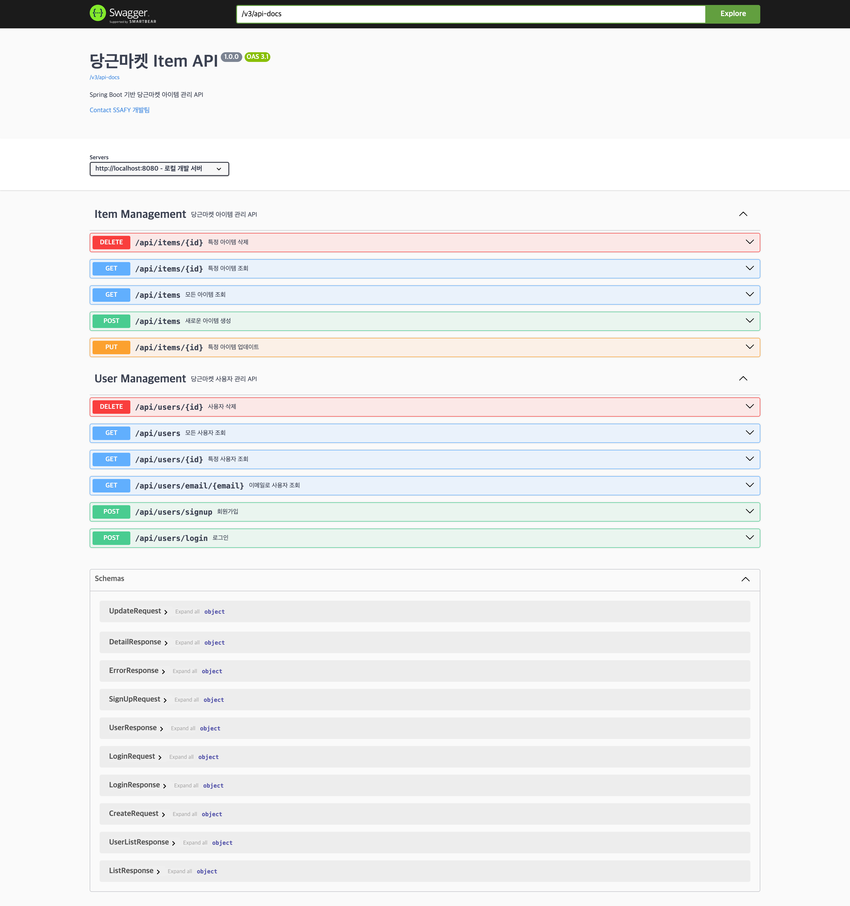

# 🥕 당근마켓 클론코딩 4주차 미션

## 📋 TO DO LIST

1. **당근마켓의 4가지 HTTP Method API 만들기**
2. **정적 팩토리 메서드를 사용한 DTO 구현**
3. **Global Exception Handler 만들기**
4. **Swagger 연동 후 Controller 통합 테스트**

---

## 1️⃣ 당근마켓의 4가지 HTTP Method API 만들기

### 🎯 구현 목표
Post Entity를 기반으로 한 당근마켓 아이템 관리 API와 User Entity를 기반으로 한 사용자 관리 API를 구현했습니다.

### ✅ Item Management API (Post 기반)

#### 📌 API 엔드포인트 구현

**1. 새로운 아이템 생성**
- **URL**: `POST /api/items/`
- **기능**: 새로운 당근마켓 아이템을 생성합니다.

```java
@PostMapping
public ResponseEntity<ItemDto.DetailResponse> createItem(@RequestBody ItemDto.CreateRequest request) {
    ItemDto.DetailResponse response = itemService.createItem(request);
    return ResponseEntity.status(HttpStatus.CREATED).body(response);
}
```

**2. 모든 아이템 조회**
- **URL**: `GET /api/items/`
- **기능**: 등록된 모든 아이템 목록을 조회합니다.

```java
@GetMapping
public ResponseEntity<List<ItemDto.ListResponse>> getAllItems() {
    List<ItemDto.ListResponse> responses = itemService.getAllItems();
    return ResponseEntity.ok(responses);
}
```

**3. 특정 아이템 조회**
- **URL**: `GET /api/items/{id}`
- **기능**: ID로 특정 아이템의 상세 정보를 조회합니다.

```java
@GetMapping("/{id}")
public ResponseEntity<ItemDto.DetailResponse> getItemById(@PathVariable("id") Long itemId) {
    ItemDto.DetailResponse response = itemService.getItemById(itemId);
    return ResponseEntity.ok(response);
}
```

**4. 특정 아이템 삭제 및 업데이트**
- **URL**: `DELETE /api/items/{id}` | `PUT /api/items/{id}`
- **기능**: ID로 특정 아이템을 삭제하거나 업데이트합니다.

```java
@DeleteMapping("/{id}")
public ResponseEntity<Void> deleteItem(@PathVariable("id") Long itemId) {
    itemService.deleteItem(itemId);
    return ResponseEntity.noContent().build();
}

@PutMapping("/{id}")
public ResponseEntity<ItemDto.DetailResponse> updateItem(
        @PathVariable("id") Long itemId,
        @RequestBody ItemDto.UpdateRequest request) {
    ItemDto.DetailResponse response = itemService.updateItem(itemId, request);
    return ResponseEntity.ok(response);
}
```

### ✅ User Management API

#### 📌 추가 구현된 사용자 관리 API

**1. 회원가입**
- **URL**: `POST /api/users/signup`
- **기능**: 새로운 사용자를 등록합니다.

**2. 로그인**
- **URL**: `POST /api/users/login`
- **기능**: 사용자 로그인을 처리합니다.

**3. 사용자 조회**
- **URL**: `GET /api/users/` | `GET /api/users/{id}` | `GET /api/users/email/{email}`
- **기능**: 사용자 목록 조회, ID로 조회, 이메일로 조회가 가능합니다.

**4. 사용자 삭제**
- **URL**: `DELETE /api/users/{id}`
- **기능**: ID로 특정 사용자를 삭제합니다.

---

## 2️⃣ 정적 팩토리 메서드를 사용한 DTO 구현

### 🎯 구현 목표
객체 생성의 일관성과 가독성을 높이기 위해 정적 팩토리 메서드를 사용한 DTO 패턴을 구현했습니다.

### ✅ ItemDto 정적 팩토리 메서드

```java
public class ItemDto {
    
    @Schema(description = "아이템 생성 요청 DTO")
    public static class CreateRequest {
        // 정적 팩토리 메서드
        public static CreateRequest of(String title, String content, Long userId) {
            return CreateRequest.builder()
                    .title(title)
                    .content(content)
                    .userId(userId)
                    .build();
        }
    }
    
    @Schema(description = "아이템 상세 조회 응답 DTO")
    public static class DetailResponse {
        // 정적 팩토리 메서드
        public static DetailResponse from(Post post) {
            return DetailResponse.builder()
                    .itemId(post.getPostId())
                    .title(post.getTitle())
                    .content(post.getContent())
                    .status(post.getStatus())
                    .userId(post.getUser().getUserId())
                    .nickname(post.getUser().getNickname())
                    .profileImgPath(post.getUser().getProfileImgPath())
                    .createdAt(post.getCreatedAt())
                    .updatedAt(post.getUpdatedAt())
                    .build();
        }
    }
}
```

### ✅ UserDto 정적 팩토리 메서드

```java
public class UserDto {
    
    public static class SignUpRequest {
        // 정적 팩토리 메서드
        public static SignUpRequest of(String email, String password, String name, 
                                     String nickname, String phone, String profile) {
            return SignUpRequest.builder()
                    .email(email)
                    .password(password)
                    .name(name)
                    .nickname(nickname)
                    .phone(phone)
                    .profile(profile)
                    .profileImgPath("/images/default.jpg")
                    .build();
        }
    }
    
    public static class UserResponse {
        // 정적 팩토리 메서드
        public static UserResponse from(User user) {
            return UserResponse.builder()
                    .userId(user.getUserId())
                    .email(user.getEmail())
                    .name(user.getName())
                    .nickname(user.getNickname())
                    .phone(user.getPhone())
                    .profile(user.getProfile())
                    .profileImgPath(user.getProfileImgPath())
                    .role(user.getRole())
                    .createdAt(user.getCreatedAt())
                    .build();
        }
    }
}
```

### 📚 정적 팩토리 메서드의 장점

1. **가독성 향상**: 메서드 이름을 통해 생성 의도를 명확히 표현
2. **객체 생성 제어**: 생성자보다 유연한 객체 생성 로직 구현
3. **타입 안전성**: 컴파일 타임에 타입 검증 가능
4. **캐싱 가능**: 동일한 객체의 재사용 가능
5. **하위 타입 반환**: 인터페이스 기반 설계 지원

---

## 3️⃣ Global Exception Handler 구현

### 🎯 구현 목표
일관된 에러 응답 형식과 중앙집중식 예외 처리를 위한 Global Exception Handler를 구현했습니다.

### ✅ GlobalExceptionHandler 구현

```java
@Slf4j
@RestControllerAdvice
public class GlobalExceptionHandler {

    @ExceptionHandler(ItemNotFoundException.class)
    public ResponseEntity<ErrorResponse> handleItemNotFoundException(ItemNotFoundException e) {
        log.error("Item not found: {}", e.getMessage());
        ErrorResponse errorResponse = ErrorResponse.of(
                HttpStatus.NOT_FOUND.value(),
                "ITEM_NOT_FOUND",
                e.getMessage()
        );
        return ResponseEntity.status(HttpStatus.NOT_FOUND).body(errorResponse);
    }

    @ExceptionHandler(UserNotFoundException.class)
    public ResponseEntity<ErrorResponse> handleUserNotFoundException(UserNotFoundException e) {
        log.error("User not found: {}", e.getMessage());
        ErrorResponse errorResponse = ErrorResponse.of(
                HttpStatus.NOT_FOUND.value(),
                "USER_NOT_FOUND",
                e.getMessage()
        );
        return ResponseEntity.status(HttpStatus.NOT_FOUND).body(errorResponse);
    }

    @ExceptionHandler(IllegalArgumentException.class)
    public ResponseEntity<ErrorResponse> handleIllegalArgumentException(IllegalArgumentException e) {
        log.error("Invalid argument: {}", e.getMessage());
        ErrorResponse errorResponse = ErrorResponse.of(
                HttpStatus.BAD_REQUEST.value(),
                "INVALID_ARGUMENT",
                e.getMessage()
        );
        return ResponseEntity.status(HttpStatus.BAD_REQUEST).body(errorResponse);
    }

    @ExceptionHandler(Exception.class)
    public ResponseEntity<ErrorResponse> handleGenericException(Exception e) {
        log.error("Unexpected error occurred: {}", e.getMessage(), e);
        ErrorResponse errorResponse = ErrorResponse.of(
                HttpStatus.INTERNAL_SERVER_ERROR.value(),
                "INTERNAL_SERVER_ERROR",
                "서버 내부 오류가 발생했습니다."
        );
        return ResponseEntity.status(HttpStatus.INTERNAL_SERVER_ERROR).body(errorResponse);
    }
}
```

### ✅ 커스텀 예외 클래스

```java
public class ItemNotFoundException extends RuntimeException {
    public ItemNotFoundException(String message) {
        super(message);
    }
    
    public ItemNotFoundException(Long itemId) {
        super("Item not found with id: " + itemId);
    }
}

public class UserNotFoundException extends RuntimeException {
    public UserNotFoundException(String message) {
        super(message);
    }
    
    public UserNotFoundException(Long userId) {
        super("User not found with id: " + userId);
    }
}
```

### ✅ ErrorResponse DTO (정적 팩토리 메서드 포함)

```java
@Schema(description = "에러 응답 DTO")
public class ErrorResponse {
    private int status;
    private String code;
    private String message;
    private LocalDateTime timestamp;
    
    // 정적 팩토리 메서드
    public static ErrorResponse of(int status, String code, String message) {
        return ErrorResponse.builder()
                .status(status)
                .code(code)
                .message(message)
                .timestamp(LocalDateTime.now())
                .build();
    }
}
```

### 📚 Global Exception Handler의 장점

1. **중앙집중식 관리**: 모든 예외를 한 곳에서 처리
2. **일관된 응답 형식**: 통일된 에러 응답 구조
3. **로깅 통합**: 예외 발생 시 자동 로깅
4. **유지보수성**: 예외 처리 로직의 중앙 관리

---

## 4️⃣ Swagger 연동 후 Controller 통합 테스트

### 🎯 구현 목표
Spring Boot 3.4.5에 맞는 Swagger UI를 연동하여 인터랙티브한 API 문서화와 테스트 환경을 구축했습니다.

### ✅ Swagger 의존성 및 설정

#### 📌 build.gradle 의존성 추가
```gradle
dependencies {
    // Swagger UI (OpenAPI 3.0)
    implementation 'org.springdoc:springdoc-openapi-starter-webmvc-ui:2.8.8'
}
```

#### 📌 application.yml 설정
```yaml
# Swagger UI 설정
springdoc:
  swagger-ui:
    path: /swagger-ui.html
    operationsSorter: method
    tagsSorter: alpha
    doc-expansion: none
  api-docs:
    path: /v3/api-docs
  default-consumes-media-type: application/json
  default-produces-media-type: application/json
```

#### 📌 OpenAPI 정보 설정
```java
@OpenAPIDefinition(
    info = @Info(
        title = "당근마켓 Item API",
        version = "1.0.0",
        description = "Spring Boot 기반 당근마켓 아이템 관리 API",
        contact = @Contact(
            name = "SSAFY 개발팀",
            email = "ssafy@example.com"
        )
    ),
    servers = {
        @Server(url = "http://localhost:8080", description = "로컬 개발 서버")
    }
)
public class Application { ... }
```

### ✅ Swagger 어노테이션 적용

#### 📌 Controller 어노테이션
```java
@Tag(name = "Item Management", description = "당근마켓 아이템 관리 API")
public class ItemController {

    @Operation(summary = "새로운 아이템 생성", description = "새로운 당근마켓 아이템을 생성합니다.")
    @ApiResponses(value = {
            @ApiResponse(responseCode = "201", description = "아이템 생성 성공",
                    content = @Content(schema = @Schema(implementation = ItemDto.DetailResponse.class))),
            @ApiResponse(responseCode = "400", description = "잘못된 요청",
                    content = @Content(schema = @Schema(implementation = ErrorResponse.class)))
    })
    @PostMapping
    public ResponseEntity<ItemDto.DetailResponse> createItem(
            @io.swagger.v3.oas.annotations.parameters.RequestBody(
                    description = "생성할 아이템 정보",
                    required = true,
                    content = @Content(schema = @Schema(implementation = ItemDto.CreateRequest.class))
            )
            @RequestBody ItemDto.CreateRequest request) { ... }
}
```

#### 📌 DTO 스키마 어노테이션
```java
@Schema(description = "아이템 생성 요청 DTO")
public static class CreateRequest {
    @Schema(description = "아이템 제목", example = "아이폰 14 팝니다", required = true)
    private String title;
    
    @Schema(description = "아이템 설명", example = "깨끗하게 사용했습니다. 직거래 선호", required = true)
    private String content;
    
    @Schema(description = "사용자 ID", example = "1", required = true)
    private Long userId;
}
```

### ✅ Security 설정 (모든 API 허용)

```java
@Configuration
@EnableWebSecurity
public class SecurityConfig {

    @Bean
    public SecurityFilterChain filterChain(HttpSecurity http) throws Exception {
        http
            .csrf(csrf -> csrf.disable())
            .authorizeHttpRequests(auth -> auth
                .anyRequest().permitAll()  // 모든 요청 허용
            );
        
        return http.build();
    }
}
```

### ✅ Controller 통합 테스트 실행

#### 📌 Swagger UI 접속
- **URL**: `http://localhost:8080/swagger-ui.html`
- **OpenAPI JSON**: `http://localhost:8080/v3/api-docs`

#### 📌 테스트 시나리오

**1. 사용자 회원가입 → 로그인 테스트**
```json
// 1. 회원가입 (POST /api/users/signup)
{
    "email": "test@example.com",
    "password": "password123",
    "name": "테스트유저",
    "nickname": "테스터",
    "phone": "010-1234-5678",
    "profile": "테스트 계정입니다."
}

// 2. 로그인 (POST /api/users/login)
{
    "email": "test@example.com",
    "password": "password123"
}
```

**2. 아이템 CRUD 테스트**
```json
// 1. 아이템 생성 (POST /api/items/)
{
    "title": "아이폰 14 팝니다",
    "content": "깨끗하게 사용했습니다. 직거래 선호",
    "userId": 1
}

// 2. 모든 아이템 조회 (GET /api/items/)
// 3. 특정 아이템 조회 (GET /api/items/1)
// 4. 아이템 업데이트 (PUT /api/items/1)
{
    "title": "아이폰 14 급처분",
    "content": "가격 네고 가능합니다",
    "status": "RESERVED"
}

// 5. 아이템 삭제 (DELETE /api/items/1)
```

### 📚 Swagger 연동의 장점

1. **인터랙티브 테스트**: 브라우저에서 직접 API 호출 가능
2. **자동 문서화**: 코드 어노테이션 기반 자동 문서 생성
3. **스키마 검증**: 요청/응답 데이터 구조 명확화
4. **개발 효율성**: API 명세와 테스트를 한 번에 처리
5. **팀 협업**: 프론트엔드 개발자와의 원활한 소통

---

## 🎯 4주차 미션 완료 요약

### ✅ 구현된 주요 기능

| 구분 | 기능 | 상태 |
|------|------|------|
| **HTTP Method API** | POST, GET, PUT, DELETE 구현 | ✅ 완료 |
| **정적 팩토리 메서드** | 모든 DTO에 적용 | ✅ 완료 |
| **Global Exception** | 통합 예외 처리 구현 | ✅ 완료 |
| **Swagger 연동** | 완전한 API 문서화 | ✅ 완료 |

### 📁 프로젝트 구조

```
src/main/java/org/example/springboot/
├── controller/
│   ├── ItemController.java         # Item 관리 API
│   └── UserController.java         # User 관리 API
├── service/
│   ├── ItemService.java           # Item 비즈니스 로직
│   └── UserService.java           # User 비즈니스 로직
├── dto/
│   ├── ItemDto.java               # Item DTO (정적 팩토리 메서드)
│   ├── UserDto.java               # User DTO (정적 팩토리 메서드)
│   ├── CommentDto.java            # Comment DTO
│   └── PhotoDto.java              # Photo DTO
├── exception/
│   ├── GlobalExceptionHandler.java # 전역 예외 처리
│   ├── ItemNotFoundException.java  # Item 커스텀 예외
│   ├── UserNotFoundException.java  # User 커스텀 예외
│   └── ErrorResponse.java         # 에러 응답 DTO
├── config/
│   └── SecurityConfig.java        # Spring Security 설정
└── Application.java               # Main 클래스 (OpenAPI 설정)
```

### 🚀 완성된 기능

1. **RESTful API**: 표준 HTTP 메서드를 활용한 API 설계
2. **계층형 아키텍처**: Controller → Service → Repository 구조
3. **DTO 패턴**: 정적 팩토리 메서드를 활용한 객체 생성
4. **예외 처리**: 일관된 에러 응답과 로깅
5. **API 문서화**: Swagger UI를 통한 인터랙티브 문서
6. **보안 설정**: Spring Security 통합 (현재는 모든 API 허용)

### 📈 학습 성과

- **Spring Boot 3.x**: 최신 버전 기반 개발 경험
- **OpenAPI 3.0**: 현대적인 API 문서화 표준 적용
- **정적 팩토리 메서드**: 객체 지향 설계 원칙 적용
- **전역 예외 처리**: 유지보수성 높은 에러 처리 구조
- **RESTful 설계**: 웹 API 설계 원칙 이해 및 적용

---

## 🔗 API 테스트 링크

- **Swagger UI**: [http://localhost:8080/swagger-ui.html](http://localhost:8080/swagger-ui.html)
- **OpenAPI Spec**: [http://localhost:8080/v3/api-docs](http://localhost:8080/v3/api-docs)

**당근마켓 클론코딩 4주차 미션을 성공적으로 완료했습니다!** 🎉 