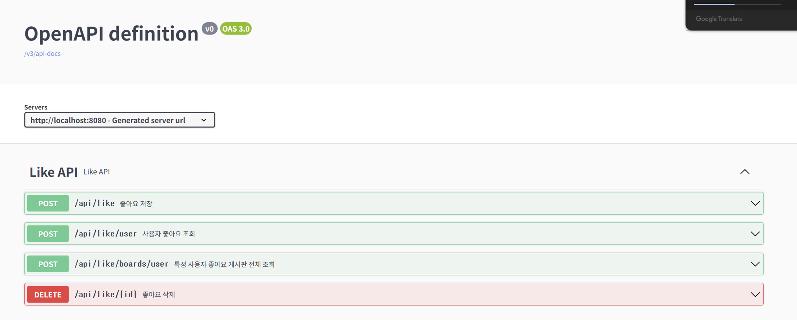
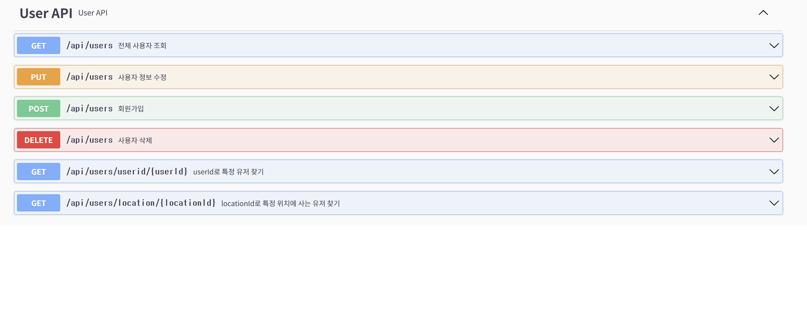
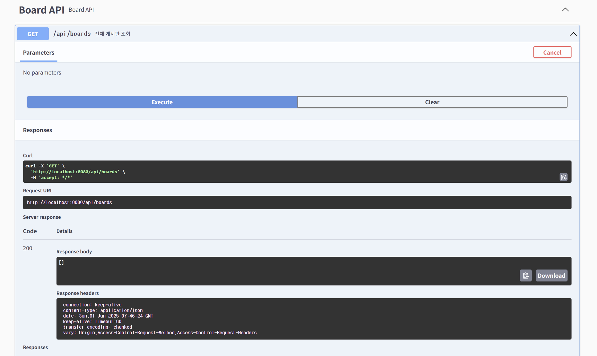
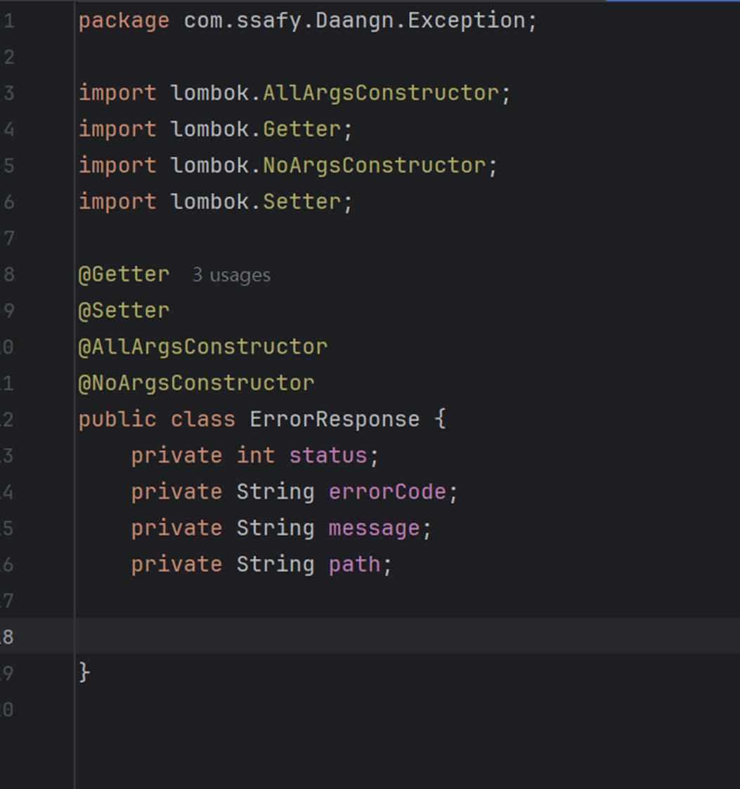
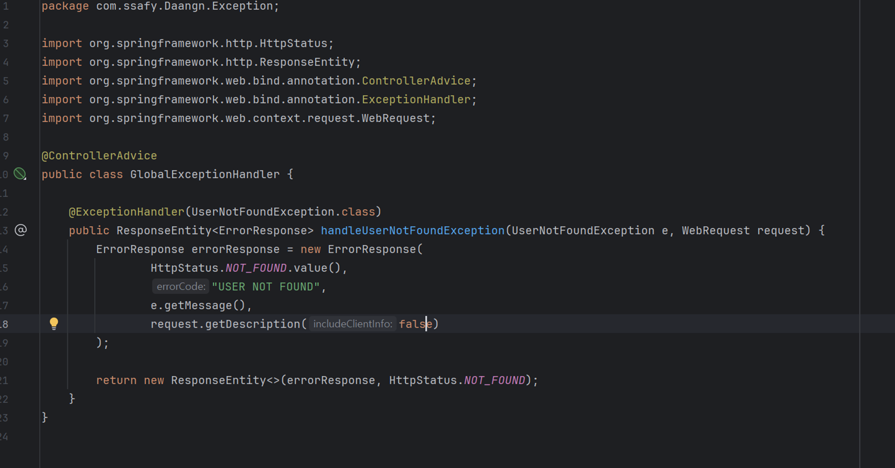
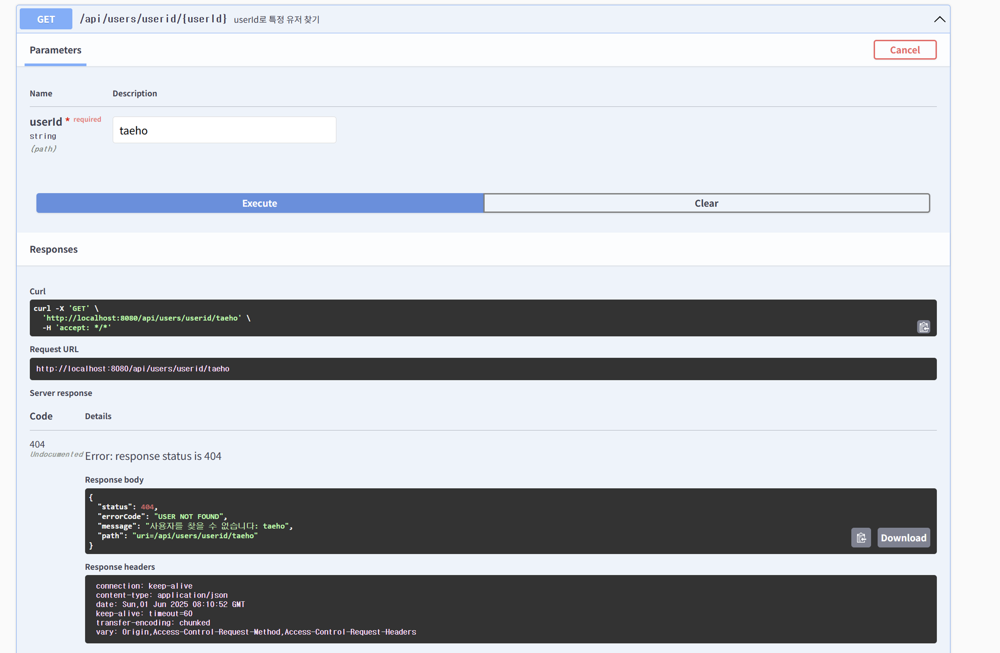
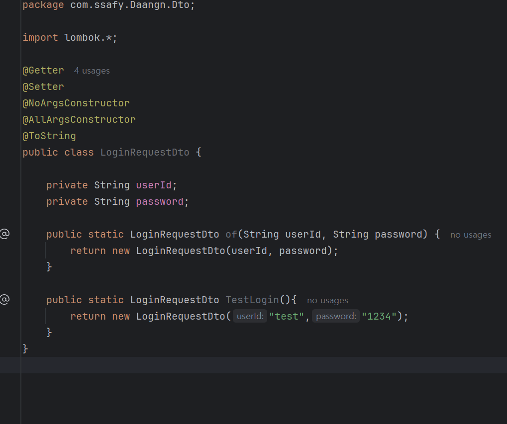

# 4주차 스터디

## Controller 만들기
- 이전까지 Repository, Service 구현 완료
- 이번주 목표 : Controller 구현하기

### Like API


### Board API


### User API


### Location API & DM API


<br><br>

## Swagger 로 테스트
### - 전체 게시판 조회 API 테스트
### - 필요한 모든 내용이 잘 출력 되는 것을 확인!!!

> 데이터가 없어서 데이터는 안나오지만 필요한 내용과 타입이 제대로 명시 되었음을 확인





<br><br>

## Controller 작성 시 유의한 점
### - 이번 프로젝트 관통에서 각 API 마다 try-catch 를 사용하지 않아 특정 상황에 에러가 발생하는 경우가 많았다.
### - 이번에는 try-catch 를 통해 어떤 상황에서도 에러가 발생하지 않도록 조절


<br><br>

## Global Error
### - 항상 try-catch를 사용하는 것이 아니라 공통으로 사용하는 Error 가 있다면 Error 를 Custom으로 관리하여 에러 관리

> 강사님께서 말씀하신 "은행권은 처리 할 에러가 수백개가 넘는다" 가 이걸 말씀하신 듯 하다..


### 1. RuntimeException 을 상속받는 UserNotFoundException 을 생성


### 2. 에러 정보를 담을 ErrorResponse 생성 


### 3. 에러를 전역으로 관리하기 위해 GlobalExceptionHandler 생성성



<br><br>

### 실제 에러 처리
### Before
#### - 별다른 에러 처리 없이 Service 구현


### After
#### - 제작한 에러로 처리


<br><br>

### Controller 에서도 Service에서 에러 처리를 해주기 때문에 try-catch 사용 XX


<br><br>

### 실제로 에러를 발생시켰을 때 결과 확인


<br><br>

## 정적 팩토리 메서드
### = 객체 생성을 담당하는 public static 메서드

<br>

### 그래서 왜 써?
#### - 의미 있는 이름이 필요할 때
#### = 객체 생성에 의미를 부여

### Before ( 생성자 종류가 많아지면 헷갈릴 것 같아.. )
```
public class User {
    private String id;
    private String pw;
    private String name;
    private int age;

    public User(String id, String pw) {
        this.id = id;
        this.pw = pw;
    }

    public User(String id, String name, int age){
        this.id = id;
        this.name = name;
        this.age = age
    }

    User user1 = new User("id", "pw");
    User user2 = new User("id","name",age);
}
```

<br>

### After ( 정적 팩토리 메서드 사용 )
#### - 이름을 가지니깐 의미가 명확해지네!
```
public class User {
    private String id;
    private String pw;
    private String name;
    private int age;

    // from = 하나의 매개변수로 생성
    public static User from(String name){
        return new User(null, null, name, 0);
    }

    // 회원가입용 DTO ( id, pw 만 저장하고 나머지는 없으므로 default 값 지정 )
    public static User registry(String id, String pw){
        return new User(id,pw,"미지정", 0);
    }

    // 로그인 테스트 용용
    public static User TestLogin(){
        return new User("Admin", "1234!", null, 0);
    }

    User user1 = User.TestLogin();
}
```

<br>

### 사용 예시
#### - 로그인 만을 위해 id,pw 만 담긴 LoginDTO 생성
