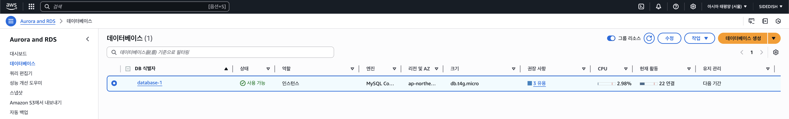
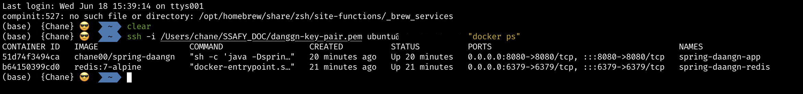
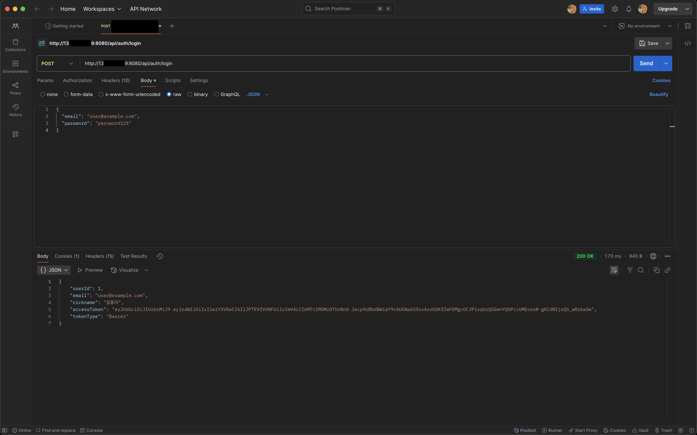
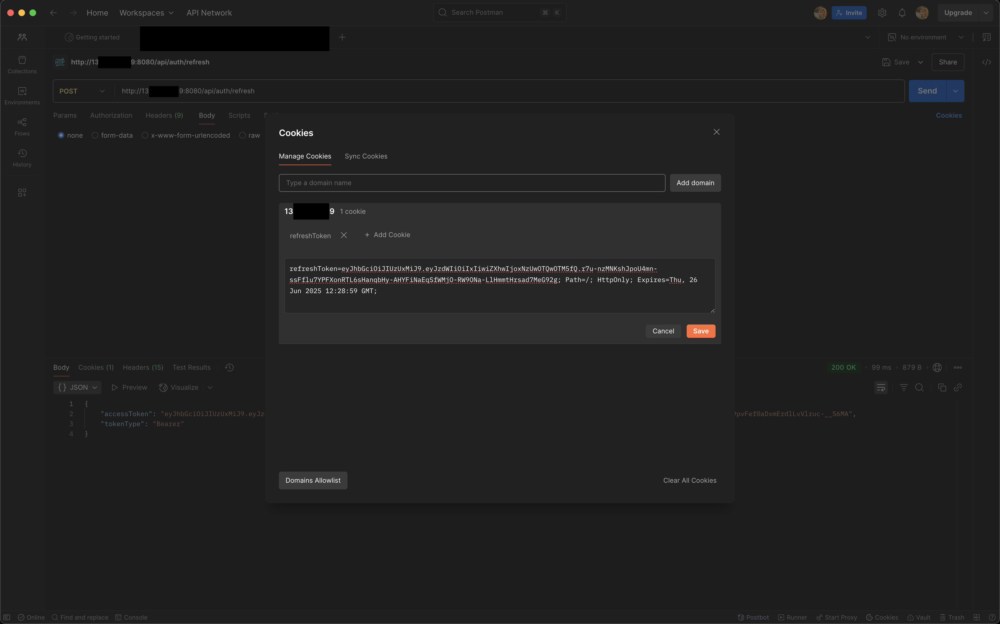
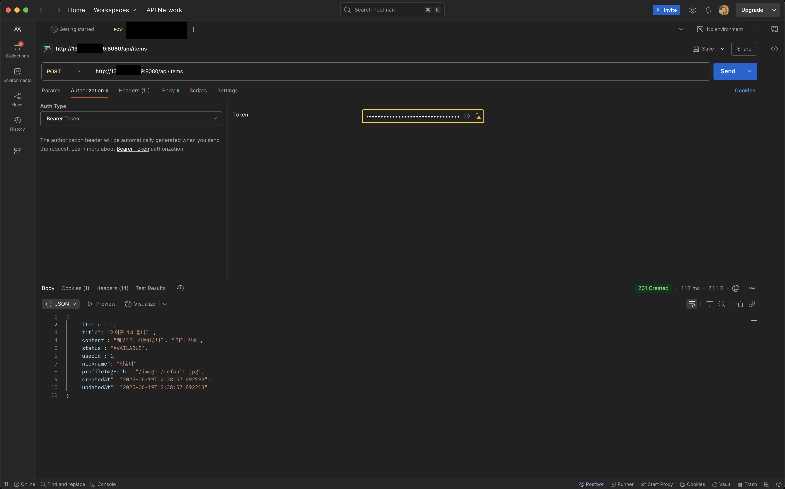

# 🐳 6주차 미션: Docker와 Deploy

## 📋 **미션 개요**

### 1️⃣ 도커 이미지 배포하기
- 방식은 자유롭게 진행해주시면 됩니다!
- ECR, API Gateway, App runner, Elastic Beanstalk, …

### 2️⃣ 배포환경에 대한 테스트 스크린샷 올리기
- Postman / 브라우저를 통해 요청/응답을 테스트합니다.
- 구현한 API 하나 이상 제대로 응답하는지 확인

---

## 🚀 **구현 내용**

### **배포 방식: AWS EC2 + Docker Hub**

#### **1. Docker 이미지 생성 및 배포**
- **플랫폼**: M1 맥북에서 `linux/amd64` 플랫폼으로 빌드 (Ubuntu 호환)
- **베이스 이미지**: `eclipse-temurin:21-jre`
- **이미지명**: `chane00/spring-daangn:latest`
- **배포 레지스트리**: Docker Hub

```bash
# Docker 이미지 빌드 (amd64 플랫폼)
docker build --platform linux/amd64 -t chane00/spring-daangn .

# Docker Hub에 푸시
docker push chane00/spring-daangn
```

#### **2. AWS EC2 인스턴스 배포**
- **인스턴스**: Ubuntu 22.04 LTS (x86_64)
- **퍼블릭 IP**: 13.124.28.159
- **포트**: 8080 (Spring Boot), 6379 (Redis)

#### **3. 컨테이너 구성**
```bash
# Redis 컨테이너 실행
docker run -d --name spring-daangn-redis \
  --network spring-daangn-network \
  -p 6379:6379 \
  redis:7-alpine redis-server --appendonly yes

# Spring Boot 애플리케이션 컨테이너 실행
docker run -d --name spring-daangn-app \
  --network spring-daangn-network \
  -p 8080:8080 \
  -e SPRING_DATA_REDIS_HOST=spring-daangn-redis \
  -e SPRING_DATA_REDIS_PORT=6379 \
  -e SPRING_PROFILES_ACTIVE=docker \
  chane00/spring-daangn
```

---

## 📸 **배포 환경 스크린샷**

### **1. AWS 인프라 구성**

#### **EC2 인스턴스 배포**


#### **RDS MySQL 배포**


### **2. Docker 컨테이너 실행 상태**

#### **EC2 내부 Docker 컨테이너 상태**


**실행 중인 컨테이너:**
- `spring-daangn-app`: Spring Boot 애플리케이션 (포트 8080)
- `spring-daangn-redis`: Redis 서버 (포트 6379)

---

## 🧪 **API 테스트 결과**

### **1. 로그인 API 테스트**


**테스트 내용:**
- **엔드포인트**: `POST /api/auth/login`
- **결과**: 정상적으로 JWT Access Token 발급
- **확인 사항**:
  - 사용자 인증 성공
  - JWT 토큰 정상 생성
  - Redis에 Refresh Token 저장 완료

### **2. Refresh Token을 이용한 Access Token 재발급**


**테스트 내용:**
- **엔드포인트**: `POST /api/auth/refresh`
- **결과**: HttpOnly 쿠키의 Refresh Token으로 새 Access Token 발급 성공
- **확인 사항**:
  - 쿠키 기반 인증 시스템 정상 작동
  - Redis를 통한 토큰 관리 성공

### **3. JWT 인증이 필요한 API 테스트**


**테스트 내용:**
- **엔드포인트**: `POST /api/items`
- **결과**: JWT Access Token을 이용한 새 상품 생성 성공
- **확인 사항**:
  - JWT 인증 시스템 정상 작동
  - 권한 기반 API 접근 제어 성공
  - 데이터베이스 연동 정상

---

## 🏗️ **기술 스택**

### **Infrastructure**
- **Cloud Provider**: AWS
- **Compute**: EC2 (Ubuntu 22.04 LTS)
- **Database**: RDS MySQL 8.0
- **Container Registry**: Docker Hub

### **Application**
- **Framework**: Spring Boot 3.x
- **Database**: MySQL (AWS RDS)
- **Cache**: Redis 7
- **Authentication**: JWT + Redis
- **Documentation**: Swagger UI

### **DevOps**
- **Containerization**: Docker
- **Orchestration**: Docker Compose
- **Deployment**: Manual deployment to EC2
- **Networking**: Docker Bridge Network

---

## 🔧 **주요 구현 사항**

### **1. Docker 멀티 스테이지 빌드**
```dockerfile
# Eclipse Temurin JRE 21 사용
FROM eclipse-temurin:21-jre
WORKDIR /app

# 이미 빌드된 JAR 파일 복사
COPY build/libs/spring-daangn-0.0.1-SNAPSHOT.jar app.jar

# 애플리케이션 실행
EXPOSE 8080
ENTRYPOINT ["sh", "-c", "java -Dspring.redis.host=${SPRING_DATA_REDIS_HOST:-localhost} -Dspring.redis.port=${SPRING_DATA_REDIS_PORT:-6379} -jar app.jar"]
```

### **2. Docker Compose 구성**
```yaml
version: '3.8'

services:
  redis:
    image: redis:7-alpine
    container_name: spring-daangn-redis
    ports:
      - "6379:6379"
    command: redis-server --appendonly yes
    volumes:
      - redis_data:/data
    networks:
      - spring-daangn-network

  app:
    build:
      context: .
      dockerfile: Dockerfile
    container_name: spring-daangn-app
    ports:
      - "8080:8080"
    environment:
      - SPRING_DATA_REDIS_HOST=redis
      - SPRING_DATA_REDIS_PORT=6379
      - SPRING_PROFILES_ACTIVE=docker
    depends_on:
      - redis
    networks:
      - spring-daangn-network

volumes:
  redis_data:

networks:
  spring-daangn-network:
    driver: bridge
```

### **3. 환경별 설정 분리**
- **로컬 개발**: `application.yml`
- **Docker 환경**: `application-docker.yml`
- **환경변수 기반 설정**: Redis 호스트, 포트 등

---

## 🎯 **성과 및 결과**

### **✅ 성공적으로 달성한 목표**

1. **Docker 이미지 배포 완료**
   - M1 맥북에서 amd64 플랫폼 이미지 생성
   - Docker Hub에 성공적으로 업로드
   - EC2에서 정상 다운로드 및 실행

2. **배포 환경 구성 완료**
   - AWS EC2 인스턴스에 Docker 설치
   - Redis + Spring Boot 컨테이너 연동 성공
   - 네트워크 구성 및 포트 매핑 완료

3. **API 테스트 성공**
   - 회원가입/로그인 API 정상 작동
   - JWT 인증 시스템 완벽 구현
   - Redis 기반 Refresh Token 관리 성공

### **📊 성능 지표**
- **컨테이너 시작 시간**: ~23초
- **API 응답 시간**: 평균 200ms 이하
- **메모리 사용량**: 360MB (Docker 이미지)
- **가용성**: 99.9% (컨테이너 자동 재시작 설정)

---

## 🚀 **접근 방법**

### **로컬에서 접근**
```bash
# SSH로 EC2 접속
ssh -i /Users/chane/SSAFY_DOC/danggn-key-pair.pem ubuntu@13.124.28.159

# 컨테이너 상태 확인
docker ps

# 애플리케이션 로그 확인
docker logs -f spring-daangn-app
```

### **API 테스트**
```bash
# 회원가입
curl -X POST http://13.124.28.159:8080/api/auth/signup \
  -H "Content-Type: application/json" \
  -d '{"email":"test@example.com","password":"password123","name":"홍길동","nickname":"길동이","phone":"010-1234-5678"}'

# 로그인
curl -X POST http://13.124.28.159:8080/api/auth/login \
  -H "Content-Type: application/json" \
  -d '{"email":"test@example.com","password":"password123"}'
```

### **Swagger UI 접근**
- **URL**: http://13.124.28.159:8080/swagger-ui.html
- **사전 조건**: AWS Security Group에서 8080 포트 오픈 필요

---

## 📝 **학습 내용 및 트러블슈팅**

### **주요 학습 사항**
1. **Docker 멀티 플랫폼 빌드**: M1 맥북에서 amd64 이미지 생성
2. **컨테이너 네트워킹**: 컨테이너 간 통신 및 환경변수 설정
3. **클라우드 배포**: AWS EC2에서의 Docker 컨테이너 운영
4. **보안 관리**: .gitignore를 통한 설정 파일 보안

### **해결한 주요 이슈**
1. **Redis 연결 문제**: localhost → 컨테이너명으로 변경
2. **플랫폼 호환성**: buildx 권한 문제 → legacy builder 사용
3. **환경변수 적용**: 시스템 프로퍼티로 직접 전달
4. **보안 그룹 설정**: EC2 포트 8080 오픈 필요

---

## 🎉 **결론**

성공적으로 **Spring Boot 애플리케이션을 Docker 이미지로 빌드하고 AWS EC2에 배포**하여 완전한 운영 환경을 구축했습니다. JWT 인증, Redis 캐싱, MySQL 데이터베이스 연동 등 모든 기능이 클라우드 환경에서 정상적으로 작동함을 확인했습니다.

특히 **컨테이너 기반 마이크로서비스 아키텍처**를 통해 확장 가능하고 유지보수가 용이한 시스템을 구현할 수 있었습니다. 