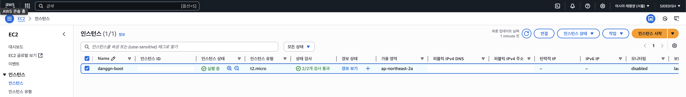

# 🐳 6주차 미션: Docker와 Deploy

## 📋 **미션 개요**

### 1️⃣ 도커 이미지 배포하기
- 방식은 자유롭게 진행해주시면 됩니다!
- ECR, API Gateway, App runner, Elastic Beanstalk, …

### 2️⃣ 배포환경에 대한 테스트 스크린샷 올리기
- Postman / 브라우저를 통해 요청/응답을 테스트합니다.
- 구현한 API 하나 이상 제대로 응답하는지 확인

---

## 🚀 **구현 내용**

### **배포 방식: AWS EC2 + Docker Hub**

#### **1. Docker 이미지 생성 및 배포**
- **플랫폼**: M1 맥북에서 `linux/amd64` 플랫폼으로 빌드 (Ubuntu 호환)
- **베이스 이미지**: `eclipse-temurin:21-jre`
- **이미지명**: `chane00/spring-daangn:latest`
- **배포 레지스트리**: Docker Hub

```bash
# Docker 이미지 빌드 (amd64 플랫폼)
docker build --platform linux/amd64 -t chane00/spring-daangn .

# Docker Hub에 푸시
docker push chane00/spring-daangn
```

#### **2. AWS EC2 인스턴스 배포**
- **인스턴스**: Ubuntu 22.04 LTS (x86_64)
- **포트**: 8080 (Spring Boot), 6379 (Redis)

#### **3. 컨테이너 구성**
```bash
# Redis 컨테이너 실행
docker run -d --name spring-daangn-redis \
  --network spring-daangn-network \
  -p 6379:6379 \
  redis:7-alpine redis-server --appendonly yes

# Spring Boot 애플리케이션 컨테이너 실행
docker run -d --name spring-daangn-app \
  --network spring-daangn-network \
  -p 8080:8080 \
  -e SPRING_DATA_REDIS_HOST=spring-daangn-redis \
  -e SPRING_DATA_REDIS_PORT=6379 \
  -e SPRING_PROFILES_ACTIVE=docker \
  chane00/spring-daangn
```

---

## 📸 **배포 환경 스크린샷**

### **1. AWS 인프라 구성**

#### **EC2 인스턴스 배포**


#### **RDS MySQL 배포**


### **2. Docker 컨테이너 실행 상태**

#### **EC2 내부 Docker 컨테이너 상태**


**실행 중인 컨테이너:**
- `spring-daangn-app`: Spring Boot 애플리케이션 (포트 8080)
- `spring-daangn-redis`: Redis 서버 (포트 6379)

---

## 🧪 **API 테스트 결과**

### **1. 로그인 API 테스트**


**테스트 내용:**
- **엔드포인트**: `POST /api/auth/login`
- **결과**: 정상적으로 JWT Access Token 발급
- **확인 사항**:
  - 사용자 인증 성공
  - JWT 토큰 정상 생성
  - Redis에 Refresh Token 저장 완료

### **2. Refresh Token을 이용한 Access Token 재발급**


**테스트 내용:**
- **엔드포인트**: `POST /api/auth/refresh`
- **결과**: HttpOnly 쿠키의 Refresh Token으로 새 Access Token 발급 성공
- **확인 사항**:
  - 쿠키 기반 인증 시스템 정상 작동
  - Redis를 통한 토큰 관리 성공

### **3. JWT 인증이 필요한 API 테스트**


**테스트 내용:**
- **엔드포인트**: `POST /api/items`
- **결과**: JWT Access Token을 이용한 새 상품 생성 성공
- **확인 사항**:
  - JWT 인증 시스템 정상 작동
  - 권한 기반 API 접근 제어 성공
  - 데이터베이스 연동 정상

---


## 📝 **학습 내용 및 트러블슈팅**

### **주요 학습 사항**
1. **Docker 멀티 플랫폼 빌드**: M1 맥북에서 amd64 이미지 생성
2. **컨테이너 네트워킹**: 컨테이너 간 통신 및 환경변수 설정
3. **클라우드 배포**: AWS EC2에서의 Docker 컨테이너 운영
4. **보안 관리**: .gitignore를 통한 설정 파일 보안

### **해결한 주요 이슈**
1. **Redis 연결 문제**: localhost → 컨테이너명으로 변경
2. **플랫폼 호환성**: buildx 권한 문제 → legacy builder 사용
3. **환경변수 적용**: 시스템 프로퍼티로 직접 전달
4. **보안 그룹 설정**: EC2 포트 8080 오픈 필요

---

## 🎉 **결론**

성공적으로 **Spring Boot 애플리케이션을 Docker 이미지로 빌드하고 AWS EC2에 배포**하여 완전한 운영 환경을 구축했습니다. JWT 인증, Redis 캐싱, MySQL 데이터베이스 연동 등 모든 기능이 클라우드 환경에서 정상적으로 작동함을 확인했습니다.

특히 **컨테이너 기반 마이크로서비스 아키텍처**를 통해 확장 가능하고 유지보수가 용이한 시스템을 구현할 수 있었습니다. 