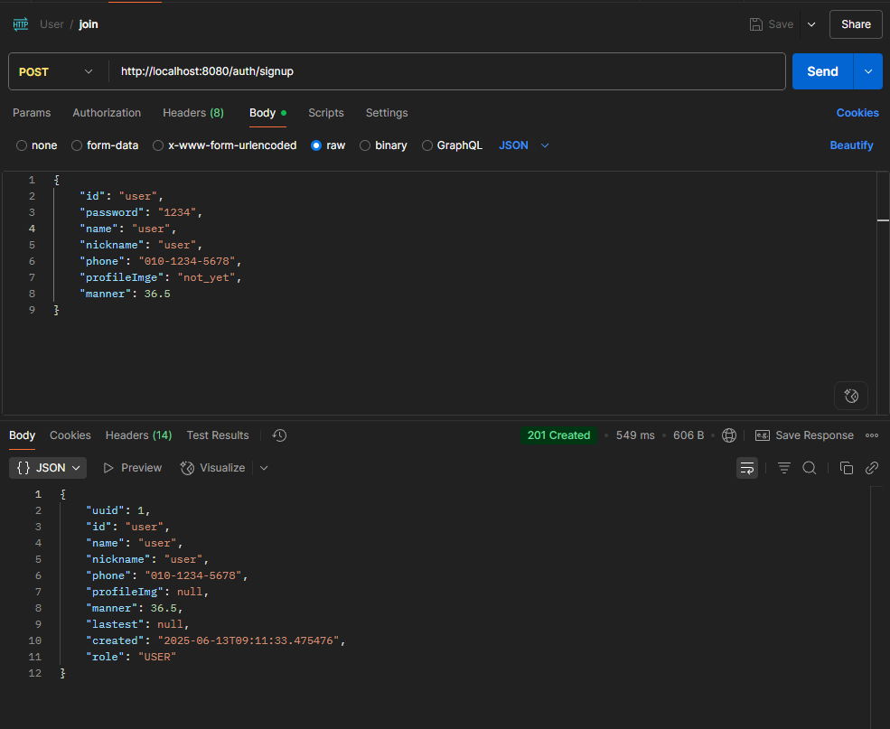
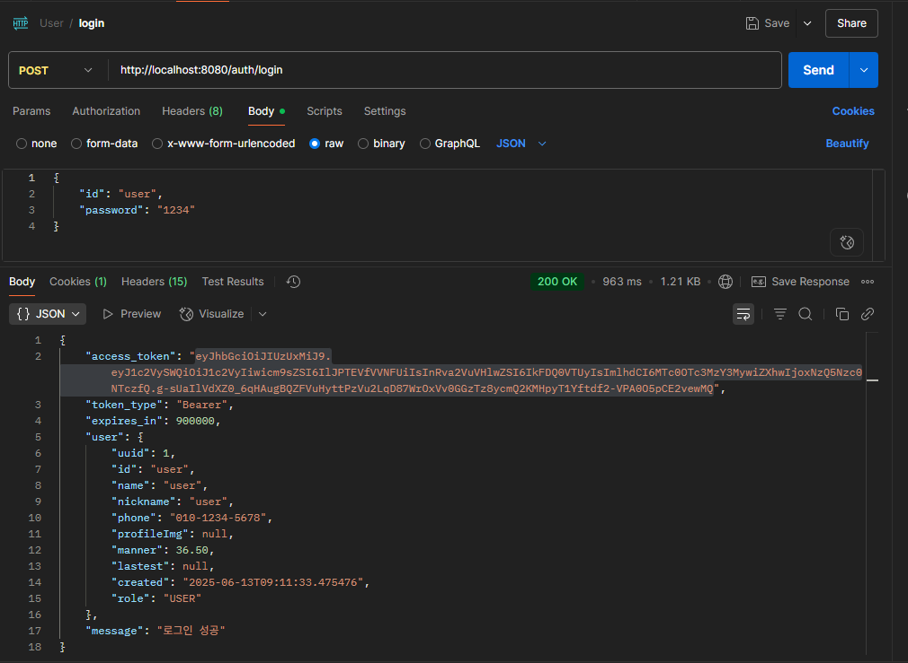
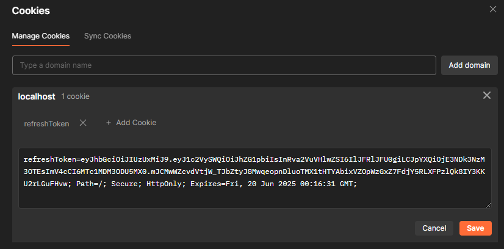
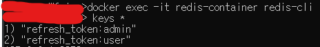
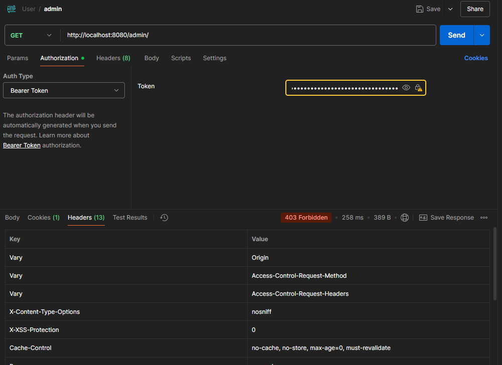
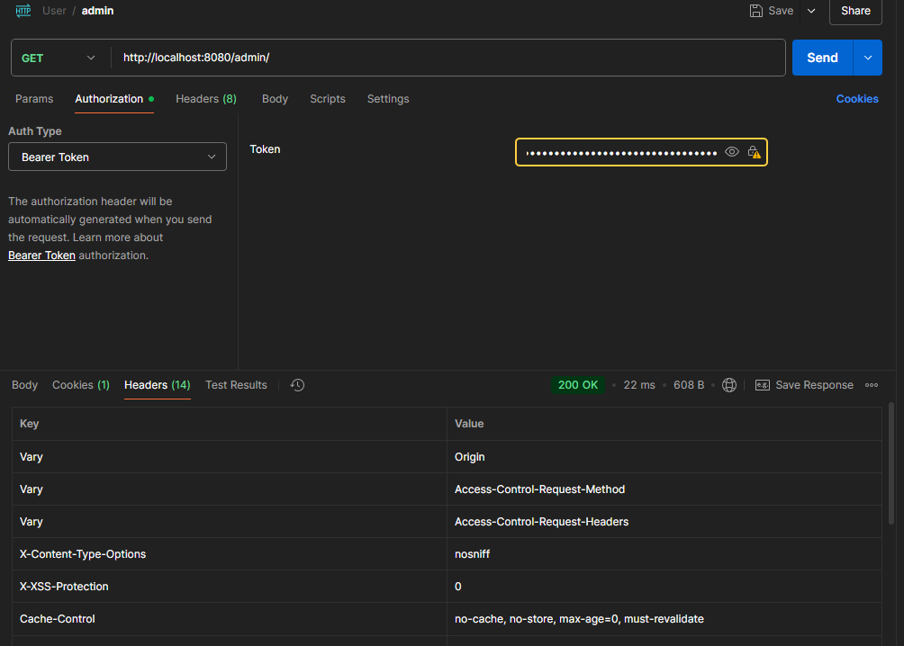

# 당근마켓 클론 프로젝트 - 5주차

## 1️⃣ JWT 인증(Authentication) 방법에 대해서 알아보기
-----------

### 인증 방식 조사 및 분석
> JWT, 세션/쿠키, OAuth 등 다양한 인증 방식에 대한 심화 학습 진행

#### JWT (JSON Web Token) 방식
**구조**: Header.Payload.Signature
- **Header**: 암호화 알고리즘 정보
- **Payload**: 사용자 정보 및 클레임
- **Signature**: 토큰 위변조 방지를 위한 서명

**장점**
- Stateless: 서버에 상태 저장 불필요
- 확장성: 마이크로서비스 환경에 적합
- 토큰 자체에 정보 포함

**단점**
- 토큰 크기가 세션보다 큼
- 토큰 탈취 시 만료까지 악용 가능

#### Access Token + Refresh Token 전략
```javascript
{
  "access_token": "eyJhbGciOiJIUzI1NiIsInR5cCI6IkpXVCJ9...",
  "refresh_token": "eyJhbGciOiJIUzI1NiIsInR5cCI6IkpXVCJ9...",
  "expires_in": 900000,
  "token_type": "Bearer"
}
```

- **Access Token**: 짧은 만료시간 (15분)으로 보안성 강화
- **Refresh Token**: 긴 만료시간 (7일)으로 사용자 편의성 확보

## 2️⃣ JWT 토큰 발급 및 검증 로직 구현하기
-----------

### JwtUtil 클래스 구현
> JWT 토큰 생성, 검증, 정보 추출을 담당하는 핵심 유틸리티

```java
@Component
public class JwtUtil {
    
    // Access Token 유효시간 (15분)
    private static final long ACCESS_TOKEN_EXPIRE_TIME = 15 * 60 * 1000L;
    
    // Refresh Token 유효시간 (7일)
    private static final long REFRESH_TOKEN_EXPIRE_TIME = 7 * 24 * 60 * 60 * 1000L;

    public String createAccessToken(String userId, String role) {
        return Jwts.builder()
                .claim("userId", userId)
                .claim("role", role)
                .claim("tokenType", "ACCESS")
                .issuedAt(new Date(System.currentTimeMillis()))
                .expiration(new Date(System.currentTimeMillis() + ACCESS_TOKEN_EXPIRE_TIME))
                .signWith(secretKey)
                .compact();
    }

    public boolean validateToken(String token) {
        try {
            Jwts.parser()
                    .verifyWith(secretKey)
                    .build()
                    .parseSignedClaims(token);
            return true;
        } catch (ExpiredJwtException e) {
            return false;
        }
    }
}
```

### JWT Filter 구현
> 모든 요청에서 JWT 토큰을 검증하는 필터

```java
@Slf4j
public class JwtFilter extends OncePerRequestFilter {

    @Override
    protected void doFilterInternal(HttpServletRequest request, 
                                   HttpServletResponse response, 
                                   FilterChain filterChain) throws ServletException, IOException {
        String authorization = request.getHeader("Authorization");
        
        if (authorization != null && authorization.startsWith("Bearer ")) {
            String token = authorization.substring(7);
            
            if (jwtUtil.validateToken(token) && jwtUtil.isAccessToken(token)) {
                // SecurityContext에 인증 정보 저장
                Authentication authentication = createAuthentication(token);
                SecurityContextHolder.getContext().setAuthentication(authentication);
            }
        }
        
        filterChain.doFilter(request, response);
    }
}
```

## 3️⃣ 회원가입 및 로그인 API 구현하고 테스트하기
-----------

### Filter 방식에서 Controller 방식으로의 전환
> 실무적 관점에서 유지보수성과 확장성을 고려한 설계 개선

#### 기존 Filter 방식의 한계점
```java
// LoginFilter.java (사용 중단)
public class LoginFilter extends UsernamePasswordAuthenticationFilter {
    // 단순 Filter만 사용 - 로직이 필터에 집중되어 유지보수 어려움
    // 에러 처리와 응답 형식 제어가 제한적
    // 비즈니스 로직과 보안 로직이 혼재
}
```

#### Controller 방식의 장점과 개선점

**1. 관심사의 분리**
- 인증 로직을 Service 레이어로 분리
- Controller는 HTTP 요청/응답 처리에만 집중
- 비즈니스 로직의 재사용성 향상

**2. 향상된 에러 처리**
```java
@PostMapping("/login")
public ResponseEntity<?> login(@Valid @RequestBody LoginRequestDto loginRequest) {
    try {
        LoginResponseDto loginResponse = authService.login(loginRequest);
        return ResponseEntity.ok(loginResponse);
    } catch (BadCredentialsException e) {
        return ResponseEntity.status(HttpStatus.UNAUTHORIZED).body(e.getMessage());
    } catch (Exception e) {
        log.error("로그인 오류", e);
        return ResponseEntity.status(HttpStatus.INTERNAL_SERVER_ERROR)
                .body("로그인 중 오류가 발생했습니다");
    }
}
```

**3. 표준화된 응답 형식**
```java
@Getter
@Builder
public class LoginResponseDto {
    @JsonProperty("access_token")
    private String accessToken;
    
    @JsonProperty("token_type") 
    private String tokenType;
    
    @JsonProperty("expires_in")
    private long expiresIn;
    
    private UserResponseDto user;
}
```

### AuthService 구현
> 인증 관련 비즈니스 로직을 담당하는 서비스

```java
@Service
@Transactional
public class AuthService {

    public LoginResponseDto login(LoginRequestDto loginRequest) {
        // Spring Security 인증 매니저를 통한 인증
        UsernamePasswordAuthenticationToken authToken = 
            new UsernamePasswordAuthenticationToken(loginRequest.getId(), loginRequest.getPassword());
        
        Authentication authentication = authenticationManager.authenticate(authToken);
        
        // 토큰 발급
        String accessToken = jwtUtil.createAccessToken(userId, role);
        String refreshToken = jwtUtil.createRefreshToken(userId);
        
        // Refresh Token Redis 저장
        refreshTokenService.saveRefreshToken(userId, refreshToken, refreshTokenExpiration);
        
        return LoginResponseDto.success(accessToken, refreshToken, expiresIn, userInfo);
    }
}
```

## 4️⃣ 토큰이 필요한 API 구현하고 테스트하기
-----------

### 권한별 접근 제어 구현
> Role-based Access Control을 통한 세밀한 권한 관리

**Security 설정**
```java
@Configuration
@EnableWebSecurity
public class SecurityConfig {

    @Bean
    public SecurityFilterChain securityFilterChain(HttpSecurity http) throws Exception {
        http.authorizeHttpRequests(auth -> auth
                // 공개 API
                .requestMatchers("/", "/auth/login", "/auth/signup").permitAll()
                // 관리자 전용 API  
                .requestMatchers("/admin/**").hasRole("ADMIN")
                // 나머지는 인증 필요
                .anyRequest().authenticated()
        );
        
        // JWT 필터 등록
        http.addFilterBefore(new JwtFilter(jwtUtil), UsernamePasswordAuthenticationFilter.class);
        
        return http.build();
    }
}
```

**관리자 전용 API 예시**
```java
@RestController
@RequestMapping("/admin")
@RequiredArgsConstructor
public class AdminController {

    @GetMapping("/")
    @PreAuthorize("hasRole('ADMIN')")
    public ResponseEntity<List<UserResponseDto>> getAllUsers() {
        List<User> users = userService.findAll();
        List<UserResponseDto> responseDtos = users.stream()
                .map(UserResponseDto::fromEntity)
                .collect(Collectors.toList());
        return ResponseEntity.ok(responseDtos);
    }
}
```

## 5️⃣ 리프레쉬 토큰 발급 로직 구현하고 테스트하기
-----------

### Redis 기반 Refresh Token 관리
> In-Memory 기반의 토큰 저장소 구현

**Redis 설정**
```java
@Configuration
public class RedisConfig {
    
    @Bean
    public RedisTemplate<String, String> redisTemplate() {
        RedisTemplate<String, String> redisTemplate = new RedisTemplate<>();
        redisTemplate.setConnectionFactory(redisConnectionFactory());
        redisTemplate.setKeySerializer(new StringRedisSerializer());
        redisTemplate.setValueSerializer(new StringRedisSerializer());
        return redisTemplate;
    }
}
```

**RefreshTokenService 구현**
```java
@Service
@RequiredArgsConstructor
public class RefreshTokenService {

    private final RedisTemplate<String, String> redisTemplate;
    private static final String REFRESH_TOKEN_PREFIX = "refresh_token:";

    public void saveRefreshToken(String userId, String refreshToken, long expirationTimeMs) {
        String key = REFRESH_TOKEN_PREFIX + userId;
        Duration expiration = Duration.ofMillis(expirationTimeMs - System.currentTimeMillis());
        
        if (expiration.toMillis() > 0) {
            redisTemplate.opsForValue().set(key, refreshToken, expiration);
        }
    }

    public boolean isValidRefreshToken(String userId, String refreshToken) {
        String storedToken = getRefreshToken(userId);
        return refreshToken.equals(storedToken);
    }
}
```

**토큰 재발급 API**
```java
@PostMapping("/refresh")
public ResponseEntity<?> refreshToken(HttpServletRequest request) {
    try {
        String refreshToken = getRefreshTokenFromCookie(request);
        
        if (refreshToken == null) {
            return ResponseEntity.status(HttpStatus.UNAUTHORIZED)
                    .body("Refresh Token이 없습니다");
        }
        
        LoginResponseDto refreshResponse = authService.refreshAccessToken(refreshToken);
        return ResponseEntity.ok(refreshResponse);
        
    } catch (IllegalArgumentException e) {
        return ResponseEntity.status(HttpStatus.UNAUTHORIZED).body(e.getMessage());
    }
}
```

### 보안 강화 방안
**HttpOnly 쿠키를 통한 Refresh Token 관리**
```java
private void setRefreshTokenCookie(HttpServletResponse response, String refreshToken) {
    Cookie refreshTokenCookie = new Cookie("refreshToken", refreshToken);
    refreshTokenCookie.setHttpOnly(true);  // XSS 공격 방지
    refreshTokenCookie.setSecure(true);    // HTTPS에서만 전송
    refreshTokenCookie.setPath("/");
    refreshTokenCookie.setMaxAge(7 * 24 * 60 * 60); // 7일
    response.addCookie(refreshTokenCookie);
}
```

## 📊 API 테스트 결과
-----------

### Postman을 사용한 API 테스트
1. **회원 가입** → `POST` `http://localhost:8080/auth/signup` (누구나 접근 가능)
   - **회원 가입 성공**
       

2. **로그인** → `POST` `http://localhost:8080/auth/login` (누구나 접근 가능)
    - **로그인 성공 -> access token 확인(body에 담겨서 옴)**
      
    - **refresh token 확인(cookie에 담겨서 옴)**
      
    - **redis의 refresh token 확인**
      

3. **권한별 관리자 API 접근** → `GET` `http://localhost:8080/admin/` (관리자만 접근 가능)
    - **`USER` 권한으로 접근 시 -> `403` 발생**
      
    - **`ADMIN` 권한으로 접근 시 -> 정상 응답**
      
4. **유효한 토큰으로 리소스 접근** → 정상 응답

## 결론
-----------

### 핵심 성과
1. **실무 중심 설계**: Filter 기반에서 Controller 기반으로 전환하여 유지보수성과 확장성 대폭 개선
2. **보안 강화**: Access Token + Refresh Token 이중 토큰 전략으로 보안성과 사용자 편의성 동시 확보
3. **안전한 토큰 관리**: Redis 기반 토큰 관리로 분산 환경에서도 확장 가능한 구조 구현
4. **세밀한 권한 제어**: Role 기반 접근 제어로 API별 차등 권한 관리 구현
