# 당근마켓 클론 프로젝트 - 6주차
> 프로젝트를 배포해보자!

## ✅ 전체 아키텍처 개요
```scss
[DockerHub] ← (Spring 서버 이미지) ← [로컬 개발환경]
      ↓
[EC2 인스턴스]
├── Spring 서버 (Docker)
├── Redis (Docker)
└── 연결: [AWS RDS - MySQL]

사용자는 EC2의 퍼블릭 IP를 통해 Spring 서버에 접근
```

## 🛠️ Setp.1 Spring 프로젝트를 DockerHub에 배포하자

### 1️⃣ Dockerfile 생성

Spring 프로젝트 루트 경로에 `Dockerfile` 추가:

```Dockerfile
FROM openjdk:21-jdk-slim
ARG JAR_FILE=build/libs/*.jar
COPY ${JAR_FILE} app.jar
ENTRYPOINT ["java","-jar","/app.jar"]
EXPOSE 8080
```

### 2️⃣ 프로젝트 빌드

```bash
./gradlew clean build
```

#### ⚠️ 오류 발생 시

```text
오류: 기본 클래스 org.gradle.wrapper.GradleWrapperMain을(를) 찾거나 로드할 수 없습니다.
```

**원인**: `gradle-wrapper.jar`가 누락되어 있음 또는 Gradle이 설치되지 않음

**해결법**:

- Gradle 설치 또는 아래 방법으로 `jar` 수동 생성:

```bash
cd gradle/wrapper
curl -L -o gradle-wrapper.jar https://github.com/gradle/gradle/raw/v8.13.0/gradle/wrapper/gradle-wrapper.jar
cd ../..
chmod +x gradlew
./gradlew --version
```

또는 IntelliJ에서 `bootJar` 실행 (우측 Gradle 탭 > Tasks > build > bootJar)

### 3️⃣ DockerHub에 이미지 Push

```bash
docker build -t {dockerhub_id}/spring-daangn .
docker login
docker push {dockerhub_id}/spring-daangn
```

#### ⚠️ 오류: `requested access to the resource is denied`

**원인**: 사용자 ID 미일치 **해결법**: DockerHub ID를 명시적으로 포함해야 함 → `docker push {dockerhub_id}/spring-daangn`

---

## ☁️ Step 2. AWS 설정

### 1️⃣ EC2 인스턴스 생성
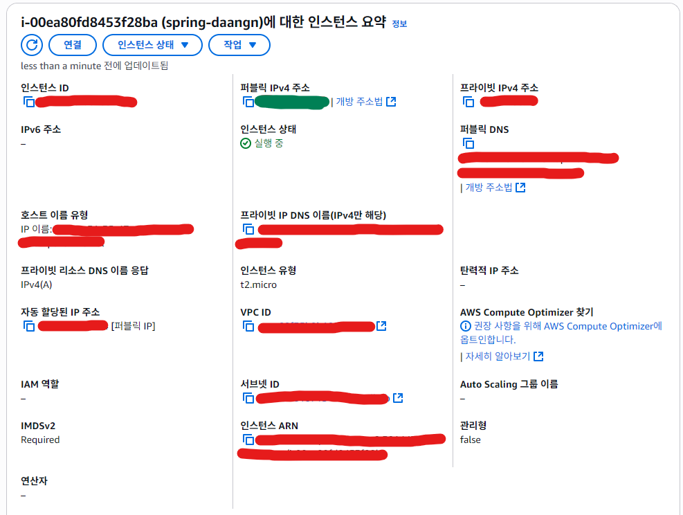
- 우리는 초록색으로 표시된 퍼블릭 IPv4주소를 사용할 예정
  - 해당 주소는 EC2를 중지 후 재시작하면 계속해서 바뀌는 주소
    - 고정된 주소를 원하면 탄력적IP를 받아서 이를 연결해주면 됨 (단, 과금 주의)

### 2️⃣ 보안 그룹 설정
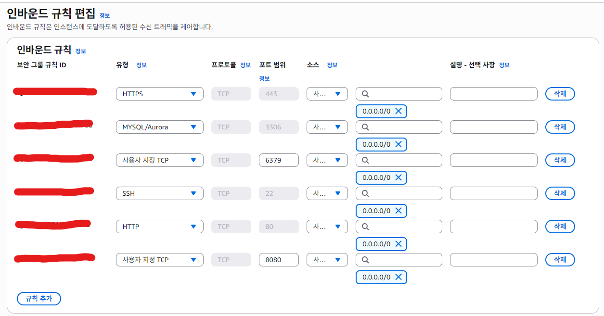
- 기본적으로 HTTPS, HTTP, SSH를 열어준다.
- 추가로 사용할 DB 포트도 열어줌(MySQL, Redis)
- 거기에 우리의 Spring 서버가 사용할 서버 포트(8080)도 열어준다.

### 3️⃣ RDS (MySQL) 생성
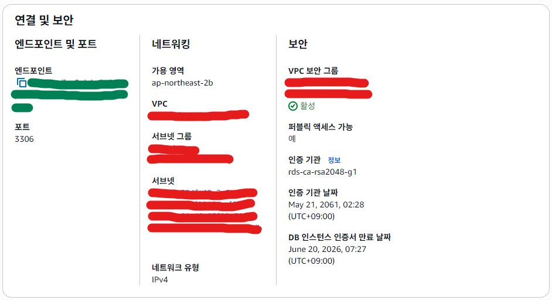
- 우리는 초록색으로 표시된 엔드포인트를 jdbc의 주소로 사용할 예정
- Endpoint 확인 → `jdbc:mysql://<rds-endpoint>:3306/db_name`

---

## 🔐 Step 3. EC2 인스턴스 셋업

### 1️⃣ EC2 접속 (PuTTY 기준)
> 본인은 window os 이기에 putty를 사용하여 접속

#### 1-1. .ppk 만들기
- putty를 다운받으면 puttygen도 같이 다운받아 졌을텐데 이 puttygen이 .pem를 가지고 .ppk를 만들어준다.
  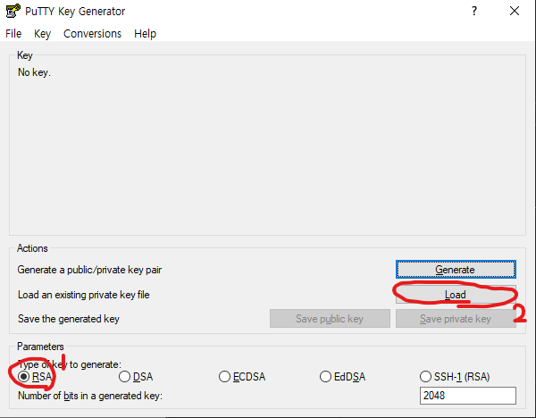
  - `load`버튼을 눌러 .pem 파일을 선택
  - .pem 파일이 안보인다면 load버튼을 누르고 하단의 파일 형식을 전체로 선택
  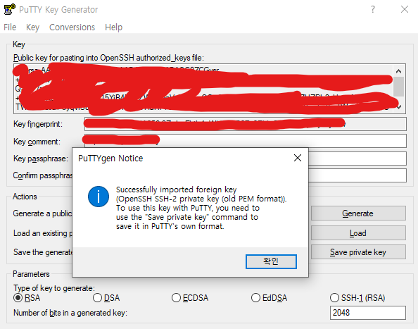
  - 다음과 같이 뜬다면 성공
  - 확인 버튼 누른 후 `Save private key` 눌러서 .ppk 파일 생성
#### 1-2. putty 셋팅
- putty에 생성한 .ppk 첨부하기
  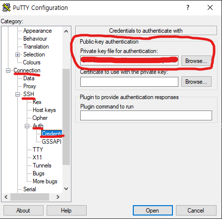
  - Connection->SSH->Auth->Credetials에 .ppk 셋팅
- Session에 ec2 등록
  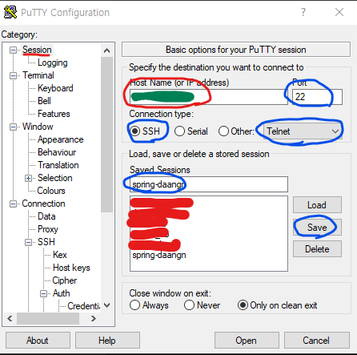
  - 녹색 부분에 AWS EC2의 퍼블릭IP 주소를 넣어주면 된다.
  - 파란색으로 표시된 부분 중 Saved Sessions 명은 자유롭게 정하면 된다.
  - 이후 open 버튼을 눌러 ec2에 접속한다.
#### 1-3. ec2 접속
- ec2 생성시 사용한 AMI가 ubuntu이기에 ubuntu를 입력해서 접속
  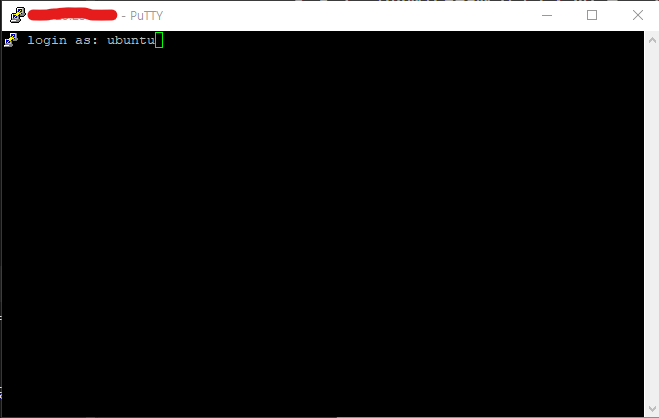
- 정상 접속 확인
  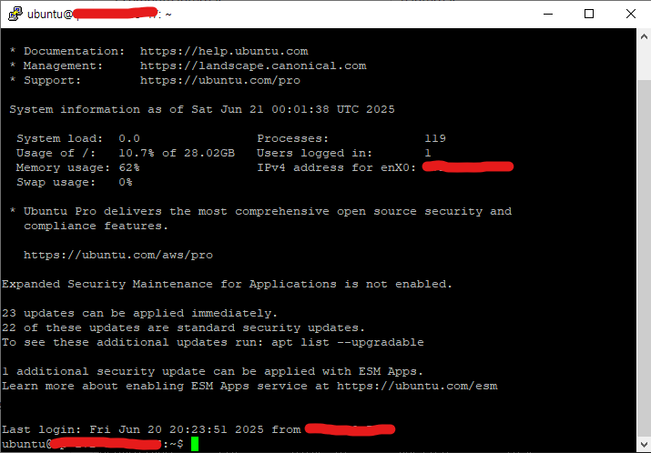

### 2️⃣ Docker 설치
```bash
sudo apt update
sudo apt install docker.io -y
```

### 3️⃣ docker-compose 설치
```bash
sudo apt install docker-compose -y
```

### 4️⃣ .env 파일 생성
- 해당 명령어를 통해 파일을 생성 및 편집
```bash
vi .env
```
- .env 파일 설정
```env
JDBC_URL=jdbc:mysql://{AWS RDS endpoints}:3306/{db 이름}?serverTimezone\=UTC&characterEncoding\=UTF-8&createDatabaseIfNotExist\=true
DB_PASSWORD=AWS RDS에서 셋팅한 db password
DB_USER=AWS RDS에서 셋팅한 user 이름
REDIS_HOST=redis
JWT_SECRET=로컬에서 셋팅한 jwt 시크릿 키
```

### 5️⃣ docker-compose.yml 작성
- 해당 명령어를 통해 파일을 생성 및 편집
```bash
vi docker-compose.yml 
```
- docker-compose.yml
```yaml
version: '3.8'

services:
  redis:
    image: redis:latest
    container_name: redis
    ports:
      - "6379:6379"
    restart: always

  app:
    image: { 내가 dockerhub에 올린 나의 어플 image이름 }
    container_name: spring-daangn
    ports:
      - "8080:8080"
    env_file:
      - .env
    depends_on:
      - redis
    restart: always
```
### 6️⃣ 컨테이너 실행
```bash
sudo docker-compose up -d
```
- 실행 확인
```bash
sudo docker ps -a
```
---

## 🔍 Step 4. 테스트 및 검증

### ✅ Swagger 확인
- EC2의 퍼블릭IP 주소로 접속
- `http://<EC2-PUBLIC-IP>:8080/...` 형식으로 접근
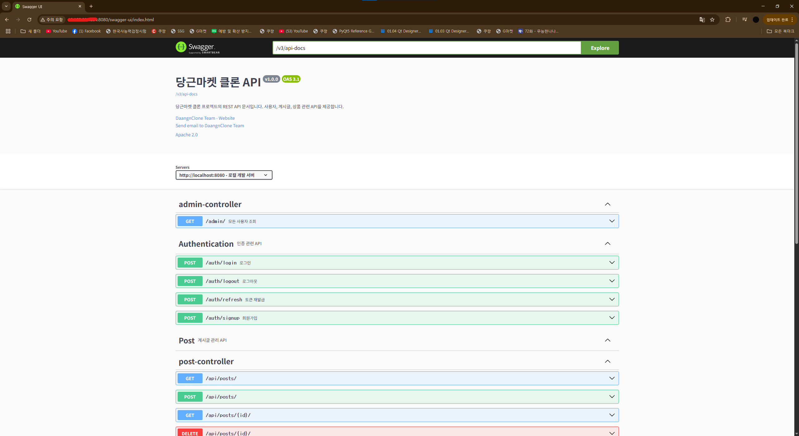

### ✅ Postman 테스트
- EC2의 퍼블릭IP 주소록 접근
- `http://<EC2-PUBLIC-IP>:8080/auth/signup`
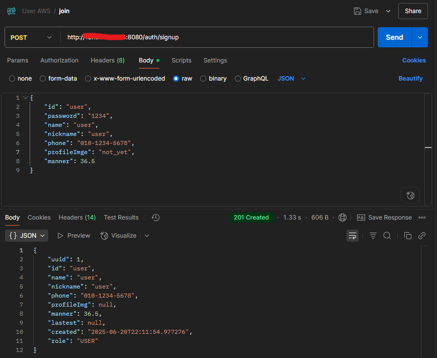

## 📅 찾은 점 & 해결점

| 오류/문제                 | 해결 방법                       |
| --------------------- | --------------------------- |
| gradle-wrapper.jar 없음 | curl 로 직접 다운로드              |
| Docker push 실패        | dockerhub ID 명시 필수          |
| .env 누락               | EC2 내 직접 작성 및 연결 확인         |
| EC2 포트 차단             | 보안 그룹에서 8080, 3306, 6379 오픈 |
| RDS 연결 불가             | 보안 그룹 양방향 열기, VPC 설정 확인     |

---