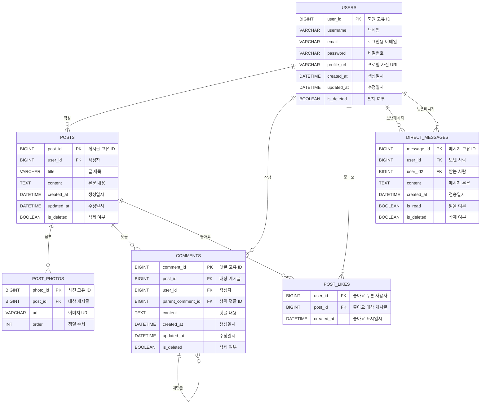

# 당근마켓 클론 프로젝트

## 서비스 소개

- 당근마켓 클론 프로젝트
- 사용자가 물품을 사진과 함께 자유롭게 거래글을 게시
- 게시글에는 댓글, 대댓글, 좋아요 기능
- 사용자간 1:1 다이렉트 메시지를 통한 거래

### 주요 기능

- 로그인/회원가입
- 게시글 조회/등록/검색/삭제
- 사진 첨부
- 게시글, 댓글(대댓글), 좋아요 조회/등록/검색/삭제
- 1:1 다이렉트 메시지
- 지역 분류

> 현재 모델링에는 로그인/회원가입과 같은 사용자 관련 기능과, 게시글/댓글(대댓글)/좋아요/다이렉트 메시지에 대해서만 구현하였다.
> 지역 관련 가능이나 세부적인 검색 기능에 대해서는 미구현하였다.

---

## 데이터 모델링

### ERD 다이어그램

**ERDCloud**

**Mermaid**



- 그동안 ERD는 Mermaid를 통해서만 작성해왔는데 이번에 처음으로 ERDCloud를 사용하면서 훨씬더 직관적으로 표현할 수 있다는 점이 좋았다.

## 테이블 및 컬럼

| 테이블명            | 설명                    |
| ------------------- | ----------------------- |
| **users**           | 서비스 사용자 정보      |
| **posts**           | 거래 게시글             |
| **post_photos**     | 게시글에 첨부된 사진    |
| **comments**        | 게시글 댓글 및 대댓글   |
| **post_likes**      | 게시글 좋아요           |
| **direct_messages** | 1:1 다이렉트 메시지(DM) |

### users

| 컬럼        | 타입         | 제약조건                     | 기본값            | 설명            |
| ----------- | ------------ | ---------------------------- | ----------------- | --------------- |
| user_id     | BIGINT       | PK, NOT NULL, AUTO_INCREMENT | —                 | 회원 고유 ID    |
| username    | VARCHAR(50)  | NOT NULL                     | —                 | 닉네임          |
| email       | VARCHAR(100) | NOT NULL, UNIQUE             | —                 | 로그인용 이메일 |
| password    | VARCHAR(255) | NOT NULL                     | —                 | 비밀번호(해시)  |
| profile_url | VARCHAR(255) | NULL                         | —                 | 프로필 사진 URL |
| created_at  | DATETIME     | NOT NULL                     | CURRENT_TIMESTAMP | 생성일시        |
| updated_at  | DATETIME     | NOT NULL                     | CURRENT_TIMESTAMP | 수정일시        |
| is_deleted  | BOOLEAN      | NOT NULL                     | FALSE             | 탈퇴 여부       |

### posts

| 컬럼       | 타입         | 제약조건                      | 기본값            | 설명           |
| ---------- | ------------ | ----------------------------- | ----------------- | -------------- |
| post_id    | BIGINT       | PK, NOT NULL, AUTO_INCREMENT  | —                 | 게시글 고유 ID |
| user_id    | BIGINT       | NOT NULL, FK → users(user_id) | —                 | 작성자         |
| title      | VARCHAR(200) | NOT NULL                      | —                 | 글 제목        |
| content    | TEXT         | NOT NULL                      | —                 | 본문 내용      |
| created_at | DATETIME     | NOT NULL                      | CURRENT_TIMESTAMP | 생성일시       |
| updated_at | DATETIME     | NOT NULL                      | CURRENT_TIMESTAMP | 수정일시       |
| is_deleted | BOOLEAN      | NOT NULL                      | FALSE             | 삭제 여부      |

### post_photos

| 컬럼     | 타입         | 제약조건                      | 기본값 | 설명         |
| -------- | ------------ | ----------------------------- | ------ | ------------ |
| photo_id | BIGINT       | PK, NOT NULL, AUTO_INCREMENT  | —      | 사진 고유 ID |
| post_id  | BIGINT       | NOT NULL, FK → posts(post_id) | —      | 대상 게시글  |
| url      | VARCHAR(500) | NOT NULL                      | —      | 이미지 URL   |
| order    | INT          | NOT NULL                      | —      | 정렬 순서    |

### comments

| 컬럼              | 타입     | 제약조건                        | 기본값            | 설명         |
| ----------------- | -------- | ------------------------------- | ----------------- | ------------ |
| comment_id        | BIGINT   | PK, NOT NULL, AUTO_INCREMENT    | —                 | 댓글 고유 ID |
| post_id           | BIGINT   | NOT NULL, FK → posts(post_id)   | —                 | 대상 게시글  |
| user_id           | BIGINT   | NOT NULL, FK → users(user_id)   | —                 | 작성자       |
| parent_comment_id | BIGINT   | NULL, FK → comments(comment_id) | NULL              | 상위 댓글 ID |
| content           | TEXT     | NOT NULL                        | —                 | 댓글 내용    |
| created_at        | DATETIME | NOT NULL                        | CURRENT_TIMESTAMP | 생성일시     |
| updated_at        | DATETIME | NOT NULL                        | CURRENT_TIMESTAMP | 수정일시     |
| is_deleted        | BOOLEAN  | NOT NULL                        | FALSE             | 삭제 여부    |

### post_likes

| 컬럼       | 타입     | 제약조건                      | 기본값            | 설명               |
| ---------- | -------- | ----------------------------- | ----------------- | ------------------ |
| user_id    | BIGINT   | NOT NULL, FK → users(user_id) | —                 | 좋아요 누른 사용자 |
| post_id    | BIGINT   | NOT NULL, FK → posts(post_id) | —                 | 좋아요 대상 게시글 |
| created_at | DATETIME | NOT NULL                      | CURRENT_TIMESTAMP | 좋아요 표시일시    |

### direct_messages

| 컬럼       | 타입     | 제약조건                      | 기본값            | 설명           |
| ---------- | -------- | ----------------------------- | ----------------- | -------------- |
| message_id | BIGINT   | PK, NOT NULL, AUTO_INCREMENT  | —                 | 메시지 고유 ID |
| user_id    | BIGINT   | NOT NULL, FK → users(user_id) | —                 | 보낸 사람      |
| user_id2   | BIGINT   | NOT NULL, FK → users(user_id) | —                 | 받은 사람      |
| content    | TEXT     | NOT NULL                      | —                 | 메시지 본문    |
| created_at | DATETIME | NOT NULL                      | CURRENT_TIMESTAMP | 전송일시       |
| is_read    | BOOLEAN  | NOT NULL                      | FALSE             | 읽음 여부      |
| is_deleted | BOOLEAN  | NOT NULL                      | FALSE             | 삭제 여부      |

### 관계

```
users 1:N posts
posts 1:N post_photos
posts 1:N comments
comments 1:N comments (대댓글은 자기참조)
users 1:N comments
users N:M posts via post_likes
users 1:N direct_messages
```

> [!IMPORTANT]
> 테이블에 is_deleted를 붙이는 이유
>
> 1. 데이터 복구
>
> - 물리적으로 삭제(purge)할 경우 삭제된 레코드를 복구하기 어렵다.
> - is_deleted 값을 true로만 변경하면, 실수로 삭제했을 때 곧바로 다시 활성화
>
> 2. 이력 관리
>
> - 누가 언제 삭제했는지 로그를 남겨서 보안 문제시 추적 가능
> - 삭제 전후의 상태를 비교 가능
>
> 3. 참조 무결성(Referential Integrity) 유지
>
> - 외래키 제약조건이 걸린 테이블에서 물리 삭제를 하면 관계가 끊어져 오류가 발생할 수 있다.
>
> 4. 급격한 데이터 손실 방지
>
> - 의도치 않은 배치작업, 버그, 또는 잘못된 조건절로 인해 다량의 레코드가 삭제되는 사고를 막아준다.
>
> 5. 운영 중 다운타임 최소화
>
> - 대용량 테이블에서 물리 삭제를 바로 수행하면 잠금(lock)이나 블로킹(blocking) 유발 가능

---

## Repository 단위 테스트

### 테스트 대상

ForeignKey( `Comment.post` / `Comment.user` )를 포함하는 `Comment` 엔티티에 대해 Repository가 정상 동작하는지 검증하였다.

### 테스트 과정

CRUD 기능 검증

- Given : 새로운 User와 Post 엔티티 저장, Comment 엔티티 3개를 생성 및 저장
- When : CommentRepository.findAll() 호출
- Then : 저장된 3개의 Comment 모두 조회

### 테스트 코드

로깅 레벨·포맷 설정
`application.properties`

```
# SQL 자체 출력
spring.jpa.show-sql=true
# 잘 포맷된 SQL 출력
spring.jpa.properties.hibernate.format_sql=true
# Hibernate SQL 로그 레벨 DEBUG
logging.level.org.hibernate.SQL=DEBUG
# 파라미터 바인딩 정보 출력 (바인딩 값)
logging.level.org.hibernate.type.descriptor.sql.BasicBinder=TRACE
```

`CommentRepositoryTest.java`

```java
// given
User user = new User("tester", "tester@example.com", "pwd", null);
user = userRepository.save(user);

Post post = new Post(user, "Test Post", "Content");
post = postRepository.save(post);

Comment c1 = new Comment(post, user, null, "First comment");
Comment c2 = new Comment(post, user, null, "Second comment");
Comment c3 = new Comment(post, user, null, "Third comment");

commentRepository.saveAll(List.of(c1, c2, c3));

// when
List<Comment> result = commentRepository.findAll();

// then
assertThat(result).hasSize(3)
    .extracting(Comment::getContent)
    .containsExactlyInAnyOrder(
        "First comment",
        "Second comment",
        "Third comment"
    );
```

### 테스트 결과

디버그 콘솔에서 확인 로그 가능

```
    create table comments (
        comment_id bigint generated by default as identity,
        content TEXT not null,
        created_at timestamp(6) not null,
        is_deleted boolean not null,
        updated_at timestamp(6) not null,
        parent_comment_id bigint,
        post_id bigint not null,
        user_id bigint not null,
        primary key (comment_id)
    )
Hibernate:
    create table comments (
        comment_id bigint generated by default as identity,
        content TEXT not null,
        created_at timestamp(6) not null,
        is_deleted boolean not null,
        updated_at timestamp(6) not null,
        parent_comment_id bigint,
        post_id bigint not null,
        user_id bigint not null,
        primary key (comment_id)
    )
2025-05-09T02:16:50.104+09:00 DEBUG 26956 --- [spring-daangn] [           main] org.hibernate.SQL                        :
    create table posts (
        post_id bigint generated by default as identity,
        content TEXT not null,
        created_at timestamp(6) not null,
        is_deleted boolean not null,
        title varchar(200) not null,
        updated_at timestamp(6) not null,
        user_id bigint not null,
        primary key (post_id)
    )
Hibernate:
    create table posts (
        post_id bigint generated by default as identity,
        content TEXT not null,
        created_at timestamp(6) not null,
        is_deleted boolean not null,
        title varchar(200) not null,
        updated_at timestamp(6) not null,
        user_id bigint not null,
        primary key (post_id)
    )
2025-05-09T02:16:50.105+09:00 DEBUG 26956 --- [spring-daangn] [           main] org.hibernate.SQL                        :
    create table users (
        user_id bigint generated by default as identity,
        created_at timestamp(6) not null,
        email varchar(100) not null,
        is_deleted boolean not null,
        password varchar(255) not null,
        profile_url varchar(255),
        updated_at timestamp(6) not null,
        username varchar(50) not null,
        primary key (user_id)
    )
Hibernate:
    create table users (
        user_id bigint generated by default as identity,
        created_at timestamp(6) not null,
        email varchar(100) not null,
        is_deleted boolean not null,
        password varchar(255) not null,
        profile_url varchar(255),
        updated_at timestamp(6) not null,
        username varchar(50) not null,
        primary key (user_id)
    )
2025-05-09T02:16:50.106+09:00 DEBUG 26956 --- [spring-daangn] [           main] org.hibernate.SQL                        :
    alter table if exists users
       drop constraint if exists UK6dotkott2kjsp8vw4d0m25fb7
Hibernate:
    alter table if exists users
       drop constraint if exists UK6dotkott2kjsp8vw4d0m25fb7
2025-05-09T02:16:50.107+09:00 DEBUG 26956 --- [spring-daangn] [           main] org.hibernate.SQL                        :
    alter table if exists users
       add constraint UK6dotkott2kjsp8vw4d0m25fb7 unique (email)
Hibernate:
    alter table if exists users
       add constraint UK6dotkott2kjsp8vw4d0m25fb7 unique (email)
2025-05-09T02:16:50.109+09:00 DEBUG 26956 --- [spring-daangn] [           main] org.hibernate.SQL                        :
    alter table if exists comments
       add constraint FK7h839m3lkvhbyv3bcdv7sm4fj
       foreign key (parent_comment_id)
       references comments
Hibernate:
    alter table if exists comments
       add constraint FK7h839m3lkvhbyv3bcdv7sm4fj
       foreign key (parent_comment_id)
       references comments
2025-05-09T02:16:50.114+09:00 DEBUG 26956 --- [spring-daangn] [           main] org.hibernate.SQL                        :
    alter table if exists comments
       add constraint FKh4c7lvsc298whoyd4w9ta25cr
       foreign key (post_id)
       references posts
Hibernate:
    alter table if exists comments
       add constraint FKh4c7lvsc298whoyd4w9ta25cr
       foreign key (post_id)
       references posts
2025-05-09T02:16:50.115+09:00 DEBUG 26956 --- [spring-daangn] [           main] org.hibernate.SQL                        :
    alter table if exists comments
       add constraint FK8omq0tc18jd43bu5tjh6jvraq
       foreign key (user_id)
       references users
Hibernate:
    alter table if exists comments
       add constraint FK8omq0tc18jd43bu5tjh6jvraq
       foreign key (user_id)
       references users
2025-05-09T02:16:50.116+09:00 DEBUG 26956 --- [spring-daangn] [           main] org.hibernate.SQL                        :
    alter table if exists posts
       add constraint FK5lidm6cqbc7u4xhqpxm898qme
       foreign key (user_id)
       references users
Hibernate:
    alter table if exists posts
       add constraint FK5lidm6cqbc7u4xhqpxm898qme
       foreign key (user_id)
       references users

    insert
    into
        users
        (created_at, email, is_deleted, password, profile_url, updated_at, username, user_id)
    values
        (?, ?, ?, ?, ?, ?, ?, default)
Hibernate:
    insert
    into
        users
        (created_at, email, is_deleted, password, profile_url, updated_at, username, user_id)
    values
        (?, ?, ?, ?, ?, ?, ?, default)
2025-05-09T02:16:50.782+09:00 DEBUG 26956 --- [spring-daangn] [           main] org.hibernate.SQL                        :
    insert
    into
        posts
        (content, created_at, is_deleted, title, updated_at, user_id, post_id)
    values
        (?, ?, ?, ?, ?, ?, default)
Hibernate:
    insert
    into
        posts
        (content, created_at, is_deleted, title, updated_at, user_id, post_id)
    values
        (?, ?, ?, ?, ?, ?, default)
2025-05-09T02:16:50.784+09:00 DEBUG 26956 --- [spring-daangn] [           main] org.hibernate.SQL                        :
    insert
    into
        comments
        (content, created_at, is_deleted, parent_comment_id, post_id, updated_at, user_id, comment_id)
    values
        (?, ?, ?, ?, ?, ?, ?, default)
Hibernate:
    insert
    into
        comments
        (content, created_at, is_deleted, parent_comment_id, post_id, updated_at, user_id, comment_id)
    values
        (?, ?, ?, ?, ?, ?, ?, default)
2025-05-09T02:16:50.785+09:00 DEBUG 26956 --- [spring-daangn] [           main] org.hibernate.SQL                        :
    insert
    into
        comments
        (content, created_at, is_deleted, parent_comment_id, post_id, updated_at, user_id, comment_id)
    values
        (?, ?, ?, ?, ?, ?, ?, default)
Hibernate:
    insert
    into
        comments
        (content, created_at, is_deleted, parent_comment_id, post_id, updated_at, user_id, comment_id)
    values
        (?, ?, ?, ?, ?, ?, ?, default)
2025-05-09T02:16:50.786+09:00 DEBUG 26956 --- [spring-daangn] [           main] org.hibernate.SQL                        :
    insert
    into
        comments
        (content, created_at, is_deleted, parent_comment_id, post_id, updated_at, user_id, comment_id)
    values
        (?, ?, ?, ?, ?, ?, ?, default)
Hibernate:
    insert
    into
        comments
        (content, created_at, is_deleted, parent_comment_id, post_id, updated_at, user_id, comment_id)
    values
        (?, ?, ?, ?, ?, ?, ?, default)
2025-05-09T02:16:50.869+09:00 DEBUG 26956 --- [spring-daangn] [           main] org.hibernate.SQL                        :
    select
        c1_0.comment_id,
        c1_0.content,
        c1_0.created_at,
        c1_0.is_deleted,
        c1_0.parent_comment_id,
        c1_0.post_id,
        c1_0.updated_at,
        c1_0.user_id
    from
        comments c1_0
Hibernate:
    select
        c1_0.comment_id,
        c1_0.content,
        c1_0.created_at,
        c1_0.is_deleted,
        c1_0.parent_comment_id,
        c1_0.post_id,
        c1_0.updated_at,
        c1_0.user_id
    from
        comments c1_0

```

- DDL로 스키마를 생성
- 데이터 삽입(insert)
- 데이터 조회(select)

> [!NOTE]
> CommentRepository.findAll() 호출 시 총 3개의 레코드 반환하는 것을 확인할 수 있다.
