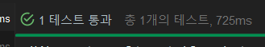

# spring-daangn

# JPA란?
- Java Persistence API

java에서 데이터베이스를 쉽게 다룰 수 있도록 도와주는 기술.
- 직접 SQL을 작성하지 않고 java 코드로 데이터베이스를 다울 수 있게 해줌.

기존 방식
```
String sql = "SELECT * FROM users WHERE id = ?";
PreparedStatement pstmt = conn.prepareStatement(sql);
pstmt.setLong(1, id);
ResultSet rs = pstmt.executeQuery();
```
JPA 사용
```
User user = entityManager.find(User.class, id);
```

### 🧱 핵심 용어

| 용어 | 설명 |
|------|------|
| `@Entity` | DB 테이블과 매핑되는 Java 클래스 |
| `EntityManager` | Entity 저장, 조회, 삭제 등을 담당 |
| `@Id` | 테이블의 기본 키(PK)를 의미 |
| `@GeneratedValue` | PK의 자동 증가 설정 |
| `@OneToMany`, `@ManyToOne` | 테이블 간의 관계 설정 (Join 처리) |


### 📌 자주 사용하는 JPA 어노테이션 정리

| 어노테이션 | 설명 |
|------------|------|
| `@Entity` | 클래스가 테이블과 매핑됨 |
| `@Table(name = "table_name")` | 매핑할 테이블명을 지정 (기본은 클래스명) |
| `@Id` | 기본 키(PK)를 지정 |
| `@GeneratedValue(strategy = ...)` | 기본 키 자동 생성 전략 (IDENTITY, SEQUENCE, AUTO 등) |
| `@Column(name = "col_name", nullable = false, unique = true, length = 100)` | 컬럼 이름, 제약조건, 길이 등을 설정 |
| `@Transient` | 해당 필드는 DB에 저장되지 않음 (임시 필드로만 사용) |
| `@Lob` | Large Object: BLOB(CLOB) 데이터를 매핑할 때 사용 |
| `@Enumerated(EnumType.STRING)` | Enum 타입을 DB에 저장할 때 문자열로 저장 |
| `@Temporal(TemporalType.DATE)` | 날짜 타입을 DATE, TIME, TIMESTAMP 중 하나로 매핑 |
| `@Embedded` | 다른 클래스의 필드를 포함시킬 때 사용 (값 타입 객체) |
| `@Embeddable` | @Embedded로 사용될 클래스에 붙임 |

### 📚 관계 매핑 어노테이션 (테이블 간 관계 설정)

| 어노테이션 | 설명 |
|------------|------|
| `@OneToOne` | 1:1 관계 설정 |
| `@OneToMany` | 1:N 관계 설정 (컬렉션) |
| `@ManyToOne` | N:1 관계 설정 (외래 키 가짐) |
| `@ManyToMany` | N:N 관계 설정 |
| `@JoinColumn(name = "fk_name")` | 외래 키(FK) 컬럼명을 지정 |
| `@JoinTable(...)` | N:N 관계에서 조인 테이블을 직접 지정 |
| `mappedBy` | 양방향 관계에서 연관관계의 주인이 아닌 쪽에 사용 |

예제 코드
```
@Entity
@Table(name = "members")
public class Member {

    @Id
    @GeneratedValue(strategy = GenerationType.IDENTITY)
    private Long id;

    @Column(nullable = false, length = 50)
    private String name;

    @Enumerated(EnumType.STRING)
    private RoleType role;

    @Temporal(TemporalType.TIMESTAMP)
    private Date createdDate;

    @Transient
    private String tempValue; // DB에 저장되지 않음

    @OneToOne
    @JoinColumn(name = "profile_id")
    private Profile profile;
}

```

# 🌱 2주차 미션
## 1️⃣ 당근마켓의 DB를 모델링해요
## 2️⃣ Repository 단위 테스트를 진행해요
## 3️⃣ (옵션) JPA 관련 문제 해결
<br>

# 1️⃣ 당근마켓의 DB를 모델링해요

# 🥕 당근마켓 클론 서비스
당근마켓은 지역 기반 중고 거래 플랫폼으로, 사용자는 자신의 위치 기반으로 중고 물품을 등록하고 거래할 수 있으며, 채팅, 댓글, 좋아요, 매너평가 등의 기능을 통해 신뢰 기반의 거래가 가능하다.


# 📦 모델 설명

## 📍 `region`

| Column | Type         | Constraints         | Description |
|--------|--------------|---------------------|-------------|
| id     | INT          | PK, AUTO_INCREMENT  | 지역 ID     |
| name   | VARCHAR(100) | NOT NULL            | 지역명      |

---

## 📁 `category`

| Column | Type         | Constraints         | Description   |
|--------|--------------|---------------------|---------------|
| id     | INT          | PK, AUTO_INCREMENT  | 카테고리 ID   |
| type   | VARCHAR(50)  | NOT NULL            | 카테고리 이름 |

---

## 👤 `user`

| Column      | Type            | Constraints                                | Description        |
|-------------|-----------------|--------------------------------------------|--------------------|
| id          | BIGINT          | PK, AUTO_INCREMENT                         | 사용자 ID          |
| region_id   | INT             | NOT NULL, FK → `region(id)`                | 지역 FK           |
| email       | VARCHAR(100)    | NULLABLE                                   | 이메일             |
| password    | VARCHAR(255)    | NULLABLE                                   | 비밀번호           |
| nickname    | VARCHAR(50)     | NULLABLE                                   | 닉네임             |
| phone       | VARCHAR(20)     | NULLABLE                                   | 전화번호           |
| temperature | DECIMAL(4,2)    | DEFAULT 36.5                               | 매너 온도          |
| create_at   | DATETIME        | DEFAULT CURRENT_TIMESTAMP                  | 생성일자           |
| update_at   | DATETIME        | DEFAULT CURRENT_TIMESTAMP ON UPDATE NOW()  | 수정일자           |
| profile_url | VARCHAR(255)    | NULLABLE                                   | 프로필 이미지 URL  |

---

## 📦 `product`

| Column         | Type           | Constraints                              | Description         |
|----------------|----------------|------------------------------------------|---------------------|
| id             | BIGINT         | PK, AUTO_INCREMENT                       | 상품 ID             |
| seller_id      | BIGINT         | NOT NULL, FK → `user(id)`                | 판매자 FK           |
| category_id    | INT            | NOT NULL, FK → `category(id)`            | 카테고리 FK         |
| region_id      | INT            | NOT NULL, FK → `region(id)`              | 지역 FK             |
| title          | VARCHAR(100)   | NOT NULL                                 | 상품 제목           |
| thumbnail      | VARCHAR(255)   | NOT NULL                                 | 썸네일 URL          |
| description    | TEXT           | NULLABLE                                 | 상품 설명           |
| price          | INT            | NULLABLE                                 | 가격                |
| is_negotiable  | TINYINT(1)     | DEFAULT 0                                | 가격 제안 여부      |
| created_at     | DATETIME       | DEFAULT CURRENT_TIMESTAMP                | 등록 시간           |
| dump_time      | INT            | NULLABLE                                 | 삭제까지 남은 시간 |
| is_reserved    | TINYINT(1)     | NOT NULL, DEFAULT 0                      | 예약 여부           |
| is_completed   | TINYINT(1)     | NOT NULL, DEFAULT 0                      | 거래 완료 여부      |
| chat_count     | BIGINT         | NOT NULL, DEFAULT 0                      | 채팅 수             |
| view_count     | BIGINT         | NOT NULL, DEFAULT 0                      | 조회 수             |
| favorite_count | BIGINT         | NOT NULL, DEFAULT 0                      | 찜 수               |

---

## ❤️ `favorite`

| Column     | Type   | Constraints                        | Description |
|------------|--------|------------------------------------|-------------|
| id         | BIGINT | PK, AUTO_INCREMENT                 | 찜 ID        |
| user_id    | BIGINT | NOT NULL, FK → `user(id)`         | 사용자 FK   |
| product_id | BIGINT | NOT NULL, FK → `product(id)`      | 상품 FK     |

---

## 💬 `comment`

| Column            | Type          | Constraints                   | Description        |
|-------------------|---------------|-------------------------------|--------------------|
| id                | BIGINT        | PK, AUTO_INCREMENT            | 댓글 ID            |
| product_id        | BIGINT        | NOT NULL, FK → `product(id)` | 상품 FK            |
| user_id           | BIGINT        | NOT NULL, FK → `user(id)`    | 작성자 FK          |
| content           | TEXT          | NOT NULL                      | 내용               |
| create_at         | DATETIME      | DEFAULT CURRENT_TIMESTAMP     | 작성 시각          |
| parent_comment_id | BIGINT        | NULLABLE                      | 부모 댓글 ID       |
| child_count       | INT           | DEFAULT 0                     | 자식 댓글 수       |
| level             | INT           | DEFAULT 0                     | 계층 깊이          |
| hierarchy_path    | VARCHAR(255)  | NULLABLE                      | 계층 경로          |

---

## 👍 `manner_detail`

| Column  | Type         | Constraints         | Description  |
|---------|--------------|---------------------|--------------|
| id      | INT          | PK, AUTO_INCREMENT  | 항목 ID      |
| content | VARCHAR(100) | NULLABLE            | 항목 내용    |

---

## ⭐ `manner_rating`

| Column        | Type   | Constraints                         | Description        |
|---------------|--------|-------------------------------------|--------------------|
| id            | BIGINT | PK, AUTO_INCREMENT                  | 평가 ID            |
| rated_user_id | BIGINT | NOT NULL, FK → `user(id)`          | 평가 대상 FK       |
| detail_id     | INT    | NOT NULL, FK → `manner_detail(id)` | 매너 항목 FK       |
| rater_user_id | BIGINT | NOT NULL                            | 평가자 ID          |

---

## 🖼️ `image`

| Column     | Type         | Constraints                   | Description    |
|------------|--------------|-------------------------------|----------------|
| id         | BIGINT       | PK, AUTO_INCREMENT            | 이미지 ID      |
| product_id | BIGINT       | NOT NULL, FK → `product(id)` | 상품 FK        |
| image_url  | VARCHAR(255) | NOT NULL                      | 이미지 URL     |
| order      | INT          | NOT NULL                      | 순서           |

---

## 🗨️ `chat_room`

| Column     | Type   | Constraints                        | Description  |
|------------|--------|------------------------------------|--------------|
| id         | BIGINT | PK, AUTO_INCREMENT                 | 채팅방 ID     |
| buyer_id   | BIGINT | NOT NULL, FK → `user(id)`         | 구매자 FK     |
| seller_id  | BIGINT | NOT NULL, FK → `user(id)`         | 판매자 FK     |
| product_id | BIGINT | NOT NULL, FK → `product(id)`      | 상품 FK       |

---

## ✉️ `message`

| Column       | Type     | Constraints                        | Description       |
|--------------|----------|------------------------------------|-------------------|
| id           | BIGINT   | PK, AUTO_INCREMENT                 | 메시지 ID         |
| chat_room_id | BIGINT   | NOT NULL, FK → `chat_room(id)`    | 채팅방 FK         |
| sender_id    | BIGINT   | NOT NULL                          | 보낸 사용자 ID     |
| message      | TEXT     | NOT NULL                          | 메시지 내용        |
| send_at      | DATETIME | DEFAULT CURRENT_TIMESTAMP         | 보낸 시간          |
| is_read      | TINYINT  | NOT NULL, DEFAULT 0               | 읽음 여부 (0/1)    |


## ❗ 비상 사태 😢
단위테스트가 안된다…

하나씩 다시 해보자

일단 Gradle 이 익숙 하지 않아 조금 찾아봤다.

## ✏️ Gradle

의존성 관리는 build.gradle 에서 DI , 의존성 주입을 해줘야 한다.

gradle은 뭔데..?

1. 라이브러리 관리
2. 프로젝트 빌드 
3. 테스트, 실행, 패키징 자동화

src/main/resources에 있는 application.properties는 지금 까지 항상 사용해왔던 프로빠리

Spring Boot의 환경 설정 파일이다.

하지만 이번에는 yml 파일로 변경하여 진행 할 것이다.

두개의 차이가 뭘까?

### ✏️ 야물과 쁘로빠리

.properties 는 key = value 방식이고

.yml 은 들여쓰기 기반 구조이다.

사실상 같은 기능을 하는것

쁘로빠리의 장점은 상대적으로 명확하다, 하지만 설정이 많아지면 가독성이 떨어지게 된다.

야물의 장점은 더 계층적이고 정돈되어 가독성은 좋지만 들여쓰기 실수 시 에러가 날 수 있다는 점이있다.

### ✏️ 스프링 부트를 생성하면..

제일 위에 생기는 4개의 폴더는 뭐야..?

.gradle : Gradle 빌드 중에 생기는 캐시 파일 저장소 이다.

.idea : IntelliJ 프로젝트 설정 파일들( 공동작업시 .gitignore에 넣는게 일반적)

build : Gradle로 빌드한 결과물이 저장되는 폴더( 실행 가능한 .jar, 클래스파일 등)

gradle : Gradle Wrapper 설정 폴더 (버전 정보 등 포함)

이런파일이 생긴다…

아래 애들은..?

build.gradle : Gradle 빌드 설정 파일 (의존성, 빌드 옵션, 플러그인 등 작성)

settings.gradle : 프로젝트 이름 정의

gradlew, gradlew.bat : Gradle이 설치되어 있지 않아도 실행할 수 있도록 도와주는 실행 스크립트

라고한다..

다음에는 단위테스트를 해보자..

## ✏️ 단위 테스트

먼저 실제 DB 연결 안하고 간단하게 실행해 보고싶었다.

H2 인메모리 데이터베이스를 사용하면 살제 DB와 연동되는 JPA Repository 단위 테스트를 진행 할 수 있다고 한다.

의존성으로 jpa와 h2database, test 이렇게 3개 추가해주었다.

앗 롬복도 없네.. 추가해준다.

근데 궁금증

## ❓Entity랑 Domain이랑 DTO랑 뭐가다른거야?


1. Entity는 DB의 테이블과 1:1 매핑되는 클래스이다. JPA의 @Entity 어노테이션으로 지정..

DB 설계에 충실한 모델로 유지할 것!

1. Domain은 넓은 의미의 “도메인 모델”, 비지니스 개념을 담은 모델, Entity와 같을 수도 있지만 Entity를 숨기고 별도로 관리 할 수 있다.. 실무에서는 Entitu가 Domain역할을 할 때가 많지만 DDD(도메인 주도 설계)에서는 Entity와 Domain을 엄격히 나누기도 한다.

1. DTO (Data Transfer Object) 는 계층간 데이터 전달용 객체이다, Controller , Service , View 사이에서 Entity를 노출하지 않고 DTO를 사용해 안전하고 효율적인 전송이 가능하게 한다. 보통 Entity를 직접 외부에 노출하지 않기 위해 DTO를 따로 정의한다.

이런식으로 폴더를 구성한다고 한다.. 뭐 프로젝트 규모와 팀의 선호도에 따라 달라질 수 있다곤 하니 정답은 없나보다.

```java
src/
├── main/
│   ├── java/
│   │   └── com/
│   │       └── example/
│   │           ├── config/           // 설정 클래스
│   │           ├── controller/       // REST API 컨트롤러
│   │           ├── dto/              // DTO 클래스
│   │           ├── entity/           // JPA 엔티티
│   │           ├── repository/       // JPA 리포지토리
│   │           ├── service/          // 비즈니스 로직
│   │           └── SpringBootBaseArchitectureApplication.java
│   └── resources/
│       ├── application.properties    // 애플리케이션 설정
│       └── static/                   // 정적 리소스
└── test/
    └── java/
        └── com/
            └── example/
                └── ...               // 테스트 클래스

```

```java
@Entity
@Getter
@Setter
@NoArgsConstructor(access = AccessLevel.PROTECTED)
@AllArgsConstructor
@Builder
@Table(name = "users")
public class User {

    @Id @GeneratedValue(strategy = GenerationType.IDENTITY)
    private Long id;

    private String name;
    private String email;
}

```

간단하게 user 도메인을 하나 만들었다.

```java
public interface UserRepository extends JpaRepository<User, Long> {
    Optional<User> findByEmail(String email);
}

```

간단하게 레포지토리도 하나만들었다.

근데 뭔지 모르는거 투성이다.

JPARepository를 extends하면 뭐가되나..?

## ❓extends JPARepository

1. 기본 CRUD 메서드 제공 :`save()`, `findById()`, `findAll()`, `deleteById()` 등 자동으로 사용 가능
2. 페이징 및 정렬 : `findAll(Pageable pageable)`, `findAll(Sort sort)` 등 제공
3. 커스텀 메서드 생성 가능 : 메서드 이름만으로 `findByEmail()`처럼 쿼리 메서드 자동 생성
4. 프록시 객체로 구현 클래스 자동 생성 : 개발자가 직접 구현하지 않아도 런타임에 Spring이 프록시로 구현체 제공
5. 트랜잭션 처리 자동화 : 스프링에서 트랜잭션 처리를 간단하게 설정 가능
6. 엔티티 기반 쿼리 작성 용이 : JPQL, @Query 사용가능, QueryDSL과의 통합도 수월

그럼 그뒤에 <User, Long> 은 뭔데?

제테릭 타입으로 JPARepository가 어떤 언티티를 다루고 어떤 타입의 PK를 갖는지 지정해주는 부분이다.

- 타입 안정성 보장 : 잘못된 타입은 컴파일 에러 발생
- User 관련 CRUD 메서들이 자동생성

Optional<User> 하는 이유는 뭔데?

- null이 될 수도 있는 User 객체를 감싸는 그릇, 데이터가 존재하지 않을 수 있기 때문
- User가 있을 수도, 없을 수도 있음을 표현하고 null 처리에 대해 명확하고 안전하다, java8 이후 등장한 기능으로 JPA에서도 적극 활용!!

좋았다..

드디어 테스트 폴더 들어가본다

```java

@DataJpaTest
class UserRepositoryTest {

    @Autowired
    private UserRepository userRepository;

    @Test
    void 유저_저장_및_이메일로_조회_테스트() {
        User user = new User();
        user.setEmail("test@example.com");
        user.setName("테스트");

        userRepository.save(user);

        Optional<User> result = userRepository.findByEmail("test@example.com");
        assertThat(result).isPresent();
        assertThat(result.get().getName()).isEqualTo("테스트");
    }
}
```

@DataJpaTest 는 뭐냐

Spring Boot에서 JPA 관련 컴포넌트만 골라서 테스트 할 수 있게 해주는 테스트용 어노테이션!!

Repository테스트에 특화된 환경을 빠르게 구성해준다.

### ✅ Spring Boot 테스트 어노테이션 정리

| 어노테이션 | 용도 | 특징 |
| --- | --- | --- |
| `@SpringBootTest` | **통합 테스트**용 전체 애플리케이션 컨텍스트 로딩 | 컨트롤러, 서비스, 리포지토리까지 다 올라옴 |
| `@WebMvcTest` | **컨트롤러 단위 테스트** | 서비스, 리포지토리는 제외. `@Controller`, `@RestController`만 테스트 |
| `@DataJpaTest` | **JPA Repository 단위 테스트** | JPA 관련 빈만 로딩, DB 자동 롤백 |
| `@MockBean` | 테스트 중 필요한 의존 객체를 **Mocking**할 때 사용 | 가짜 Bean을 주입함 |
| `@TestConfiguration` | 테스트 전용 설정 클래스 정의 | `@Configuration`의 테스트 버전 |
| `@AutoConfigureMockMvc` | `MockMvc` 사용 설정 | 실제 서버 없이 Spring MVC 테스트 가능 |
| `@Transactional` | 테스트 메서드 트랜잭션 처리 | 테스트 후 자동 롤백되는 데 유용 |
| `@TestPropertySource` | 테스트용 프로퍼티 설정 적용 | 커스텀 `application-test.yml` 등 사용할 때 |

뭔가 이렇게 많단다.

## ❓assertThat vs assertEquals

아니그래서 assertThat(result).isPresent() 이거뭔데

- null 이 아닌 값이 존재하냐? 라는 뜻

그아래는 이제 값 꺼내서 비교해본거지..

근데 비교를 왜 assertEquals()가 아닌 특이한방식으로 헀어?

- AssertJ 방식 : 실제값 기준으로 이 값이 테스트와 같아야 한다, 더 읽기 쉬운 현대식 체이닝 스타일 이라한다.
- 메서드 체이닝, 더 풍부한 표현식, 디버깅 친화적에 가독성이 높다..

그럼 Equals는 뭐가문제야

- 고전적인 JUnit 스타일이지만 간단하고 익숙하긴해

assertThat이 좋긴해보이네

- 근데 (expected, actual) 순서로 순서 중요한데 순서 바뀌면 헷갈림

그럼 결국 코드 읽어보면 실제로 User user에 값 넣고 JPARepository가 자동으로 주는 CRUD 중 save 써서 하나 저장하고

findByEmail 만들어둔거로 result 값 뽑아본다음

assertThat에 null 아니니? 이후 테스트 값 맞니?? 해봤더니

두개다 만족해야 테스트 통과가 나온다..

이제야 이해가간다

그럼 이 save 한 데이터는 실제로 남아있냐??

아니다.. 각 테스트는 트랜잭션 안에서 실행되고, 자동으로 롤백된다!!!

왜냐! @DataJpaTest에는 기본적으로 @Transactional이 포함되어 있기 때문에 테스트가 끝나면 롤백된다.

@Transactional(propagation = Propagation.NOT_SUPPORTED 하면 트랜잭션 끌수도 있다.

처음으로 단위테스트 통과 초록불을 봤다…

✨✨✨✨✨✨✨✨✨✨✨✨✨✨✨✨✨✨✨✨✨✨✨✨✨✨✨✨✨✨

위에 한것들이 노트북으로 했는데 안돌아가서 처음부터 깎아본거다.. 처음으로 초록불 떴으니 노트북으로 다시 실행해 봤는데 역시나 안되고 오류를 못찾겠다..

gpt가 해당 위치에 가면 에러 뭔지 찾아 줄수 있단다…


근데도 못찾아.. 아래 사진이 해당 html이다 저기가 에러나면 왜터지는지 저장하는 곳이란다


시도 1. 혹시 db 연결이 안되어서그런가? 
`runtimeOnly 'com.h2database:h2'` 

위에서 했듯이 해당 의존성을 추가해서 돌려보았지만… 뺴엑..

시도 2. 그럼 간단한 단위 테스트부터 해볼까?

```jsx
public class SimpleTest {

    @Test
    void testAddition() {
        int result = 1 + 2;
        assertThat(result).isEqualTo(3);
        System.out.println("✅ 단순 테스트 성공");
    }
}

```

이 테스트 코드조차 똑같은 에러코드가 뜬다. 빼에엑…

시도 3. build.gradle이 test 위치 못찾는거 같다고 이거로 위치 찾아주랜다.

```jsx
sourceSets {
	test {
		java {
			srcDirs = ['src/test/java']
		}
	}
}
```

역시나 어림도 없다.

시도 4. build.gradle이 의존성 제대로 안먹을수도 있다고

```jsx
./gradlew clean build --no-build-cache
```

이거로 캐시 날려보라해서 날려봣지만 빼에엑..

시도 5. 

```jsx
//tasks.named('test') {
//	useJUnitPlatform()
//}
test {
	useJUnitPlatform()
}

```

찾아보니 기존의 build.gradle 에서 주석처리한 부분을 아래 코드로 변경하면 된다는 말이있어서 변경해 보았지만

아직도 뺴에엑….

## 👍정답  
- 설정에 빌드 및 실행값이 default 가 아닌 IntelliJ IDEA로 바꿔서 해결


해당 설정 페이지에서 다음을 사용하여 테스트 실행을 default 값인 Gradle에서 IntelliJ IDEA로 바꿔주니 실행이된다..

이러니 코드를 아무리 고쳐봐야 안되지

## ❗깃 망가짐
.git 파일이 두개생겼다
pull, push 하는 과정에서 뭔가가 꼬였다..
그냥 새로 fork 해서 레포지토리를 다시 파서 해결했다..

근데 out 이라는 처음보는 폴더가 생겼다
저게 뭐냐

🔹 out 폴더란?
Java 프로젝트를 컴파일할 때 컴파일된 .class 파일을 저장하는 디폴트 출력 디렉토리입니다.

build 폴더와는 다르게, Gradle/Maven이 아닌 IntelliJ 자체 빌드 시스템을 사용할 때 생성됩니다.

📁 하위 폴더 설명
production : src/main/java 쪽 코드를 컴파일한 결과물(.class 파일 등)이 저장됩니다.

test : src/test/java 쪽 테스트 코드를 컴파일한 결과물들이 여기에 저장됩니다.

라고 한다

# 폴더 구조 고찰
지금의 폴더구조는 gpt의 추천형식의 폴더 구조였다
Domain 중심 구조..
근데 만들고나니 폴더가 생각보다 너무 분리되어있어 한눈에 보이지가 않았다
예전에는 계층식 구조로 만들었을때 한 폴더안에 너무 많은 파일들이 들어가서 찾기가 함들다는 단점이있어서 이 방법이 좋아 보였고 이런 방법으로 진해앟였는데
이 구조가 편한것 만은 아닌것 같다

그래서 각 구조의 장단점을 알아보자

## 도메인 중심 구조의 목적
- 기능별로 묶는 게 아니라, 도메인 단위로 책임을 명확하게 나눈다.
### 장점
- 각 도메인의 변경이 다른 도메인에 영향을 적게준다. (low coupling)
- 팀 개발 시 도메인 별 역할 분담이 쉽다.
- 마이크로서비스로 전환시 모듈화 기반이 됨

확실히 팀개발시 역할 분담을 하고 큰 프로젝트라면 이 구조가 유리하긴 한것 같다
하지만 지금 개인이 만드는 구조라 이 구조가 적합한지는 한번더 생각해 봤어야 할것같다.

다른 구조도 알아보자
## 계층 구조(Layered Architecutre)
- Controller, Service, Repository, Entity 계층을 기준으로 폴더 구성
### 장점
- 계층 간 의존 관계가 명확하고 익숙
- 빠르게 CRUD 뼈대를 잡기에 편함
### 단점
- 기능 하나 변경할때 여러 계층을 오가며 찾기 어려움
- 실제 업무 기준인 "기능" 또는 "도메인" 관점과 괴리

일단 지금 도메인 중심 구조로 시작했고 이런 폴더 구조로도 한번쯤 해보고 싶으니 이 방식으로 계속해서 진행해 보겠다..

또한 이제와서 생각하는건데 각 FK가 PK로 사용되는 경우를 제대로 고민하지 않고 FK를 생성한것 같다
다음에 진행할때는 어떤점을 고려해야할지 조금 더 알게 된것같다.
사실 지금의 ERD가 좋은 ERD인가?? 아직 잘 모르곘고 어떻게 고쳐야 더 좋은 구조인지도 잘 모르곘다
이번 과제 결과물들을 확인하면서 조금더 생각해 볼 필요가 있어보인다.

어쩄든.. 다시 돌아와서
## 2️⃣ Repository 단위 테스트를 진행해요
모델링 제작을 완료하였다면 해당 모델이 제대로 되었는지 확인하기 위해서 `Repository` 계층의 단위 테스트를 작성해봅시다!

- **ForeignKey 필드를 포함하는 Entity**을 하나 선택하여 다음과 같은 테스트를 진행해주세요
    - given when then 에 따라서 테스트를 작성하기
    - 테스트에서 객체를 3개 이상 넣은 이후에 해당 객체가 출력되는지 확인하기
    - 테스트를 수행할 때 발생하는 JPA 쿼리를 조회해보기

ForeignKey 필드를 포함하는 Entity인 ProductRepository로 테스트를 해보기로 헀다.
given when than에 따라 테스트를 작성해야하는데..
이게 뭐냐

| 구분        | 의미              | 테스트 코드에서 하는 일         |
| --------- | --------------- | --------------------- |
| **given** | "어떤 상황이 주어졌을 때" | 테스트를 위한 **초기 데이터 생성** |
| **when**  | "이 행동을 했을 때"    | 테스트 대상 **행동(메서드 호출)** |
| **then**  | "이 결과가 나와야 한다"  | **결과 검증(assert)**     |

JPA가 알아서 다해줘버리니까 쿼리가 뭔지 모른다
그래서 우리는 야물 파일에서 설정을 통해 쿼리를 확인 할수 있다.
```
# application.yml
spring:
jpa:
show-sql: true        # 콘솔에 SQL 보여줌
properties:
hibernate:
format_sql: true  # 보기 좋게 정렬
open-in-view: false   # (옵션) 성능상 좋음
logging:
level:
org.hibernate.SQL: debug             # SQL 문장 출력
org.hibernate.type.descriptor.sql: trace  # 바인딩 값까지 출력
```
그리고 ProductRepositoryTest를 실행해 보았다.

```java
2025-05-09T09:43:48.302+09:00 DEBUG 27504 --- [           main] org.hibernate.SQL                        : insert into region (name) values (?)
Hibernate: insert into region (name) values (?)
2025-05-09T09:43:48.361+09:00 DEBUG 27504 --- [           main] org.hibernate.SQL                        : insert into category (type) values (?)
Hibernate: insert into category (type) values (?)
2025-05-09T09:43:48.364+09:00 DEBUG 27504 --- [           main] org.hibernate.SQL                        : insert into users (create_at,email,nickname,password,phone,profile_url,region_id,temperature,update_at) values (?,?,?,?,?,?,?,?,?)
Hibernate: insert into users (create_at,email,nickname,password,phone,profile_url,region_id,temperature,update_at) values (?,?,?,?,?,?,?,?,?)
2025-05-09T09:43:48.372+09:00 DEBUG 27504 --- [           main] org.hibernate.SQL                        : insert into product (category_id,chat_count,created_at,description,dump_time,favorite_count,is_completed,is_negotiable,is_reserved,price,region_id,seller_id,thumbnail,title,view_count) values (?,?,?,?,?,?,?,?,?,?,?,?,?,?,?)
Hibernate: insert into product (category_id,chat_count,created_at,description,dump_time,favorite_count,is_completed,is_negotiable,is_reserved,price,region_id,seller_id,thumbnail,title,view_count) values (?,?,?,?,?,?,?,?,?,?,?,?,?,?,?)
2025-05-09T09:43:48.376+09:00 DEBUG 27504 --- [           main] org.hibernate.SQL                        : insert into product (category_id,chat_count,created_at,description,dump_time,favorite_count,is_completed,is_negotiable,is_reserved,price,region_id,seller_id,thumbnail,title,view_count) values (?,?,?,?,?,?,?,?,?,?,?,?,?,?,?)
Hibernate: insert into product (category_id,chat_count,created_at,description,dump_time,favorite_count,is_completed,is_negotiable,is_reserved,price,region_id,seller_id,thumbnail,title,view_count) values (?,?,?,?,?,?,?,?,?,?,?,?,?,?,?)
2025-05-09T09:43:48.379+09:00 DEBUG 27504 --- [           main] org.hibernate.SQL                        : insert into product (category_id,chat_count,created_at,description,dump_time,favorite_count,is_completed,is_negotiable,is_reserved,price,region_id,seller_id,thumbnail,title,view_count) values (?,?,?,?,?,?,?,?,?,?,?,?,?,?,?)
Hibernate: insert into product (category_id,chat_count,created_at,description,dump_time,favorite_count,is_completed,is_negotiable,is_reserved,price,region_id,seller_id,thumbnail,title,view_count) values (?,?,?,?,?,?,?,?,?,?,?,?,?,?,?)
2025-05-09T09:43:48.471+09:00 DEBUG 27504 --- [           main] org.hibernate.SQL                        : select p1_0.id,p1_0.category_id,p1_0.chat_count,p1_0.created_at,p1_0.description,p1_0.dump_time,p1_0.favorite_count,p1_0.is_completed,p1_0.is_negotiable,p1_0.is_reserved,p1_0.price,p1_0.region_id,p1_0.seller_id,p1_0.thumbnail,p1_0.title,p1_0.view_count from product p1_0
Hibernate: select p1_0.id,p1_0.category_id,p1_0.chat_count,p1_0.created_at,p1_0.description,p1_0.dump_time,p1_0.favorite_count,p1_0.is_completed,p1_0.is_negotiable,p1_0.is_reserved,p1_0.price,p1_0.region_id,p1_0.seller_id,p1_0.thumbnail,p1_0.title,p1_0.view_count from product p1_0
Product(id=1, title=아이폰, thumbnail=url1, description=null, price=null, createdAt=2025-05-09T09:43:48.371131, dumpTime=null, isReserved=false, isCompleted=false, isNegotiable=false, chatCount=0, viewCount=0, favoriteCount=0)
Product(id=2, title=갤럭시, thumbnail=url2, description=null, price=null, createdAt=2025-05-09T09:43:48.376149, dumpTime=null, isReserved=false, isCompleted=false, isNegotiable=false, chatCount=0, viewCount=0, favoriteCount=0)
Product(id=3, title=노트북, thumbnail=url3, description=null, price=null, createdAt=2025-05-09T09:43:48.379207, dumpTime=null, isReserved=false, isCompleted=false, isNegotiable=false, chatCount=0, viewCount=0, favoriteCount=0)
```

일단 지금 test 하는거 자체를 내가 뭔가 알고 한게 아닌것같다..
일단 3번 과제도 내용이 궁금하니 먼저 진행하고 테스트를 추가해서 돌려보겠다

# 3️⃣ JPA 관련 문제 해결 

## Spring Data JPA에 인터페이스만 선언하고 Impl 하지 않았는데 어떻게 작동하지??
- Spring Data JPA는 인터페이스 이름만 보고 동적으로 구현 클래스를 만들어준다.

```java
public interface ProductRepository extends JpaRepository<Product, Long> {
    List<Product> findByTitle(String title);
}
```
이렇게 JpaRepository를 상속하면
```java
class ProductRepositoryImpl implements ProductRepository {
    List<Product> findByTitle(String title) {
        // 내부적으로는 JPQL 쿼리 생성 → EntityManager로 실행
    }
}
```
실제 구현체가 자동으로 만들어진다고 한다.

### 스프링 부트가 자동으로 프록시 구현체 생성
- 스프링이 실행될 때 @EnableJpaRepositories가 동작
- Repository 인터페이스 분석
- 메스드 규칙 (findByTitle, findById, countBy...) 등을 읽음.
- JPQL 쿼리를 동적으로 생성해서 실제 구현체를 만들어 등록

### 내부 기술 : SimpleJpaRepository
- JpaRepository의 내부 구현은 대부분 SimpleRepository 클래스가 담당 한다.
- Spring은 이걸 프록시 객체로 감싸서 Bean으로 등록

이런 방식으로 JPA가 알아서 다해주는 거였구나
repository를 만들떄도 궁금했었다
interface만 만들고 Impl을 안해줬는데 이게 어떻게 되지? 라는 질문에 대한 대답이 된것 같다.

## Test 할때에도 있었는데 em 이 뭐지?
### EntityManager 이란?
- JPA에서 가장 핵심적인 객체
- 엔티티를 데이터베이스에 CRUD 해줄 수 있게 해주는 인터페이스
- JPA를 이용한 모든 DB 작업의 출입구
  🧱 EntityManager가 하는 일
  | 기능              | 설명                        |
  | --------------- | ------------------------- |
  | `persist()`     | 새로운 엔티티 저장 (INSERT)       |
  | `find()`        | 기본 키(PK)로 엔티티 조회 (SELECT) |
  | `merge()`       | 수정된 엔티티 저장 (UPDATE)       |
  | `remove()`      | 엔티티 삭제 (DELETE)           |
  | `createQuery()` | JPQL 쿼리 생성 후 실행           |
  | `flush()`       | 변경 내용을 DB에 즉시 반영          |
  | `clear()`       | 영속성 컨텍스트 초기화 (캐시 제거)      |

CRUD 를 직접 안만들어도 할수 있었던게 이녀석 덕분이었구나
### 내부적 동작
- Spring Boot 가 실행 될 때, EntityManagerFactory가 만들어지고
- 각 트랜잭션마다 EntityManager가 주입되고 사용된다.
- EntityManager은 실제 DB Connection을 통해 SQL을 날린다.

## data jpa를 찾다보면 SimpleRepository에서 entity manager 생성자자 주입을 통해ㅜ 주입 받는다.그런데 싱글통 객체는 한번만 할당을 받는데, 한번 연결 때 마다 생성이 되는 entity manager를 생성자 주입을 통해 받는것은 이상하다고 한다? 어떻게 되는 것인가
### ✅ 결론
- Spring이 주입해주는 EntityManager는 "프록시 객체"
- 이 프록시가 내부적으로 현재 트랜잭션에 맞는 진짜 EntityManager을 찾아서 동작

### ✅ 자세한 설명
EntityManager는 기본적으로 트랜잭션 범위 빈
- 트랜잭션이 열릴 떄마다 새로 생성
- 트랜잭션이 끝나면 자동으로 닫히는 Scope = transaction

Spring은 싱글톤 빈에게 @PersistenceContext 또는 Di를 통해 EntityManager를 주입할 때
진짜 EntityManager가 아니라 EntityManager를 감싼 프록시를 주입한다.

이게 뭔소리야
EntityManager는 DB랑 연결된 객체이고 이 객체가 매번 새로 만들어져야한다.
왜냐?
- 누가 어떤 데이터를 보고 있는지 햇갈리면 안되고
- 트랜잭션이 끝나면 그 연결은 닫아줘야함.

@Repository 클래스나 SimpleJpaRepository는 싱글톤이다.
근데 이 안에서 EntityManager를 사용해야한다.
그래서 진짜 EntityManager를 주입하는게 아니라 가짜 프록시 객체를 넣는다..

🤖 가짜 프록시 객체가 하는일
- 이 프록시는 실제 EntityManager를 모른다.
- 누군가 .persist()같은 메서드를 호출하면 
- 지금 트랜잭션 안에서 사용중인 진짜 EntityManager가 누군지 찾고
- 위임(delegate) 한다.
 -> 이걸 `동적 프록시` 라고 한다.

📦 GPT의 비유
당신이 마트 직원이에요. 근데 그 마트는 매번 다른 창고에서 물건이 와요.
그럼 마트 주인은 이렇게 말하죠:
"네가 매번 직접 창고랑 통신하진 마."
"창고 담당자(프록시)를 두고, 걔한테 '이거 가져와!'라고 해."
"걔가 지금 연결된 진짜 창고한테 알아서 요청할 거야."
즉, 프록시는 창고가 누구든 대신 전달해주는 사람이에요.

## ✏️ 정리
SimpleJpaRepository : 싱글톤
EntityManager : 프록시 객체가 생성자 주입됨
요청마다 새로 생성되는 실제 EM : 이 프록시가 내부적으로 트랜잭션에 따라 꺼내 사용

## ✏️ 요약
- EntityManager는 트랜잭션마다 새로 생기는 객체
- @Autowired나 생성자 주입으로 주입받을 땐 프록시 객체가 주입
- 이 프록시는 항상 현재 트랜잭션에 맞는 실제 EntityManager를 찾아서 위임
- SimpleJpaRepository 같은 싱글톤 클래스도 안전하게 사용가능

## Fetch join(N+1) 할 때 distinct릉 안하면 생길 수 있는 문제
# 🧩 1. N+1 문제란?
게시글 1개에 댓글이 3개 있다고 해보자 그럼 총 1+N개의 쿼리가 발생하게 되는데 이게 N+1 문제라고 한다.

<br>

# 🚀 2. fetch join으로 해결
```java
@Query("SELECT p FROM Post p JOIN FETCH p.comments")
List<Post> findAllWithComments();
```
- fetch join은 한번에 조인해서 모든 데이터를 가져온다.
- 따라서 쿼리는 1번만 날아간다
- 단점은 결과가 중복될 수 있다.

✅ 해결 방법: distinct 사용
```java
@Query("SELECT DISTINCT p FROM Post p JOIN FETCH p.comments")
List<Post> findAllWithComments();
```
- distinct 를 사용하여 SQL에서 중복제거

## 💡 정리
- N+1 개의 쿼리가 발생하게 되는 문제가 있음
- fetch join 과 distinct 를 이용하여 해결

## ✅ fetch join이란?
기본적으로 JPA는 연관된 엔티티를 지연로딩(LAZY) 방식으로 가져온다.

잘 모르곘으니까 예시 들어보자

🧱 엔티티
```java
@Entity
public class User {
    @Id @GeneratedValue
    private Long id;

    private String nickname;

    @OneToMany(mappedBy = "seller")
    private List<Product> products = new ArrayList<>();
}
```
```java
@Entity
public class Product {
    @Id @GeneratedValue
    private Long id;

    private String title;

    @ManyToOne(fetch = FetchType.LAZY) // ❗ Lazy 설정
    @JoinColumn(name = "seller_id")
    private User seller;
}
```

🧨 N+1 발생 Repository & Test
```java
public interface ProductRepository extends JpaRepository<Product, Long> {
}
```
```java
@Test
void nPlusOneProblemTest() {
    List<Product> products = productRepository.findAll();

    for (Product p : products) {
        System.out.println(p.getSeller().getNickname()); // ❗ 여기서 매번 쿼리 날림!
    }
}
```
- findAll()은 Product만 가져온다
- getSeller() 호출 시마다 추가쿼리 -> N+1 문제 발생

✅ fetch join으로 해결한 버전
```java
public interface ProductRepository extends JpaRepository<Product, Long> {

    @Query("SELECT p FROM Product p JOIN FETCH p.seller")
    List<Product> findAllWithSeller();
}
```
```java
@Test
void noNPlusOneWithFetchJoin() {
    List<Product> products = productRepository.findAllWithSeller();

    for (Product p : products) {
        System.out.println(p.getSeller().getNickname()); // 쿼리 1번에 다 가져옴
    }
}
```

### ✏️ 요약
기본적으로 JPA는 연관 엔티티를 Lazy로 가져온다,
그래서 연관된 엔티티를 꺼낼 때 쿼리를 추가로 날려서 가져온다. N번 만큼
fetch join은 연관된 엔티티를 한번의 쿼리로 함께 로딩한다. 따라서 쿼리를 1번만 실행해도 된다!!

### 아직 fetch join을 실제로 사용해보진 못했지만 4번 질문이 있으니 먼저 에러를 맞아보자
fetch join 을 할 때 생기는 에러가 생기는 3가지 에러 메시지의 원인과 해결 방안
1. `HHH000104: firstResult/maxResults specified with collection fetch; applying in memory!`
2. `query specified join fetching, but the owner of the fetched association was not present in the select list`
3. `org.hibernate.loader.MultipleBagFetchException: cannot simultaneously fetch multiple bags`

## 1번 에러
`HHH000104: firstResult/maxResults specified with collection fetch; applying in memory!`
### 🔍 원인
- @OneToMany 또는 컬렉션을 fetch join 하면서 페이징 하면 발생
- DB 레벨이 아니라 자바 메모리에서 페이징 처리, 성능 나빠짐!

### ✅ 해결 방안
- 컬렉션 fetch join + 페이징은 절대 함께 사용하면 안됨
- 1. 컬렉션 fetch join 제거 + Batch Size로 최적화
- 2. @EntityGraph로 1:1 또는 N:1관계만 join fetch 하도록 쿼리 분리

## 2번 에러
`query specified join fetching, but the owner of the fetched association was not present in the select list`

### 🔍 원인
- JPQL에서 fetch join 했는데, select 대상에 join 대상(owner 엔티티)이 없음.
- JPA는 select된 엔티티에서 연관된 엔티티를 fetch 해야 하는데, 대상이 없어서 실패.
```java
@Query("SELECT c.content FROM Comment c JOIN FETCH c.user") // ⚠ `c`는 엔티티가 아님
List<String> findContentWithUser();
```

✅ 해결 방안
- fetch join은 반드시 엔티티 전체를 select 해야 동작함.
```java
@Query("SELECT c FROM Comment c JOIN FETCH c.user")
List<Comment> findAllWithUser();
```

## 3번 에러
`org.hibernate.loader.MultipleBagFetchException: cannot simultaneously fetch multiple bags`

### 🔍 원인
- Hibernate는 두 개 이상의 @OneToMany List(Bag)를 fetch join으로 동시에 가져올 수 없음.
- 이유는 DB의 Cartesian Product(곱집합) 때문에 어떤 자식이 누구 소속인지 알 수 없게 됨.
```java
@Query("SELECT u FROM User u JOIN FETCH u.products JOIN FETCH u.comments") // ⚠ 둘 다 List
List<User> findAllWithProductsAndComments();
```
### ✅ 해결 방안
1. 하나를 Set으로 바꾸기(List + Set)
```java
@OneToMany(mappedBy = "user")
private Set<Product> products;
```
2. 또는 하나만 fetch join 하고, 나머지는 @BatchSize 사용하여 N+1 최적화
3. 아니면 쿼리를 2개로 분리해서 fetch

### 📌 요약표
| 에러 메시지                                   | 원인                   | 해결 방법              |
| ---------------------------------------- | -------------------- | ------------------ |
| `HHH000104`                              | 컬렉션 fetch join + 페이징 | 페이징 분리, batch size |
| `query specified join fetching, but ...` | fetch 대상이 select에 없음 | 엔티티 전체를 select     |
| `MultipleBagFetchException`              | 여러 List fetch join   | 하나를 Set으로, 쿼리 분리   |

## 추가...

# ✏️ 영속성 컨텍스트란?
- JPA가 엔티티 객체를 관리하는 1차 캐시 공간
- EntityManager가 관리하는 메모리 공간.

## 영속성 컨텍스트의 특징
1. 1차 캐시 : DB에서 조회한 엔티티를 Map 형태로 저장해서 같은 엔티티를 다시 조회할 때 DB를 안찾음
2. 동일성 보장 : 같은 엔티티는 항상 같은 객체로 리턴
3. 변경 감지 (Dirty Checking) : 객체의 필드 값이 바뀌면 JPA가 알아서 UPDATE 쿼리 만들어줌
4. 지연 쓰기 (Write-Behind) : save() 해도 당장 DB 반영 안됨, 트랜잭션 끝날 때 한꺼번에 반영
5. flush() : 변경 사항을 DB에 강제로 반영
6. clear() : 1차 캐싱(영속성 컨텍스트)를 초기화, 이후부터는 DB 다시 조회

### 그래서.. 단위테스드 좀더해보자

```java
2025-05-09T15:26:05.244+09:00 DEBUG 1724 --- [           main] org.hibernate.SQL                        : insert into category (type) values (?)
Hibernate: insert into category (type) values (?)
2025-05-09T15:26:05.281+09:00 DEBUG 1724 --- [           main] org.hibernate.SQL                        : insert into category (type) values (?)
Hibernate: insert into category (type) values (?)
2025-05-09T15:26:05.354+09:00 DEBUG 1724 --- [           main] org.hibernate.SQL                        : select c1_0.id,c1_0.type from category c1_0
Hibernate: select c1_0.id,c1_0.type from category c1_0
[Category(id=1, type=전자기기), Category(id=2, type=가구)]

org.opentest4j.AssertionFailedError: 
expected: "가구"
 but was: "전자기기"
필요:"가구"
실제   :"전자기기"
```

처음으로 직접 입력해서 단위테스트를 해봤다..
오.. 뭐가 잘못되었는지 잘 나오니까 디버깅을 할 수 있겠다



야호


