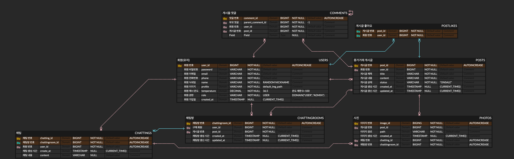
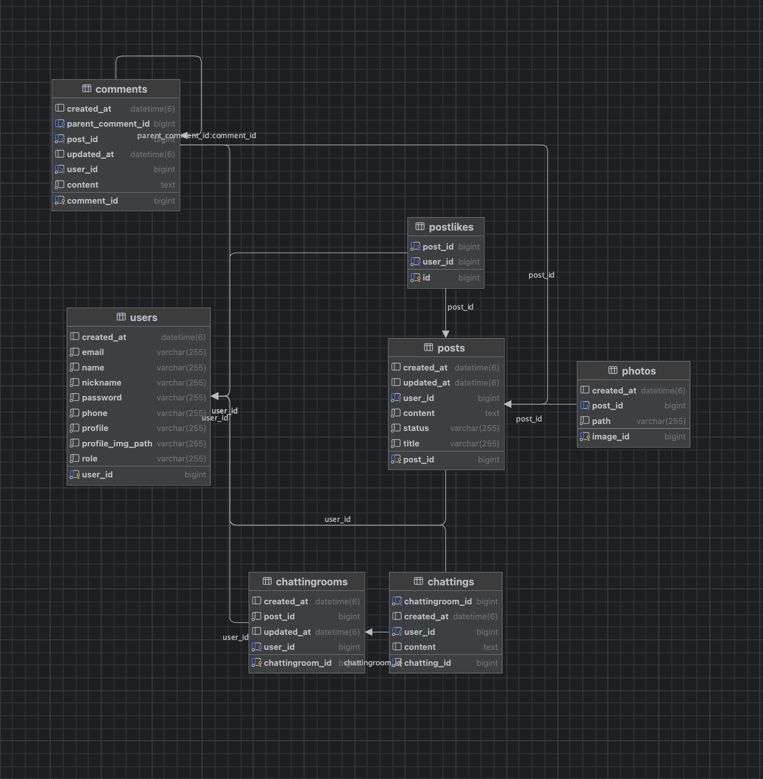
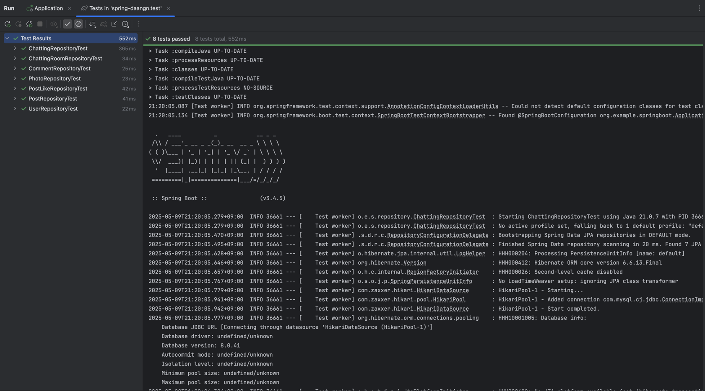
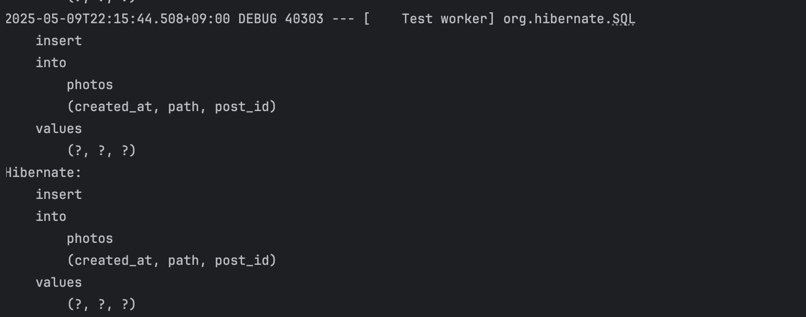
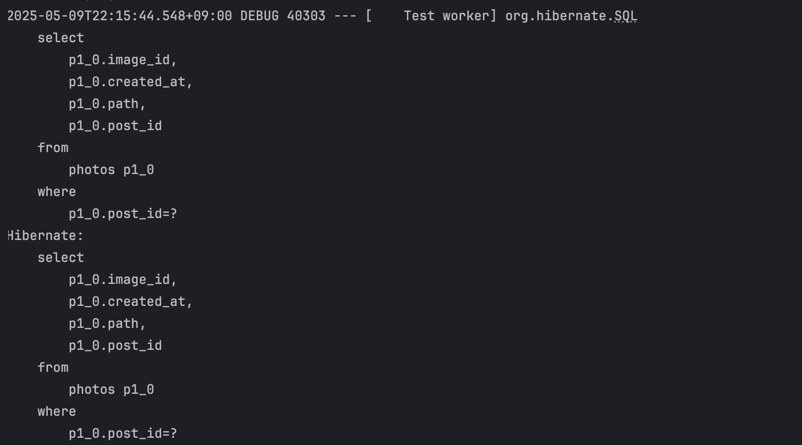

# 🌱 2주차 미션

## 1️⃣ 당근마켓의 DB를 모델링해요
#### 📌_ERDCLOUD

#### 📌_IntelliJ ERD


```
    📚 당근 ERD 설계 이유
```

```
   📌 회원
   - 당근은 회원가입시 핸드폰 번호가 필수이기 때문에 추가
   - 회원의 경우 email을 입력하지만 비밀번호를 입력하지 않지만 추후 로그인을 위해 추가
   - 프로필 이미지는 
   - profile 이미지는 1:1이기 때문에 경로를 user 테이블에 저장 
       -> Join을 하지 않아도 되기에 성능 개선
   
   📌 채팅 & 채팅방
   - 채팅은 2명의 유저와 게시글을 꼭 포함하는 상태이다.
   - 어차피 ChattingRooms에 post가 있고, post에 판매자 user가 있어서 실제로 1개만 존재
   - 채팅은 채팅방과 상대 유저와 생성 시간을 가져서 생성 시간으로 정렬해서 사용
   - 채팅방은 갱신 시간을 두어 최근 활동 채팅방을 위로 정렬할 수 있도록 설계
   
   📌 게시글
   - 게시글 또한 갱신 시간으로 최신순으로 정렬이 가능하게 구현
   - 제목, 상태, 내용, 판매자 user 데이터를 연결
   
   📌 사진
   - 각각의 게시글에 사진이 1:N으로 잡히기에 분리해서 저장
   - 각 사진은 게시글 ID를 외래키로 가지며, 추후 Join을 이용해 List로 관리
   
   📌 게시글 좋아요
   - 중고거래에서 관심있다는 표시의 하트를 구현
   - 각 하트는 게시글과 누른 사람으로 구성됨
   - 추후에 post_id에 대한 count()를 이용해 하트 수를 관리
   
   📌 댓글
   - 댓글은 대댓글이 가능하도록 부모 댓글을 가진다.
   - 댓글은 게시글에 종속적으로 설계되며 Self-Join 관계를 포함함
```

---
## 2️⃣ Repository 단위 테스트를 진행해요
### ✅ 총 8개의 테스트 코드를 작성


---
### 😛 Foreign Key Test : 중고 게시글이 사진을 여러개 가지는 것을 가정하고 테스트
```
    🫠 이미지를 특정 post에 3개를 넣고, post 조회시에 올바르게 조회되는지 검증
```

``` java
    @Test
    @DisplayName("게시물과 관련된 사진 등록 및 조회 테스트")
    public void testPostWithPhotos() {
        // given
        // 1. 게시물 생성
        Post post = Post.builder()
                .user(user1)
                .title("사진이 있는 게시물")
                .content("사진이 첨부된 게시물 내용입니다.")
                .status("판매중")
                .build();
        postRepository.save(post);

        // 2. 해당 게시물에 관련된 사진 3개 생성
        Photo photo1 = Photo.builder()
                .post(post)
                .path("/images/posts/photo1.jpg")
                .build();

        Photo photo2 = Photo.builder()
                .post(post)
                .path("/images/posts/photo2.jpg")
                .build();

        Photo photo3 = Photo.builder()
                .post(post)
                .path("/images/posts/photo3.jpg")
                .build();

        // when
        // 3. 사진들을 저장
        photoRepository.save(photo1);
        photoRepository.save(photo2);
        photoRepository.save(photo3);

        // 4. 게시물 ID로 게시물을 다시 조회
        Post retrievedPost = postRepository.findById(post.getPostId()).orElse(null);

        // 5. 게시물에 연결된 사진 목록 조회
        List<Photo> photos = photoRepository.findByPost(retrievedPost);

        // then
        // 6. 게시물이 null이 아닌지 확인
        assertThat(retrievedPost).isNotNull();

        // 7. 게시물의 제목이 올바른지 확인
        assertThat(retrievedPost.getTitle()).isEqualTo("사진이 있는 게시물");

        // 8. 사진 목록이 비어있지 않은지 확인
        assertThat(photos).isNotEmpty();

        // 9. 사진 목록의 크기가 3인지 확인
        assertThat(photos).hasSize(3);

        // 10. 각 사진의 경로가 올바른지 확인
        assertThat(photos).extracting("path")
                .containsExactlyInAnyOrder(
                        "/images/posts/photo1.jpg",
                        "/images/posts/photo2.jpg",
                        "/images/posts/photo3.jpg"
                );

        // 11. 모든 사진이 동일한 게시물을 참조하는지 확인
        assertThat(photos).allMatch(photo -> photo.getPost().getPostId().equals(post.getPostId()));
    }
```
---

## 📌 테스트를 수행할 때 발생하는 JPA 쿼리를 조회해보기

### ❇️ 데이터를 삽입하는 쿼리

---
### ❇️ 데이터를 조회하는 쿼리

---


## 👏🏻 추가 공부 : JPA 엔티티에서 @Data와 Setter 사용을 지양해야 하는 이유

### 1. @Data 어노테이션의 문제점

**@Data 어노테이션은 다음 기능을 모두 포함합니다:**
- `@Getter`
- `@Setter`
- `@ToString`
- `@EqualsAndHashCode`
- `@RequiredArgsConstructor`

이는 편리해 보이지만 JPA 엔티티에서는 심각한 문제를 일으킬 수 있습니다:

- **순환 참조(Circular Reference) 문제**: 양방향 연관관계가 있는 엔티티에서 `@ToString`이 기본적으로 모든 필드를 포함하므로 무한 순환 참조가 발생할 수 있습니다. 이는 `StackOverflowError`를 발생시킵니다.

- **부적절한 해시코드 구현**: `@EqualsAndHashCode`는 기본적으로 모든 필드를 사용하므로, 양방향 관계에서 또다시 순환 참조 문제가 발생합니다.

- **불필요한 Setter 노출**: 모든 필드에 대한 Setter 메서드가 생성되어 객체의 불변성(Immutability)을 해칩니다.

### 2. 무분별한 Setter 사용의 문제점

JPA 엔티티에서 무분별한 Setter 사용은 다음과 같은 문제를 야기합니다:

- **객체의 일관성 훼손**: 어디서든 객체의 상태를 변경할 수 있게 되어 객체가 항상 유효한 상태를 유지하기 어렵습니다.

- **의도하지 않은 상태 변경**: 여러 곳에서 Setter를 호출하면 객체의 상태 추적이 어려워져 버그 원인을 찾기 힘들게 됩니다.

- **JPA의 변경 감지(Dirty Checking) 메커니즘과의 충돌**: JPA는 엔티티의 변경을 감지하여 자동으로 업데이트 쿼리를 생성합니다. 무분별한 Setter 사용은 이 메커니즘을 예측하기 어렵게 만듭니다.

### 3. 더 나은 대안

#### Builder 패턴
```java
User user = User.builder()
    .email("user@example.com")
    .password("password")
    .name("사용자")
    // ...
    .build();
```

**장점:**
- 객체 생성 시 필요한 값만 명시적으로 설정
- 가독성 향상
- 불변 객체 생성 가능
- 필수 값 검증이 용이

#### 도메인 특화 메서드
필요한 상태 변경은 의미 있는 이름의 메서드로 구현:

```java
public void changePassword(String newPassword) {
    this.password = newPassword;
}

public void updateProfile(String profile) {
    this.profile = profile;
}
```

### 4. 객체 불변성의 중요성

불변성이 높은 객체는:

- **스레드 안전(Thread-safe)**: 여러 스레드에서 동시에 접근해도 안전합니다.
- **예측 가능한 동작**: 한번 생성된 객체의 상태가 변경되지 않으므로 코드의 예측 가능성이 높아집니다.
- **버그 감소**: 상태 변경이 명확한 메서드를 통해서만 이루어지므로 버그 발생 가능성이 줄어듭니다.

### 5. JPA 영속성 컨텍스트와의 조화

- JPA는 트랜잭션 내에서 엔티티의 변경을 감지하여 자동으로 데이터베이스에 반영합니다.
- 제한된 접근 방식(Builder + 도메인 메서드)은 이러한 변경이 언제, 어디서 일어나는지 명확하게 파악할 수 있게 해줍니다.
- 결과적으로 애플리케이션의 유지보수성과 안정성이 향상됩니다.

### 결론

JPA 엔티티에서는 `@Data` 대신 다음을 사용하는 것이 좋습니다:

- **`@Getter`**: 필드 접근용
- **`@NoArgsConstructor`**: JPA 요구사항
- **`@AllArgsConstructor` + `@Builder`**: 객체 생성 패턴
- **특정 필드에만 `@Setter` 또는 도메인 메서드**: 필요한 경우에만 제한적으로 사용
- **`@ToString(exclude = {...})`**: 순환 참조 방지
- **`@EqualsAndHashCode(of = "id")`**: 식별자 필드만 사용

이러한 접근 방식은 코드의 안정성, 가독성, 유지보수성을 크게 향상시킵니다.