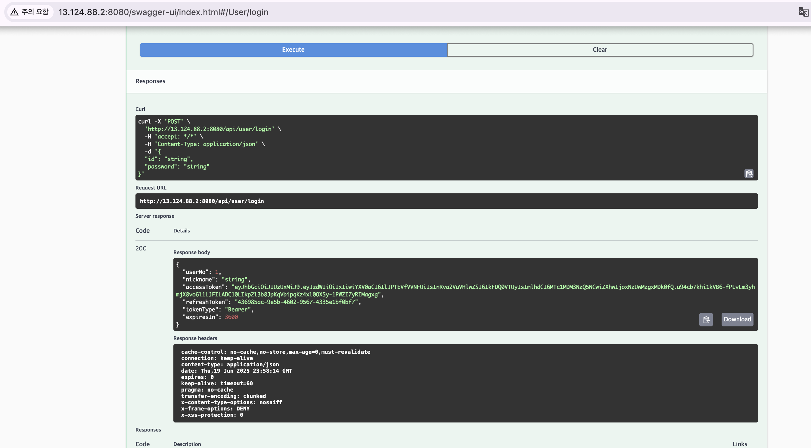

# 프로젝트명: 당근마켓 클론 코딩 (Daangn Clone)

## 📌 프로젝트 소개

- **프로젝트 이름**: 당근 클론코딩
- **한줄 소개**: 당근 서비스를 보고 DB 설계 및 JPA를 이용하여 레포지토리 작성, JUnit 테스트 진행
- **목표**: 서비스를 처음부터 직접 만들어보며, 다른 사람의 코드를 참고해 클린 코드에 대해 배우고자 함. 선택한 이유와 배경을 중심으로 고민하며 프로젝트를 진행함.

## 🗂️ ERD


## 🧩 주요 기능

### 🔸 카테고리

- 실제로는 `INSERT INTO` 쿼리로 직접 넣을 가능성이 높지만, JPA의 `save()` 메서드를 활용하여 작성 예정

### 🔸 채팅

- **Create**
- **Read**
  - 채팅방 아이디 기준으로 보낸 시간순 정렬 (최대 100개)

### 🔸 채팅방

- **Create**
- **Read**
  - 판매자 아이디 기준 생성일순 정렬
  - 구매자 아이디 기준 생성일순 정렬
  - 상품 기준 생성일순 정렬
  - 구매자 + 상품 기준 생성일순 정렬

### 🔸 중고거래 이미지

- **Create / Update / Delete**
- **Read**
  - 중고거래 상세 조회 시 함께 조회 (JPQL 사용 예정)

### 🔸 중고거래

- **Create / Update / Delete**
- **Read**
  - 판매자 아이디 기준 생성일순 리스트 조회
  - 제목 + 상세설명 키워드 검색
  - 특정 위도, 경도로부터 거리 N 이하 물품 조회
  - 중고거래 상세 보기

### 🔸 좋아요

- **Create / Delete**

### 🔸 중고거래 상태

- 실제 서비스에서는 직접 쿼리문 사용 예정이나, 본 프로젝트에서는 `save()`로 생성

### 🔸 검색

- **Create**

### 🔸 사용자

- **Create / Update / Delete**
- **Read**
  - 나의 정보 상세 보기

## 🛠 기술 스택

- Spring Boot
- JPA
- MySQL
- JUnit
- Lombok

## 🗂 프로젝트 구조

- `.env` 파일을 만들어 환경변수 관리


<br/>
<br/>
<br/>
<br/>
<br/>
<br/>
<br/>

# 3주차 과제

## [N+1문제 TEST]

### 1. laze로 그냥 불러왔을 때
```java
//레파지토리
List<Sale> findAll();

///테스트
@Test
@Transactional
public void problem() {
    List<Sale> sales = saleRepository.findAll();
    System.out.println("sales : " + sales);
    for (Sale sale : sales) {
        System.out.println(sale.getUser().getNickname()); // ← 여기서 추가 쿼리 N번 발생
    }
}
```
 - select문이 22개 나오는 것을 알 수 있다. 


### 2. fetch로 불러왔을 때
```java
//레파지토리
@Query("""
  SELECT DISTINCT s FROM Sale s
  JOIN FETCH s.user
  JOIN FETCH s.category
  JOIN FETCH s.status
""")
List<Sale> findAllWithUserCategoryStatus();

///테스트
@Test
@Transactional
public void solution() {
    List<Sale> sales = saleRepository.findAllWithUserCategoryStatus();
    for (Sale sale : sales) {
        System.out.println(sale.getUser().getNickname());
    }
}
```
 - select문이 2개 나오는 것을 알 수 있다. 


## [service 테스트]
- 채팅방 저장 및 삭제 테스트 


# 4주차 과제
## swagger


## 중고거래 게시판 테스트
- 이미지와 같이 들어가는 경우 swagger로 테스트가 잘 안되어서 post는 postman 사용하여 테스트 진행.

### post요청 보냄.


### 로컬에 이미지 잘 들어간거 확인 가능


### 다시 조회 시 화긴 가능


### delete요청

- 이미지도 함께 삭제 됨.


### 커스텀 에러 처리


# 5주차 과제 : 스프링 시큐리티

## 1. JWT 인증(Authentication) 방법
STUDY > auth_flow_summary.md 참고

## 2. 액세스 토큰 및 인증 인가

### 회원가입


### encoding된 password


### 로그인 시 액세스 토큰 발급


### 토큰 없이 채팅방 생성 시 인증 필요


### 토큰 인증 후 채팅방 생성 시 성공


### 리프레시 토큰 로그인


### 리프레시 토큰을 이용한 액세스 토큰 갱신


### 추가 하고싶은 일
- 로그아웃 시 액세스 토큰도 블랙리스트에 등록하기
- 토큰에 있는 user정보와 실제 api에 필요한 권한이 일치하는지 확인하는 filter추가
- 레디스에 올리고 쿠키에서 안보이게 하기


<br><br><br><br><br><br>

# 6주차 과제


## ✅ 개요

Spring Boot 프로젝트를 Docker 이미지로 만들고, Docker Compose를 이용해 **Spring Boot + MySQL** 환경을 로컬과 EC2에 배포하는 실습을 진행

---

## 🛠️ 작업 과정 정리

### 1. Spring Boot `jar` 파일 빌드

```bash
./gradlew build
```

* 결과물은 `build/libs/*.jar`로 생성됨

---

### 2. Dockerfile 작성

```Dockerfile
FROM openjdk:17
ARG JAR_FILE=build/libs/*.jar
COPY ${JAR_FILE} app.jar
ENTRYPOINT ["java", "-jar", "/app.jar"]
```

---

### 3. 로컬 Docker 이미지 빌드 및 실행

```bash
docker image build -t daangn-spring:0.2 .
```

---

### 4. 최초 문제: Spring만 단독 실행 시 DB 접근 실패

> **에러 메시지**

```
Caused by: org.hibernate.HibernateException: Unable to determine Dialect without JDBC metadata
```

> **원인**

* MySQL 없이 Spring만 실행 → DB 메타데이터를 읽을 수 없어 Hibernate가 Dialect를 유추하지 못함
* 즉, DB 컨테이너와 **연결되지 않아** 생긴 문제

---

### 5. Docker Compose 구성 및 개선

로컬 환경에서는 다음과 같은 `docker-compose.yml`을 작성하여 Spring과 MySQL을 **같은 네트워크에 배치**하고 **환경 변수로 연결 정보 전달**.

```yaml
services:
  spring:
    image: dlwngus3856/daangn-spring:0.2
    ports:
      - "8080:8080"
    environment:
      DB_HOST: mysql
      DB_PORT: 3306
      DB_NAME: daangn
      DB_USER: ssafy
      DB_PASSWORD: ssafy
      JWT_SECRET: (생략)
      JWT_VALIDITY: 3600
    depends_on:
      - mysql
    networks:
      - daangn-network

  mysql:
    image: mysql:8
    container_name: daangn-mysql
    ports:
      - "3306:3306"
    environment:
      MYSQL_DATABASE: daangn
      MYSQL_USER: ssafy
      MYSQL_PASSWORD: ssafy
      MYSQL_ROOT_PASSWORD: ssafy
      TZ: Asia/Seoul
    volumes:
      - mysql_data:/var/lib/mysql
    networks:
      - daangn-network

networks:
  daangn-network:

volumes:
  mysql_data:
```

> ✅ 위 설정을 통해 **포트포워딩 없이도 컨테이너 간 연결이 가능**
> `localhost:3307`이 아닌 내부 컨테이너 이름 `mysql:3306` 사용 가능
> Spring 환경변수 `DB_HOST=mysql`, `DB_PORT=3306` 지정

---

## 🧪 로컬 테스트 결과

```bash
docker compose up -d
```

* Spring + MySQL 컨테이너가 잘 실행됨
* `localhost:8080`에서 서버 정상 확인
* DB 연결 및 마이그레이션도 성공 → 로컬에서는 전체 시스템 문제 없음

---

## ☁️ EC2 서버에서 발생한 문제

### 1. `docker compose` 명령 사용 불가

* `docker compose` 명령어가 기본으로 안 됨 → 수동 설치 필요

```bash
COMPOSE_VERSION="v2.27.0"
sudo mkdir -p /usr/local/lib/docker/cli-plugins
sudo curl -SL https://github.com/docker/compose/releases/download/${COMPOSE_VERSION}/docker-compose-linux-x86_64 \
  -o /usr/local/lib/docker/cli-plugins/docker-compose
sudo chmod +x /usr/local/lib/docker/cli-plugins/docker-compose
docker compose version
```

### 2. 터미널 프리징 현상

* `docker compose up` 후 터미널이 **입출력 정지**
* `docker ps`도 안 되고, SSH 세션이 완전히 멈춤
* **원인 의심**:

  * EC2 사양 부족 (t2.micro, 1GB RAM)
  * Docker 로그 과다 → 로그 제한 옵션도 고려
  * 디스크 I/O 병목

### 해결방법
1. 스왑메모리 사용(4gb)
2. RDS 사용 -> mysql은 ec2에 안올리고 안돌림


### 3. 임시 해결 시도

* EC2 종료 → 재시작 반복
* 인스턴스 스펙 업 (스토리지 증가, 메모리 여유 확보)
* 도커 로그 제한 옵션도 향후 도입 고려


## ddl-auto가 create여서 두번째 실행할 때 drop하고 하려해서 참조키 에러 남
### 해결방법
ddl-auto를 validate로 바꿈  
-> 그러면 스키마가 자동으로 만들어지지 않는 문제 발생  
-> spring을 올리기전에 rds에 접속해서 ddl을 직접 실행함


## docker-compose에 mysql필요없어짐
때문에 이렇게 compose수정함(DB_HOST를 rds로 수정)
```docker
services:
  spring:
    image: dlwngus3856/daangn-spring:0.2
    ports:
      - "8080:8080"
    environment:
      DB_HOST: database-1.**************.ap-**************-2.rds.amazonaws.com(RDS의 DNS)
      DB_PORT: 3306
      DB_NAME: daangn
      DB_USER: ssafy
      DB_PASSWORD: ssafy123
      JWT_SECRET: ...
      JWT_VALIDITY: ...
    restart: always
    networks:
      - daangn-network

networks:
  daangn-network:

```


---

## 💡 결론 및 회고

| 구분     | 결과 및 인사이트                                                                                           |
| ------ | --------------------------------------------------------------------------------------------------- |
| 로컬 테스트 | Docker Compose 기반 Spring + MySQL 완벽 실행 성공                                                           |
| EC2 도전 | 시스템 자원 부족으로 인해 지속적인 프리징 및 실행 실패                                                                     |
| 개선 방향  | <ul><li>RDS로 DB 분리</li><li>EC2는 Spring만 실행</li><li>로그 제한 설정 도입</li></ul>                            |
| 학습한 점  | <ul><li>Docker 네트워크 설정 및 환경변수 연동</li><li>컨테이너 간 연결 방식의 차이</li><li>Docker Compose 설치 트러블슈팅</li></ul> |

---

## 📌 다음 단계
* 민감정보 compose파일에 안넣고 할 수 있나?
* Nginx 연동 + HTTPS 인증서 적용
* `docker-compose.yml`에 `logging.driver`, `max-size` 옵션 추가
* 사실 오브젝트 스토리지는 안해서 사진 안올라가지롱


## 느낀점
배포는...너무...어렵다...ㅠㅜ
뭔가 하긴 했는데 아직도 잘 모르겠어요...

그래도 형준이가 엄청 잘 정리해줘서 겨우 따라갔다...

내가 막힌걸 형준이 노션보고 다 해결했다...

형준이는 신이다...


## api실행 화면
