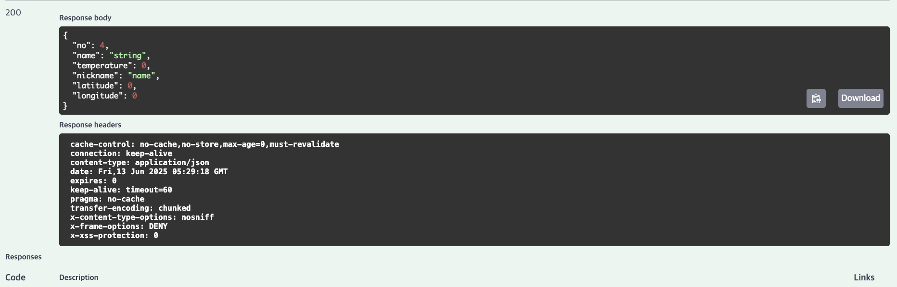

# Spring Daangn

- 카테고리

  - 실제로는 insert into구문 직접 칠 가능성 높음
  - 하지만 jpa레파지토리에서 제공하는 save함수 사용하여 만들 예정

- 채팅

  - create
  - read
    - 채팅방 아이디 기준으로 보낸 시간으로 정렬해서 읽어오기(최대 100개)

- 채팅방

  - create
  - read
    - 판매자 아이디 기준으로 생성된 시간으로 정렬해서 읽어오기
    - 구매자 아이디 기준으로 생성된 시간으로 정렬해서 읽어오기
    - 상품을 기준으로 생성된 시간을 기준으로 정렬해서 읽어오기
    - 구매자 아이디, 상품 기준으로 생성된 시간 기준 정렬

- 중고거래 이미지

  - create
  - read
    - read는 중고거래 detail에서 함께 가져올 예정(jpql사용 예정)
  - update
  - delete

- 중고거래

  - create
  - read
    - 판매자 아이디 기준 생성된 시간으로 정렬해서 list읽어오기
    - 제목, 상세설명 기준으로 검색해서 list
    - 특정 위도, 경도로부터 차이가 n이하인 판매물품 가져오기
    - 중고거래 상세 보기
  - update
  - delete

- 좋아요

  - create
  - delete

- 중고거래 상태

  - 실제로는 쿼리문으로 할 예정
  - 하지만 난 create로 넣을듯?

- 검색

  - create

- 사용자
  - create
  - read
    - 나의 정보 상세보기
  - update
  - delete

당근 기능 명세

서비스 1 : 사용자

- 매너온도
- 지역
- 닉네임
- 아이디
- 비밀번호
- 주소
- 연락처
- 이메일

서비스 1-2 : 특정 사람이 파는 매물

서비스 1-3 : 특정 사람이 남긴 거래 후기

---

서비스 2 : 중고거래

- 지역
- 카테고리
- 최초 가격
- 할인율
- 끌올 시간
- 작성 시간
- 수정 시간
- 제목
- 사진
- 대표사진
- 관심수
- 조회수
- 채팅수

서비스 2-2 : 인기매물

서비스 2-3 : 채팅

- 보낸 시간
- 읽음 여부
- 메시지

- 보낸사람
- 받은사람
- 채팅방 이름

서비스 3 : 인기 검색어

- 검색어
- 검색횟수

---

참고...공부중...

✅ 의존성 스코프 정리
| 스코프 | 의미 및 용도 |
| --------------------- | ---------------------------------------------------------------- |
| `implementation` | **프로덕션 코드와 테스트 코드에서 모두 사용 가능**한 의존성. 외부에 노출 안 됨. 가장 일반적인 의존성 설정. |
| `compileOnly` | **컴파일 시에만 필요**하고, **실행 시엔 없어도 되는** 의존성. 대표적으로 `lombok` |
| `annotationProcessor` | **애노테이션 처리기**를 위한 설정. `lombok`이나 `mapstruct` 사용 시 필수 |
| `developmentOnly` | **개발 환경에서만 동작**해야 하는 의존성 (예: `spring-boot-devtools`) |
| `testImplementation` | **테스트 코드에서만 사용**되는 의존성 (예: `JUnit`, `MockMvc`) |
| `testRuntimeOnly` | 테스트할 때 **실행 시에만 필요한 의존성** (보통 잘 쓰지 않음, 특정 런처만 필요할 때 사용) |
