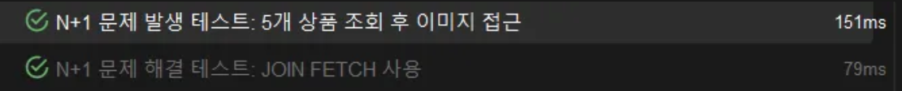
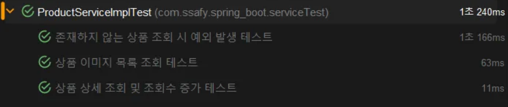
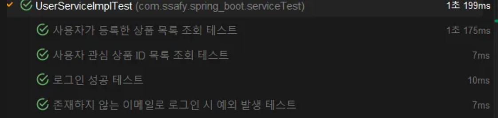

# 3주차 과제 일지

# .env

DB 정보를 .env 에  gitIgnore로 숨겼다

### 1️⃣ 당근마켓의 서비스 코드를 작성해요

# service 만들기!

있어야 할 서비스 생각해보기

## 사용자

- 아이디, 비밀번호로 로그인
- 사용자 id로 사용자 detail 가져오기
- 사용자 메너온도계산하기
- 사용자가 올린 중고상품 확인하기
- 사용자가 사용중인 채팅방 보기
- 사용자가 관심있는 중고상품 id 보기
- 사용자의 지역 id로 지역 조인하기

## 중고상품

- 중고 상품 아이디로 검색하기
- 검색한것에서 상품사진 1+N 불러오기
- 상품 카테고리 1+N 불러오기

>> 이후 1+N 문제 쿼리 최적화 해보기

- 중고상품에 달려있는 댓글보기

## 채팅방

- 해당 채팅방을 사용하는 채팅내용 불러오기

## JPA Repository에서는 Entity를 반환할까, DTO를 반환할까?

### ✨ 일반적인 원칙

- 기본은 Entity 반환

서비스 계층에서 비지니스 로직을 처리하기 위해 Entity를 반환하고 Service 계층에서 DTO로 변환

## 그렇다면 Service에서 Entity가 아니라 DTO를 어떻게 반환해?

- DTO를 만들때 보통 from() 메서드를 구현한다.

### ✨ from()를 만드는 이유

- Entity → DTO 변환을 쉽게 하기 위해서
- 중복 제거
- 변경에 강함
- 텍스트, 가독성, 분리

- Entity → DTO 변환 담당 유틸 메서드!

```jsx
package com.ssafy.spring_boot.product.dto;

import com.ssafy.spring_boot.product.domain.Product;
import lombok.Builder;
import lombok.Getter;

import java.time.LocalDateTime;

@Getter
@Builder
public class ProductDTO {
    private Long id;
    private String title;
    private String thumbnail;
    private String description;
    private Integer price;
    private LocalDateTime createdAt;
    private Integer dumpTime;

    private Boolean isReserved;
    private Boolean isCompleted;
    private Boolean isNegotiable;

    private Long chatCount;
    private Long viewCount;
    private Long favoriteCount;

    private Integer sellerId;
    private String sellerNickname;

    private Integer categoryId;
    private String categoryName;

    private Integer regionId;
    private String regionName;

    // Entity -> DTO 변환 메소드 추가
    public static ProductDTO from(Product product) {
        return ProductDTO.builder()
                .id(product.getId())
                .title(product.getTitle())
                .thumbnail(product.getThumbnail())
                .description(product.getDescription())
                .price(product.getPrice())
                .createdAt(product.getCreatedAt())
                .dumpTime(product.getDumpTime())
                .isReserved(product.getIsReserved())
                .isCompleted(product.getIsCompleted())
                .isNegotiable(product.getIsNegotiable())
                .chatCount(product.getChatCount())
                .viewCount(product.getViewCount())
                .favoriteCount(product.getFavoriteCount())
                .sellerId(product.getSeller().getId())
                .sellerNickname(product.getSeller().getNickname())
                .categoryId(product.getCategory().getId())
                .categoryName(product.getCategory().getType())
                .regionId(product.getRegion().getId())
                .regionName(product.getRegion().getName())
                .build();
    }
}
```

DTO 예시 하나

### 2️⃣ Repository 계층의 테스트를 진행해요

이번 세션에서 배운 연관관계 매핑 및 N+1 문제에 대한 테스팅을 꼭 포함해주세요

JPA 관련 테스팅을 해야하기 때문에 @DataJpaTest 또는 @SpringBootTest 를 사용해서 테스트를 진행해주세요

## 먼저 결과부터



- 5개 뿐이었는데 속도가 2배이상 차이가난다…

### 테스트 데이터 준비

```jsx
    @BeforeEach
    void setUp() {
        // 테스트 데이터 준비
        region = regionRepository.save(Region.builder().name("서울").build());
        category = categoryRepository.save(Category.builder().type("전자기기").build());
        seller = userRepository.save(
                User.builder()
                        .region(region)
                        .nickname("판매자")
                        .temperature(36.5)
                        .build()
        );

        // 5개의 상품 생성
        String[] productNames = {"아이폰", "갤럭시", "맥북", "아이패드", "애플워치"};
        for (int p = 0; p < 5; p++) {
            Product product = productRepository.save(Product.builder()
                    .title(productNames[p])
                    .thumbnail("thumbnail_" + p + ".jpg")
                    .category(category)
                    .region(region)
                    .seller(seller)
                    .price(1000000 - p * 100000)
                    .description(productNames[p] + " 상품입니다")
                    .build());

            products.add(product);

            // 각 상품마다 5개의 이미지 저장
            for (int i = 0; i < 5; i++) {
                imageRepository.save(Image.builder()
                        .product(product)
                        .imageUrl(productNames[p] + "_image" + i + ".jpg")
                        .order(i)
                        .build());
            }
        }

        // 영속성 컨텍스트 초기화
        em.flush();
        em.clear();

        System.out.println("======= 테스트 데이터 설정 완료: 상품 5개, 각 상품당 이미지 5개 =======");
    }
```

먼저 N+1 문제를 확인하기위해 5개의 연관관계 매핑이 들어가도록 setup 했다.

# N+1 문제

```jsx
@Test
    @DisplayName("N+1 문제 발생 테스트: 5개 상품 조회 후 이미지 접근")
    void testNPlus1Problem() {
        // when - 1개의 쿼리 실행 (상품 조회)
        System.out.println("\n\n======= 상품 목록 조회 시작 (1개의 쿼리 예상) =======");
        List<Product> allProducts = productRepository.findAll();
        System.out.println("======= 상품 목록 조회 완료: " + allProducts.size() + "개 상품 =======\n");

        // then
        assertThat(allProducts).hasSize(5);

        // N개의 쿼리 추가 실행 (각 상품의 이미지 조회 - N+1 문제)
        System.out.println("\n======= 이미지 접근 시작 (N+1 문제: 5개의 추가 쿼리 예상) =======");
        int productCount = 0;
        for (Product p : allProducts) {
            productCount++;
            System.out.println("\n----- 상품 " + productCount + ": " + p.getTitle() + " 의 이미지 조회 시작 -----");
            // 이미지 접근 시 추가 쿼리 발생 (N+1 문제)
            List<Image> images = imageRepository.findAllByProduct_Id(p.getId());
            assertThat(images).hasSize(5);

            // 이미지 URL 출력 (실제 데이터 접근)
            System.out.println(p.getTitle() + "의 이미지 " + images.size() + "개:");
            images.forEach(image -> System.out.println("  - " + image.getImageUrl()));
            System.out.println("----- 상품 " + productCount + "의 이미지 조회 완료 -----");
        }
        System.out.println("\n======= 이미지 접근 완료 (총 1 + 5 = 6개 쿼리 실행됨) =======");
    }
```

```jsx

======= 상품 목록 조회 시작 (1개의 쿼리 예상) =======
2025-05-16T16:55:23.224+09:00 DEBUG 15340 --- [           main] org.hibernate.SQL                        : select p1_0.id,p1_0.category_id,p1_0.chat_count,p1_0.created_at,p1_0.description,p1_0.dump_time,p1_0.favorite_count,p1_0.is_completed,p1_0.is_negotiable,p1_0.is_reserved,p1_0.price,p1_0.region_id,p1_0.seller_id,p1_0.thumbnail,p1_0.title,p1_0.view_count from product p1_0
Hibernate: select p1_0.id,p1_0.category_id,p1_0.chat_count,p1_0.created_at,p1_0.description,p1_0.dump_time,p1_0.favorite_count,p1_0.is_completed,p1_0.is_negotiable,p1_0.is_reserved,p1_0.price,p1_0.region_id,p1_0.seller_id,p1_0.thumbnail,p1_0.title,p1_0.view_count from product p1_0
======= 상품 목록 조회 완료: 5개 상품 =======

======= 이미지 접근 시작 (N+1 문제: 5개의 추가 쿼리 예상) =======

----- 상품 1: 아이폰 의 이미지 조회 시작 -----
2025-05-16T16:55:23.241+09:00 DEBUG 15340 --- [           main] org.hibernate.SQL                        : select i1_0.id,i1_0.image_url,i1_0.`order`,i1_0.product_id from image i1_0 left join product p1_0 on p1_0.id=i1_0.product_id where p1_0.id=?
Hibernate: select i1_0.id,i1_0.image_url,i1_0.`order`,i1_0.product_id from image i1_0 left join product p1_0 on p1_0.id=i1_0.product_id where p1_0.id=?
아이폰의 이미지 5개:
  - 아이폰_image0.jpg
  - 아이폰_image1.jpg
  - 아이폰_image2.jpg
  - 아이폰_image3.jpg
  - 아이폰_image4.jpg
----- 상품 1의 이미지 조회 완료 -----

----- 상품 2: 갤럭시 의 이미지 조회 시작 -----
2025-05-16T16:55:23.246+09:00 DEBUG 15340 --- [           main] org.hibernate.SQL                        : select i1_0.id,i1_0.image_url,i1_0.`order`,i1_0.product_id from image i1_0 left join product p1_0 on p1_0.id=i1_0.product_id where p1_0.id=?
Hibernate: select i1_0.id,i1_0.image_url,i1_0.`order`,i1_0.product_id from image i1_0 left join product p1_0 on p1_0.id=i1_0.product_id where p1_0.id=?
갤럭시의 이미지 5개:
  - 갤럭시_image0.jpg
  - 갤럭시_image1.jpg
  - 갤럭시_image2.jpg
  - 갤럭시_image3.jpg
  - 갤럭시_image4.jpg
----- 상품 2의 이미지 조회 완료 -----

----- 상품 3: 맥북 의 이미지 조회 시작 -----
2025-05-16T16:55:23.250+09:00 DEBUG 15340 --- [           main] org.hibernate.SQL                        : select i1_0.id,i1_0.image_url,i1_0.`order`,i1_0.product_id from image i1_0 left join product p1_0 on p1_0.id=i1_0.product_id where p1_0.id=?
Hibernate: select i1_0.id,i1_0.image_url,i1_0.`order`,i1_0.product_id from image i1_0 left join product p1_0 on p1_0.id=i1_0.product_id where p1_0.id=?
맥북의 이미지 5개:
  - 맥북_image0.jpg
  - 맥북_image1.jpg
  - 맥북_image2.jpg
  - 맥북_image3.jpg
  - 맥북_image4.jpg
----- 상품 3의 이미지 조회 완료 -----

----- 상품 4: 아이패드 의 이미지 조회 시작 -----
2025-05-16T16:55:23.254+09:00 DEBUG 15340 --- [           main] org.hibernate.SQL                        : select i1_0.id,i1_0.image_url,i1_0.`order`,i1_0.product_id from image i1_0 left join product p1_0 on p1_0.id=i1_0.product_id where p1_0.id=?
Hibernate: select i1_0.id,i1_0.image_url,i1_0.`order`,i1_0.product_id from image i1_0 left join product p1_0 on p1_0.id=i1_0.product_id where p1_0.id=?
아이패드의 이미지 5개:
  - 아이패드_image0.jpg
  - 아이패드_image1.jpg
  - 아이패드_image2.jpg
  - 아이패드_image3.jpg
  - 아이패드_image4.jpg
----- 상품 4의 이미지 조회 완료 -----

----- 상품 5: 애플워치 의 이미지 조회 시작 -----
2025-05-16T16:55:23.257+09:00 DEBUG 15340 --- [           main] org.hibernate.SQL                        : select i1_0.id,i1_0.image_url,i1_0.`order`,i1_0.product_id from image i1_0 left join product p1_0 on p1_0.id=i1_0.product_id where p1_0.id=?
Hibernate: select i1_0.id,i1_0.image_url,i1_0.`order`,i1_0.product_id from image i1_0 left join product p1_0 on p1_0.id=i1_0.product_id where p1_0.id=?
애플워치의 이미지 5개:
  - 애플워치_image0.jpg
  - 애플워치_image1.jpg
  - 애플워치_image2.jpg
  - 애플워치_image3.jpg
  - 애플워치_image4.jpg
----- 상품 5의 이미지 조회 완료 -----

======= 이미지 접근 완료 (총 1 + 5 = 6개 쿼리 실행됨) =======
```

1개의 상품 조회 쿼리 실행후

5개의 상품에 대하여 각각 이미지 조회 쿼리를 실행한다

결국 1+5개의 쿼리가 발생하게 된다.

# JOIN FETCH 사용

```jsx
    @Test
    @DisplayName("N+1 문제 해결 테스트: JOIN FETCH 사용")
    void testSolveNPlus1WithJoinFetch() {
        System.out.println("\n\n======= JOIN FETCH로 상품과 연관 엔티티 함께 조회 시작 (1개의 쿼리 예상) =======");
        List<Product> productsWithDetails = em.createQuery(
                        "SELECT DISTINCT p FROM Product p " +
                                "JOIN FETCH p.seller " +
                                "JOIN FETCH p.category " +
                                "JOIN FETCH p.region", Product.class)
                .getResultList();
        System.out.println("======= JOIN FETCH 조회 완료: " + productsWithDetails.size() + "개 상품 =======\n");

        assertThat(productsWithDetails).hasSize(5);

        // 이미지 조회를 위한 단일 쿼리 사용
        System.out.println("\n======= 이미지 한번에 조회 시작 (1개의 쿼리 예상) =======");
        List<Long> productIds = productsWithDetails.stream()
                .map(Product::getId)
                .collect(Collectors.toList());

        List<Image> allImages = em.createQuery(
                        "SELECT i FROM Image i WHERE i.product.id IN :productIds ORDER BY i.product.id, i.order", Image.class)
                .setParameter("productIds", productIds)
                .getResultList();
        System.out.println("======= 이미지 조회 완료: " + allImages.size() + "개 이미지 =======\n");

        assertThat(allImages).hasSize(25); // 5개 상품 * 5개 이미지

        // 결과 표시
        Map<Long, List<Image>> imagesByProductId = allImages.stream()
                .collect(Collectors.groupingBy(image -> image.getProduct().getId()));

        System.out.println("\n======= 그룹화된 이미지 정보 =======");
        for (Product p : productsWithDetails) {
            List<Image> images = imagesByProductId.get(p.getId());
            System.out.println(p.getTitle() + "의 이미지 " + images.size() + "개:");
            images.forEach(image -> System.out.println("  - " + image.getImageUrl()));
            assertThat(images).hasSize(5);
        }
        System.out.println("\n======= JOIN FETCH 테스트 완료 (총 쿼리 2개 실행됨) =======");
    }
```

```jsx
======= JOIN FETCH로 상품과 연관 엔티티 함께 조회 시작 (1개의 쿼리 예상) =======
2025-05-16T16:55:23.329+09:00 DEBUG 15340 --- [           main] org.hibernate.SQL                        : select distinct p1_0.id,p1_0.category_id,c1_0.id,c1_0.type,p1_0.chat_count,p1_0.created_at,p1_0.description,p1_0.dump_time,p1_0.favorite_count,p1_0.is_completed,p1_0.is_negotiable,p1_0.is_reserved,p1_0.price,p1_0.region_id,r1_0.id,r1_0.name,p1_0.seller_id,s1_0.id,s1_0.create_at,s1_0.email,s1_0.nickname,s1_0.password,s1_0.phone,s1_0.profile_url,s1_0.region_id,s1_0.temperature,s1_0.update_at,p1_0.thumbnail,p1_0.title,p1_0.view_count from product p1_0 join users s1_0 on s1_0.id=p1_0.seller_id join category c1_0 on c1_0.id=p1_0.category_id join region r1_0 on r1_0.id=p1_0.region_id
Hibernate: select distinct p1_0.id,p1_0.category_id,c1_0.id,c1_0.type,p1_0.chat_count,p1_0.created_at,p1_0.description,p1_0.dump_time,p1_0.favorite_count,p1_0.is_completed,p1_0.is_negotiable,p1_0.is_reserved,p1_0.price,p1_0.region_id,r1_0.id,r1_0.name,p1_0.seller_id,s1_0.id,s1_0.create_at,s1_0.email,s1_0.nickname,s1_0.password,s1_0.phone,s1_0.profile_url,s1_0.region_id,s1_0.temperature,s1_0.update_at,p1_0.thumbnail,p1_0.title,p1_0.view_count from product p1_0 join users s1_0 on s1_0.id=p1_0.seller_id join category c1_0 on c1_0.id=p1_0.category_id join region r1_0 on r1_0.id=p1_0.region_id
======= JOIN FETCH 조회 완료: 5개 상품 =======

======= 이미지 한번에 조회 시작 (1개의 쿼리 예상) =======
2025-05-16T16:55:23.336+09:00 DEBUG 15340 --- [           main] org.hibernate.SQL                        : select i1_0.id,i1_0.image_url,i1_0.`order`,i1_0.product_id from image i1_0 where i1_0.product_id in (?,?,?,?,?) order by i1_0.product_id,i1_0.`order`
Hibernate: select i1_0.id,i1_0.image_url,i1_0.`order`,i1_0.product_id from image i1_0 where i1_0.product_id in (?,?,?,?,?) order by i1_0.product_id,i1_0.`order`
======= 이미지 조회 완료: 25개 이미지 =======

======= 그룹화된 이미지 정보 =======
아이폰의 이미지 5개:
  - 아이폰_image0.jpg
  - 아이폰_image1.jpg
  - 아이폰_image2.jpg
  - 아이폰_image3.jpg
  - 아이폰_image4.jpg
갤럭시의 이미지 5개:
  - 갤럭시_image0.jpg
  - 갤럭시_image1.jpg
  - 갤럭시_image2.jpg
  - 갤럭시_image3.jpg
  - 갤럭시_image4.jpg
맥북의 이미지 5개:
  - 맥북_image0.jpg
  - 맥북_image1.jpg
  - 맥북_image2.jpg
  - 맥북_image3.jpg
  - 맥북_image4.jpg
아이패드의 이미지 5개:
  - 아이패드_image0.jpg
  - 아이패드_image1.jpg
  - 아이패드_image2.jpg
  - 아이패드_image3.jpg
  - 아이패드_image4.jpg
애플워치의 이미지 5개:
  - 애플워치_image0.jpg
  - 애플워치_image1.jpg
  - 애플워치_image2.jpg
  - 애플워치_image3.jpg
  - 애플워치_image4.jpg

======= JOIN FETCH 테스트 완료 (총 쿼리 2개 실행됨) =======
```

와우..  1개의 쿼리만으로 모든 이미지를 조회해 버렸다

엄청나다

### 3️⃣ Service 계층의 단위 테스트를 진행해요

비즈니스 로직을 제대로 구현하였는지 확인하기 위해 `Service` 계층의 단위 테스트를 작성해봅시다!

## ProductServiceImple 테스트
```java
 @Test
    @DisplayName("상품 이미지 목록 조회 테스트")
    void getProductImagesTest() {
        // given
        Product product = Product.builder()
                .id(1L)
                .title("아이폰")
                .build();

        Image image1 = Image.builder()
                .id(1L)
                .product(product)
                .imageUrl("image1.jpg")
                .order(1)
                .build();

        Image image2 = Image.builder()
                .id(2L)
                .product(product)
                .imageUrl("image2.jpg")
                .order(2)
                .build();

        List<Image> images = Arrays.asList(image1, image2);

        when(imageRepository.findAllByProduct_Id(1L)).thenReturn(images);

        // when
        List<ImageDTO> result = productService.getProductImages(1L);

        // then
        assertThat(result).hasSize(2);
        assertThat(result.get(0).getImageUrl()).isEqualTo("image1.jpg");
        assertThat(result.get(1).getImageUrl()).isEqualTo("image2.jpg");

        verify(imageRepository).findAllByProduct_Id(1L);
    }
```
1. 상품 상세 조회 및 조회수 증가
2. 존재하지 않는 상품 조회 시 예외 발생
3. 상품 이미지 목록 조회



## UserServiceImpl 테스트

1. 로그인 성공
2. 존재하지 않는 이메일로 로그인 시 예외 발생
3. 사용자가 등록한 상품 목록 조회
4. 사용자 관심 상품 ID 목록 조회

