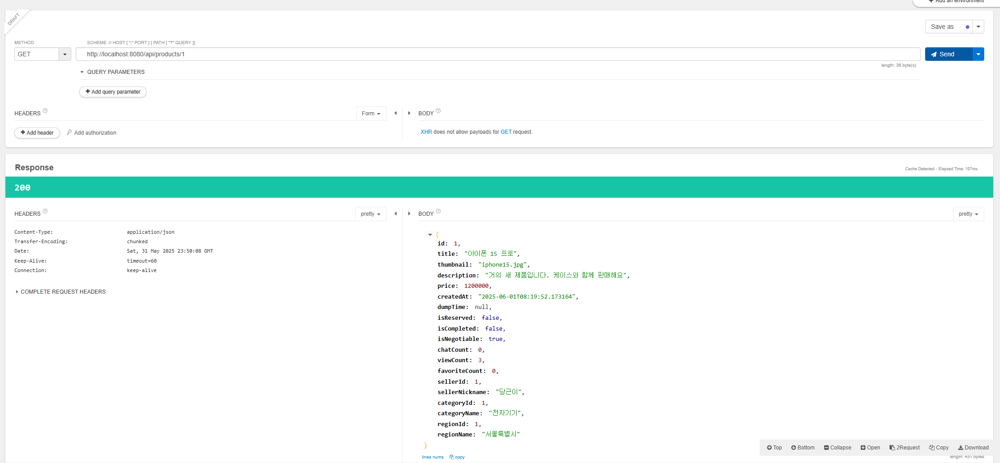
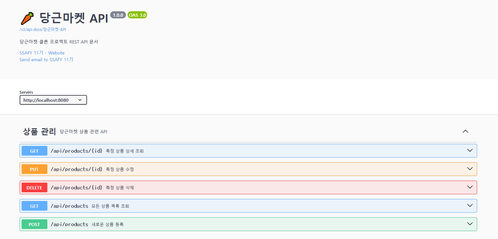
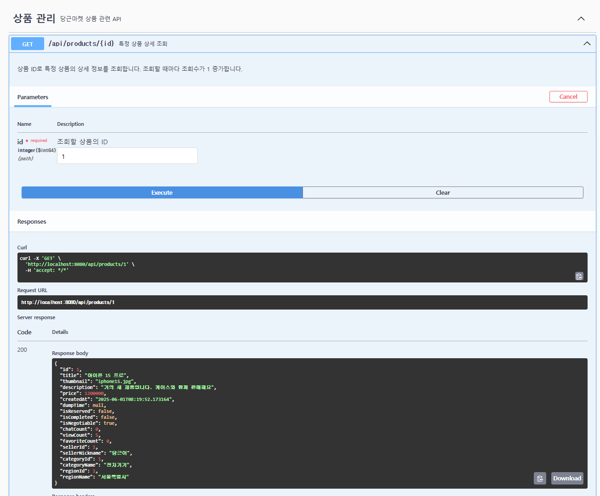
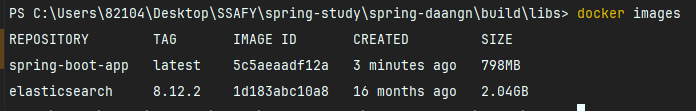

# 당근마켓의 4가지 HTTP Method API 만들기

## 이후 과제로 있던 Global Exception과 Swagger 연동후 만든 ProductController

```java
package com.ssafy.spring_boot.product.controller;

import com.ssafy.spring_boot.product.dto.ProductCreateRequestDTO;
import com.ssafy.spring_boot.product.dto.ProductDTO;
import com.ssafy.spring_boot.product.service.ProductService;
import io.swagger.v3.oas.annotations.Operation;
import io.swagger.v3.oas.annotations.Parameter;
import io.swagger.v3.oas.annotations.responses.ApiResponse;
import io.swagger.v3.oas.annotations.responses.ApiResponses;
import io.swagger.v3.oas.annotations.tags.Tag;
import lombok.RequiredArgsConstructor;
import org.springframework.http.HttpStatus;
import org.springframework.http.ResponseEntity;
import org.springframework.web.bind.annotation.*;

import java.util.List;

@RestController
@RequestMapping("/api/products")
@RequiredArgsConstructor
@Tag(name = "상품 관리", description = "당근마켓 상품 관련 API")
public class ProductController {

    private final ProductService productService;

    @Operation(summary = "새로운 상품 등록", description = "새로운 중고상품을 등록합니다.")
    @ApiResponses(value = {
            @ApiResponse(responseCode = "201", description = "상품 등록 성공"),
            @ApiResponse(responseCode = "400", description = "잘못된 요청 데이터"),
            @ApiResponse(responseCode = "404", description = "판매자, 카테고리 또는 지역을 찾을 수 없음")
    })
    @PostMapping
    public ResponseEntity<ProductDTO> createProduct(@RequestBody ProductCreateRequestDTO requestDTO) {
        ProductDTO createdProduct = productService.createProduct(requestDTO);
        return ResponseEntity.status(HttpStatus.CREATED).body(createdProduct);
    }

    @Operation(summary = "모든 상품 목록 조회", description = "등록된 모든 상품 목록을 조회합니다.")
    @ApiResponse(responseCode = "200", description = "조회 성공")
    @GetMapping
    public ResponseEntity<List<ProductDTO>> getAllProducts() {
        List<ProductDTO> products = productService.getAllProducts();
        return ResponseEntity.ok(products);
    }

    @Operation(summary = "특정 상품 상세 조회", description = "상품 ID로 특정 상품의 상세 정보를 조회합니다. 조회할 때마다 조회수가 1 증가합니다.")
    @ApiResponses(value = {
            @ApiResponse(responseCode = "200", description = "조회 성공"),
            @ApiResponse(responseCode = "404", description = "상품을 찾을 수 없음")
    })
    @GetMapping("/{id}")
    public ResponseEntity<ProductDTO> getProductById(
            @Parameter(description = "조회할 상품의 ID", required = true)
            @PathVariable Long id) {
        ProductDTO product = productService.getProductDetail(id);
        return ResponseEntity.ok(product);
    }

    @Operation(summary = "특정 상품 삭제", description = "상품 ID로 특정 상품을 삭제합니다.")
    @ApiResponses(value = {
            @ApiResponse(responseCode = "204", description = "삭제 성공"),
            @ApiResponse(responseCode = "404", description = "상품을 찾을 수 없음")
    })
    @DeleteMapping("/{id}")
    public ResponseEntity<Void> deleteProduct(
            @Parameter(description = "삭제할 상품의 ID", required = true)
            @PathVariable Long id) {
        productService.deleteProduct(id);
        return ResponseEntity.noContent().build();
    }

    @Operation(summary = "특정 상품 수정", description = "상품 ID로 특정 상품의 정보를 수정합니다.")
    @ApiResponses(value = {
            @ApiResponse(responseCode = "200", description = "수정 성공"),
            @ApiResponse(responseCode = "404", description = "상품을 찾을 수 없음"),
            @ApiResponse(responseCode = "400", description = "잘못된 요청 데이터")
    })
    @PutMapping("/{id}")
    public ResponseEntity<ProductDTO> updateProduct(
            @Parameter(description = "수정할 상품의 ID", required = true)
            @PathVariable Long id,
            @RequestBody ProductCreateRequestDTO requestDTO) {
        ProductDTO updatedProduct = productService.updateProduct(id, requestDTO);
        return ResponseEntity.ok(updatedProduct);
    }
}
```

## 충돌 문제 발생
처음 시도했을 떄 Swagger와 Global Exceoption에 충돌이 발생하여 두개를 따로따로 실행 할 때는 정상 작동하였지만 같이 실행하려할 때 문제가 발생하였다
swagger 버전을 낮춰봐도 제대로 실행이 안되었었는데
Spring Boot 3.4.5 (Spring Framework 6.2.6) 버전과 Swagger 의존성인 springdoc-openapi 2.x (2.2.0, 2.6.0) 의 대부 API 구조가 맞지 않아서
NoSuchMethodError 가 발생 헀었다.

Spring Framework 6.2+ 에서는 ControllerAdviceBean 생성자 시그니처가 변경 되었는데
springdoc-openapi 는 아직 이 변경사항을 반영하지 못했다고 한다.

아마 과제진행중에 spring boot 3.4.5 버전 사용중인 사람들은 나랑 똑같은 충돌을 겪었을 것으로 생각된다.
해결은 spring boot 버전을 3.1.5 버전으로 낮췄더니 정상적으로 실행이 된다.

## API 테스트



- 대충 더미데이터들을 넣어서 Talend Test를 통해 Get 메서드에 대해 실행 시켜보았다.

# swagger 연결



- Product 관련 API를 만들어서 Swagger를 연결한 상태이다.



- 정상적으로 잘 작동한다.

# Global Exception

```java
package com.ssafy.spring_boot.common.exception;

import jakarta.persistence.EntityNotFoundException;
import lombok.extern.slf4j.Slf4j;
import org.springframework.http.HttpStatus;
import org.springframework.http.ResponseEntity;
import org.springframework.web.bind.annotation.ExceptionHandler;
import org.springframework.web.bind.annotation.RestControllerAdvice;
import org.springframework.web.context.request.WebRequest;

import java.time.LocalDateTime;

@Slf4j
@RestControllerAdvice // 다시 활성화
public class GlobalExceptionHandler {

    /**
     * EntityNotFoundException 처리
     */
    @ExceptionHandler(EntityNotFoundException.class)
    public ResponseEntity<ErrorResponse> handleEntityNotFoundException(
            EntityNotFoundException ex, WebRequest request) {

        log.error("EntityNotFoundException: {}", ex.getMessage());

        ErrorResponse errorResponse = ErrorResponse.builder()
                .timestamp(LocalDateTime.now())
                .status(HttpStatus.NOT_FOUND.value())
                .error("Not Found")
                .message(ex.getMessage())
                .path(request.getDescription(false).replace("uri=", ""))
                .build();

        return ResponseEntity.status(HttpStatus.NOT_FOUND).body(errorResponse);
    }

    /**
     * IllegalArgumentException 처리
     */
    @ExceptionHandler(IllegalArgumentException.class)
    public ResponseEntity<ErrorResponse> handleIllegalArgumentException(
            IllegalArgumentException ex, WebRequest request) {

        log.error("IllegalArgumentException: {}", ex.getMessage());

        ErrorResponse errorResponse = ErrorResponse.builder()
                .timestamp(LocalDateTime.now())
                .status(HttpStatus.BAD_REQUEST.value())
                .error("Bad Request")
                .message(ex.getMessage())
                .path(request.getDescription(false).replace("uri=", ""))
                .build();

        return ResponseEntity.status(HttpStatus.BAD_REQUEST).body(errorResponse);
    }

    /**
     * RuntimeException 처리 (일반적인 런타임 예외)
     */
    @ExceptionHandler(RuntimeException.class)
    public ResponseEntity<ErrorResponse> handleRuntimeException(
            RuntimeException ex, WebRequest request) {

        log.error("RuntimeException: {}", ex.getMessage(), ex);

        ErrorResponse errorResponse = ErrorResponse.builder()
                .timestamp(LocalDateTime.now())
                .status(HttpStatus.INTERNAL_SERVER_ERROR.value())
                .error("Internal Server Error")
                .message("서버 내부 오류가 발생했습니다.")
                .path(request.getDescription(false).replace("uri=", ""))
                .build();

        return ResponseEntity.status(HttpStatus.INTERNAL_SERVER_ERROR).body(errorResponse);
    }

    /**
     * Exception 처리 (모든 예외의 최상위 핸들러)
     */
    @ExceptionHandler(Exception.class)
    public ResponseEntity<ErrorResponse> handleGlobalException(
            Exception ex, WebRequest request) {

        log.error("Unexpected Exception: {}", ex.getMessage(), ex);

        ErrorResponse errorResponse = ErrorResponse.builder()
                .timestamp(LocalDateTime.now())
                .status(HttpStatus.INTERNAL_SERVER_ERROR.value())
                .error("Internal Server Error")
                .message("예상치 못한 오류가 발생했습니다.")
                .path(request.getDescription(false).replace("uri=", ""))
                .build();

        return ResponseEntity.status(HttpStatus.INTERNAL_SERVER_ERROR).body(errorResponse);
    }
}
```
- 서비스단에서 발생하는 오류를 던져주면 위에 만들어둔 GlobalExceptionHandler를 이용해 예외처리를 해줍니다.

```java
    @Override
    @Transactional
    public ProductDTO getProductDetail(Long productId) {
        Product product = productRepository.findByIdWithAll(productId)
                .orElseThrow(() -> new EntityNotFoundException("상품을 찾을 수 없습니다. ID: " + productId));

        // 조회수 증가
        product.setViewCount(product.getViewCount() + 1);
        productRepository.save(product);

        return ProductDTO.from(product);
    }
```



# 정적 팩토리 메서드란
- 객체 생성을 담당하는 static 메서드, 생성자 대신 객체를 생성
- User.from(dto) 또는 UserDTO.from(entity)

이전에 서비스를 만들때 이미 사용해 둔 상태여서 이번주차에서는 업데이트 하지 않고 그대로 사용하였다.
```java
    // Entity -> DTO 변환 메소드 추가
    public static ProductDTO from(Product product) {
        return ProductDTO.builder()
                .id(product.getId())
                .title(product.getTitle())
                .thumbnail(product.getThumbnail())
                .description(product.getDescription())
                .price(product.getPrice())
                .createdAt(product.getCreatedAt())
                .dumpTime(product.getDumpTime())
                .isReserved(product.getIsReserved())
                .isCompleted(product.getIsCompleted())
                .isNegotiable(product.getIsNegotiable())
                .chatCount(product.getChatCount())
                .viewCount(product.getViewCount())
                .favoriteCount(product.getFavoriteCount())
                .sellerId(product.getSeller().getId())
                .sellerNickname(product.getSeller().getNickname())
                .categoryId(product.getCategory().getId())
                .categoryName(product.getCategory().getType())
                .regionId(product.getRegion().getId())
                .regionName(product.getRegion().getName())
                .build();
    }
```

