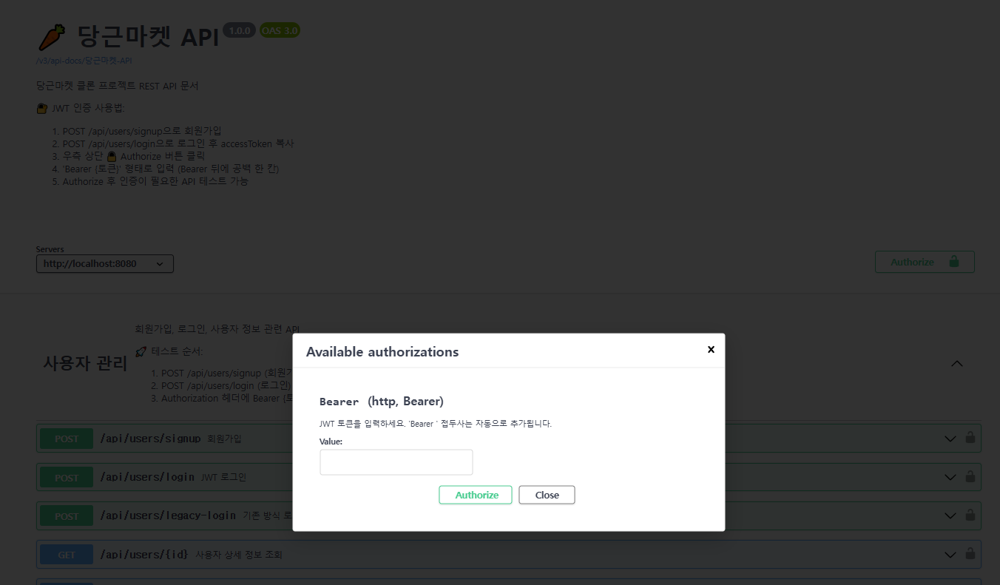

# 1️⃣ JWT 인증(Authentication) 방법에 대해서 알아보기

## JWT (JSON Web Token)
- JSON 포맷을 사용하여 사용자 정보를 안전하게 표현하는 토큰
- 서버와 클라이언트 간 상태를 유지하지 않는 무상태(stateless) 인증 방식에 적합

## JWT 구성

- Header
```java
{
  "alg": "HS256",
  "typ": "JWT"
}
```
- Payload
```java
{
  "sub": "user123",
  "roles": ["ROLE_USER"],
  "iat": 1620000000,
  "exp": 1620003600
}
```
- Signature
    -   HMACSHA256(Base64UrlEncode(header) + "." + Base64UrlEncode(payload), secretKey)

## 엑세스 토큰 (Access Token)
- 정의 및 역할 : API 요청 시 본인 인증용으로 사용되는 짧은 수명 토큰
- 만료 시간 : 일반적으로 수 분에서 수 시간 단위로 짧게 설정
- 전송 방식 : HTTP Header

## 리프레시 토큰 (Refresh Token)
- 정의 및 역할 : 엑세스 토큰 만료시 새로운 엑세스 토큰을 발급받기 위해 사용
- 만료 시간 : 엑세스 토큰보다 긴 시간
- 저장 위치 : 서버 DB 또는 Redis에 저장하여 서버에서 토큰 유효성 관리
- 재발급 흐름 : 클라이언트가 리프레시 토큰을 전송하면 서버에서 검증 후 새 액세스 토큰 발급

# 세션, 쿠키, OAuth 방식 조사해보기

## 세션 기반 인증
- 설명 : 로그인 시 서버에 세션 정보를 저장하고, 클라이언트는 세션 ID를 쿠키에 저장하여 서버와 통신
- 장점 : 
  - 서버가 모든 세션 상태를 관리하므로 보안상 통제 용이
  - 만료 처리, 로그아웃 처리 용이

## 쿠키 기반 인증
- 설명 : 인증 정보를 쿠키에 저장하고 매 요청마다 자동으로 서버에 전송됨
- 장점 : 
  - HTTP 표준에 맞춰 자동 전송되어 편리 
  - XSS, CSRF 방지 설정 가능
- 단점 : 
  - 쿠키 탈취 시 위험
  - 클라이언트의 저장소에 의존

## OAuth 2.0
- 설명 : 제 3자 애플리케이션이 리소스 소유자를 대신하여 리소스에 접근할 수 있도록 허용하는 인증 프레임워크
- 주요 구성요소 : Resource Owner, Client, Authorization Server, Resource Server
- 장점 :
  - 제 3자 서비스 인증 가능 (Google, Kakao, Naver, Github 등)
  - 토큰 기반 인증 확장성 높음
- 단점 :
  - 구현 복잡도 높음
  - 잘못 구성하면 보안에 취약해질 수 있음

# ✏️한줄 요약
- JWT : 서버 상태를 저장하지 않고, 서명된 토큰으로 인증을 처리하는 무상태 인증 방식
- Access Token : 사용자가 인증되었음을 증명하며, API 요청 시 사용되는 짧은 수명의 토큰
- Refresh Token : Access Token이 만료되었을 때 새로운 토큰을 발급받기 위해 사용하는 긴 수명의 토큰
- 세션 : 로그인 정보를 서버가 관리하고, 클라이언트는 세션 ID만 쿠키로 전달하는 상태 기반 인증
- 쿠키 : 인증 정보를 클라이언트의 쿠키에 저장하여 매 요청마다 자동 전송하는 방식
- OAuth 2.0 : 제3자 애플리케이션이 사용자 대신 자원에 접근할 수 있도록 권한을 위임하는 인증 프레임워크

# ❓Redis가 뭘까?

Redis는 메모리 기반의 초고속 데이터 저장소로, 주로 캐시, 세션, 토큰, 랭킹 처리 등에 사용되는 NoSQL 데이터베이스

## Redis는 주로 무엇에 사용하나?
- Refresh Token 저장 : 클라이언트가 보낸 Refresh Token을 서버가 직접 검증 가능
- Access Token 블랙리스트 관리 : 로그아웃한 토큰, 탈취된 토큰을 Redis에 블랙리스트로 등록해서 무효 처리
- 세션 저장소 : 로그인 유지 세션을 Redis에 저장해서 서버간 공유 가능
- 일시적 데이터 캐싱 : 자주 조회되는 데이터를 메모리 캐시로 저장

## ❓왜 JWT 인증에서 Redis를 많이 쓸까?
- Refresh Token을 Redis에 저장하면
  - 탈취 방지 가능 ( 서버에서 유효성 판단 )
  - 빠른 만료 처리 가능 (TTL 설정)
  - 사용자 로그아웃 시 토큰 즉시 삭제 가능
- AccessToken 블랙리스트도 Redis에 등록해서 무효화 체크 가능

### RDB는 도서관 이라면 Redis는 작은 수첩

## Redis를 사용할때 장점과 사용하지 않을 때의 단점
- 장점 :
  - 초고속 성능 : 메모리 기반이라 읽기/쓰기 속도가 매우 빠름
  - TTL 설정 : 토큰 만료 시간을 Redis에서 직접 관리 가능
  - 실시간 제어 : 로그아웃시 Refresh Token 즉시 삭제 가능
  - 마이크로서비스 확장 : 서버간 세션/토큰 공유 용이
  - 데이터 구조 다양 : List, Hash, Set 등 여러 구조를 지원해서 활용도 노음
- 사용하지 않을 때 단점 : 
  - Refresh Token 검증 불가 : 클라이언트가 보낸 Refresh Token을 서버가 검증할 방법이 없다.
  - 토큰 강제 만료 어려움 : 로그아웃 해도 Refresh Token이 계속 유효 -> 사용자 제어 어려움
  - 블랙리스트 불가 : Access Token이 탈취되어도 서버가 막을 방법이 없음
  - 마이크로서비스 확장어려움 : 서버마다 세션/토큰 상태 관리 어려움

# ❓NoSQL이란?

- NoSQL(Not Only SSQL)은 전통적인 RDBMS와 달리 정해진 스키마 없이 유연하게 데이터를 저장하는 데이터베이스

## NoSQL 특징
- 스키마 없음 : 미리 테이블 구조를 정의할 필요 없음
- 수평 확장 용이 : 데이터 양이 많아질수록 서버를 여러 대로 쉽게 나눌 수 있음
- 다양한 유형 : key-value(Redis), Document (MongoDb), Column(Cassandra), Graph (Neo4j)
- JOIN 없음 : 관계보다는 빠른 접근성과 유연한 저장을 중시

# JWT를 적용해보자!

## JWT 기본 흐름

1. 회원가입
2. 로그인 : Access + Refresh 토큰 발급
3. 인증된 요청 : Access 토큰 포함
4. Access 토큰 만료 시 : Refresh 토큰으로 재발급 요청
5. 로그아웃 시 : Refresh 토큰 제거, Access 블랙리스트 등록

## 필요한 작업 정리
1. 의존성 추가 
```groovy
// build.gradle
implementation 'io.jsonwebtoken:jjwt-api:0.11.5'
runtimeOnly 'io.jsonwebtoken:jjwt-impl:0.11.5'
runtimeOnly 'io.jsonwebtoken:jjwt-jackson:0.11.5'
```

2. JWT 유틸 클래스 생성
- JWT 생성, 파싱, 검증 로직 포함
- JwtUtil 로 이름 설정
```java
public class JwtUtil {
    public String createAccessToken(...) { ... }
    public String createRefreshToken(...) { ... }
    public Claims parseToken(String token) { ... }
    public boolean isExpired(String token) { ... }
}
```

3. 로그인/회원가입 API 구현
- 로그인 시 : 
  - Access Token, Refresh Token 발급
  - Access Token은 클라이언트에 반환
  - Refresh Token 은 Redis 또는 DB에 저장

4. Redis 연동 (선택사항)
- Refresh Token 관리 및 로그아웃 처리 등을 위해 사용
- 의존성 추가, 설정 파일 작성

5. 인증 필터 작성
- OncePerRequestFilter를 상속하여 JWT 검증 필터 구현
- 유효한 Access Token 이면 SecurityContext에 인증 정보 설정
```java
public class JwtAuthenticationFilter extends OncePerRequestFilter {
    protected void doFilterInternal(...) {
        // 토큰 파싱 → 인증 성공 시 SecurityContextHolder 설정
    }
}
```

6. Srping Security 설정
- 위에서 만든 필터를 Spring Security에 등록
```java
http.addFilterBefore(jwtAuthenticationFilter, UsernamePasswordAuthenticationFilter.class);
```

7. Access Token 재발급 API 구현
- 클라이언트가 Refresh Token을 보내면
  - 서버는 Redis에서 확인 후 
  - 새로운 Access Toekn을 발급해 반환

8. 로그아웃 API 구현
- Refresh Toekn 삭제
- Access Token을 Redis에 블랙리스트로 등록해 무효 처리

## 역할별 클래스 정리
| 계층           | 클래스 이름                              | 역할                          |
| ------------ | ----------------------------------- | --------------------------- |
| `security`   | `JwtAuthenticationFilter`           | 요청 필터링 시 JWT 검증             |
| `security`   | `JwtTokenProvider`                  | JWT 생성, 검증 유틸               |
| `controller` | `AuthController`                    | 로그인, 회원가입, 토큰 재발급, 로그아웃 API |
| `service`    | `AuthService`                       | 비즈니스 로직 처리                  |
| `repository` | `RefreshTokenRepository` (optional) | Redis 또는 DB 저장소             |
| `config`     | `SecurityConfig`                    | Spring Security 설정          |


# 🚗해보자 해보자

1. JWT 의존성 추가하기
2. JWTUtil 만들기
3. JwtAuthenticationFilter 만듥; (JWT 인증 필터)
4. userDetailsService 구현체 만들기
5. SecurityConfig 만들기
6. 필수 JWT DTO 만들기
7. UserService와 UserServiceImpl JWT 방식으로 업그레이드
8. BCrypt 적용을 위해 회원가입 리팩토링
9. UserController 만들기
10. application.yml에 JWT 설정 추가하기
11. SecurityConfig에서 로그인관련 요청권한 업데이트 하기
12. JWT토큰을 Swagger에서 입력할 수 있도록 SwaggerConfig 업데이트
13. SecurityUtil 만들기
14. GlobalExceptionHandler에 접근 권한 예외 처리 추가
15. TokenProvider라는걸 이제야 발견!! 공부해보고 구현해보자 아래에서 다시 이야기 하겠다.

## ❓ BCrypt 가 뭔데?

- Blowfish 암호 알고리즘을 기반으로 만들어진 비밀번호 해싱 함수
- Salt(랜덤 값)를 자동으로 생성·조합하고, 반복(round) 횟수를 조절할 수 있어 점점 더 느리게(→ 더 안전하게) 연산
- 해시 결과 문자열에 사용된 salt와 cost(work factor)가 함께 인코딩되어 저장됨

## ❓ Blowfish 가 뭐지?

- 1993년, 암호학자 Bruce Schneier가 개발한 대칭키 블록 암호화 알고리즘
- 대칭키: 암호화/복호화에 같은 키를 사용하는 방식
- 블록 암호: 고정된 크기(예: 64비트)의 데이터를 블록 단위로 암호화함
- 빠르고 유연하고 무료,공개 알고리즘 이지만 옛날 알고리즘이라 AES보다는 덜 추천

## 로그인 및 회원가입 Swagger 페이지


## 회원가입 성공!


## Bcrypt 로 비밀번호 해싱


## 로그인 성공!


## 12번에서 Swagger 페이지에 Authorize 추가


## 기본적으로 로그인 하지않으면(토큰이 없으면) 403 권한 없음


## 로그인 진행후 사용자 정보 조회


## JWT 토큰 정보를 이용하여 사용자 정보조회


# TokenProvider
JWTUtil을 만들었었는데 과제 내용을 보니 TokenProvider을 사용하는 방식이었다.
무슨 차이가 있을까?


## JwtUtil: 기본적인 로그인/인증 
- 회원가입/로그인
- 기본 API 인증
- 간단하고 빠름

## TokenProvider: 고급 보안 기능

- 복잡한 권한 관리
- 토큰 갱신 시스템
- 실시간 보안 모니터링
- Spring Security 완전 통합
- 토큰 분석 및 통계

## TokenProvider로 구현하면 좋을 기능들
- 토큰 갱신 API - 가장 실용적
- 관리자 권한 시스템 - 확장성 좋음
- 보안 모니터링 대시보드 - 운영에 유용
- 다중 권한 관리 - 비즈니스 로직에 필요


# TokenProvider 적용해보기

- 토큰 갱신 기능을 추가해보자

1. UserServiceImpl에 TokenProvider 추가하기
2. UserController에 토큰 갱신 추가
3. 필요한 DTO 추가
4. JwtAuthenticationFilter에 TokenProvider지원 추가
5. SecurityConfig에 경로 추가

## 토큰 갱신 과정
1. 로그인시 AccessToken과 RefreshToken 두개 발급
2. Access Token 만료시 /api/users/refresh로 토큰 재발급
3. 새로운 Access Token으로 API 호출

현재는 수동 갱신 방법으로 진행중이다. 이후 Redis를 이용하여 자동갱신까지 진행해 보자

