# 6주차 미션
## 배포를 해보자

## 배포가 뭐니??
- 개발 환경(내 PC)에서 잘 돌아가는 애플리케이션을 운영 환경(클라우드 서버)으로 옮겨 실제 사용자에게 서비스 가능하도록 만드는 모든 과정

1. 빌드 : 소스 -> 실행파일(또는 컨테이너 이미지)로 패키징
2. 릴리스(Release) : 산출물을 버전,태그로 관리 (ex: v1.0.2, Docker 이미지 SHA)
3. 프로비저닝(Provisioning) : 인프라-네트워크 생성 (ECR,ECS,App Runner 등)
4. 배치(Deploy) : 산출물을 대상 환경에 배치하고 롤아웃
5. 운영(Operate) : 모니터링, 오토스케일링, 롤백 등

## 흐름을 알아보자
1. 로컬에서 Docker 이미지 만들기 : Dockerfile 작성
```
docker build -t myapp:latest -
```
2. AWS ECR(Elastic Container Registry) 설정
- ECR 저장소 생성
```
aws ecr create-repository --repository-name myapp 
```
- ECR 로그인 (권한 필요)
```
aws ecr get-login-password | docker login --username AWS --password-stdin <ECR-URL>
```
- Docker 이미지 태깅 & 푸시
```
docker tag myapp:latest <ECR-URL>:latest
docker push <ECR-URL>:latest
```

3. AWS App Runner로 배포
- AWS 콘솔 -> App Runner -> Create service
  - Source: ECR 선택
  - Runtime: Container image
  - port:8080 (Spring Boot 기본 포트)
- 배포 완료되면 서비스 URL 생성
```
https://xxxxx.apprunner.amazonaws.com
```

4. Postman 또는 브라우저로 API 테스트

### 🔄 전체 과정 한 줄 요약
Docker 이미지 생성 → ECR에 업로드 → App Runner에서 실행 → URL 확인 후 API 테스트

# ❓ 도커에 대해 간단히 정리해보자

## 도커란?
- 내 앱을 통째로 포장해서 어디서든 똑같이 실행되게 해주는 도구

### 도커의 장점
- 환경 일관성 보장
- 배포 자동화에 필수 : 클라우드에서든 대부분 Docker 기반으로 배포
- 경량 실행 : 가상머신보다 가볍고 빠름

### 도커를 왜 써야하는가..?
- Docker는 애플리케이션과 실행 환경을 하나로 묶어 어디서나 동일하게 실행되도록 해주는 컨테이너 기술
- Docker를 통해 만든 이미지는 실행에 필요한 모든 요소가 포함되어 운영체제나 버전에 관계없이 어떤 서버에서도 일관되게 실행
- 이 이미지를 AWS의 ECR에 저장하고 App Runner나 ECS 같은 실행 서비스가 이를 가져와 실행
- AWS는 자동으로 외부에서 접근 가능한 도메인(URL)을 생성

# ❓ 컨테이너와 이미지의 차이가 뭐야?

## 도커 이미지 (Docker Image)
`"컨테이너를 만들기 위한 설치 패키지(템플릿)"`
- 실행 환경 + 애플리케이션 + 설정 + 라이브러리를 정적인 파일로 저장한 것
- 실행되지 않음
- ex) myapp:latest

## 도커 컨테이너 (Docker Container)
`"이미지를 실행시켜 '작동 중인 앱'으로 만든 것"`
- 이미지를 기반으로 실행된 상태
- 메모리 위에서 돌아가는, 실제 작동 중인 애플리케이션
- 여러 개 만들 수 있음 (하나의 이미지 -> 여러 컨테이너)

## 📌 한줄 요약
- 이미지 : 컨테이너의 설계도
- 컨테이너 : 이미지로 만든 실제 실행 인스턴스

# ❓ ECR / ECS / App Runner 이게 뭐야?
## ECR (Elastic Container Registry)
- 역할 : 도커 이미지를 저장하고 배포할 때 끌어오는 컨테이너
- AWS에서 Docker Hub 처럼 쓰는 저장소

## ECS (Elastic Container Service)
- 역할 : 컨테이너 앱을 클러스터 환경에서 운영, 관리 (스케일링, 업데이트 등)
- 사용 방식 : 
  - ECR에 푸쉬된 이미지를 ECS가 가져와서 실행
  - 실행 환경은 두가지 중 선택
    - EC2: 직접 서버를 띄워서 컨테이너 올림
    - Fargate: 서버 없이 컨테이너만 실행하는 서버리스 방식
  - 특징 : 
    - 설정이 복잡하지만 제어 권한 많음 (VPC, ALB, 로그 등)
    - 대규모 시스템에 적합

## App Runner
- 역할 : 가장 쉽게 컨테이너 앱을 배포하고 운영
- 특징 : 
  - ECR에 있는 이미지를 클릭만으로 배포
  - 서버, 오토스케일링, 로드밸런서, HTTPS 등 자동
- 초보자에게 가장 쉬운 AWS 배포 서비스

| 항목                | 필수 여부 | 설명                                         |
| ----------------- |-------| ------------------------------------------ |
| 🐳 **Docker**     | ✅ 필수  | 내 애플리케이션을 컨테이너로 감쌈                         |
| 📦 **ECR**        | ✅ 필수  | 그 컨테이너 이미지를 AWS에 저장                        |
| 🚀 **ECS**        | ⛔ 선택  | 직접 EC2 or Fargate에 올려서 컨테이너 실행 (복잡하지만 유연함) |
| 🪄 **App Runner** | ⛔ 선택  | 이미지만 있으면 바로 배포되는 자동화된 실행 서비스 (쉽고 빠름)       |


# ✅ AWS 배포 개념 요약
- 배포는 개발한 앱을 사용자들이 접근할 수 있는 환경에 실행하고 URL을 제공하는 과정이다.
- Docker는 앱과 실행 환경을 하나로 묶어 어디서든 동일하게 실행되도록 해주는 도구다.
- ECR은 이 Docker 이미지를 AWS에 저장하는 컨테이너 이미지 창고다.
- App Runner나 ECS는 ECR의 이미지를 꺼내 컨테이너를 실행하고, 외부에서 접근 가능한 도메인(URL) 을 자동으로 제공해준다.
- Docker + ECR은 기본 구성, App Runner와 ECS는 실행 방식의 선택지다.
  - App Runner: 자동화된 쉬운 배포
  - ECS: 세밀한 제어가 가능한 고급 배포


# 🚀해보자!
### 1. 인텔리제이에 gradle/Tasks/build/bootJar을 클릭
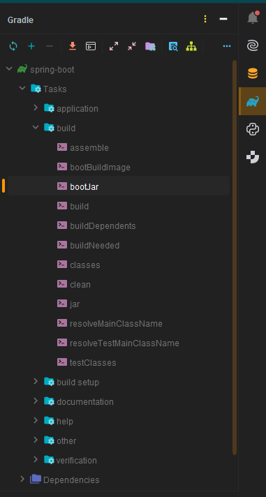

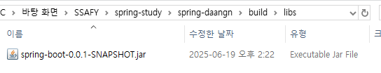

### 2. AWS 회원가입!
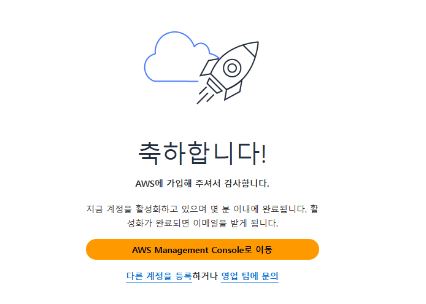

### 3. EC2에 인스턴스 시작하기!
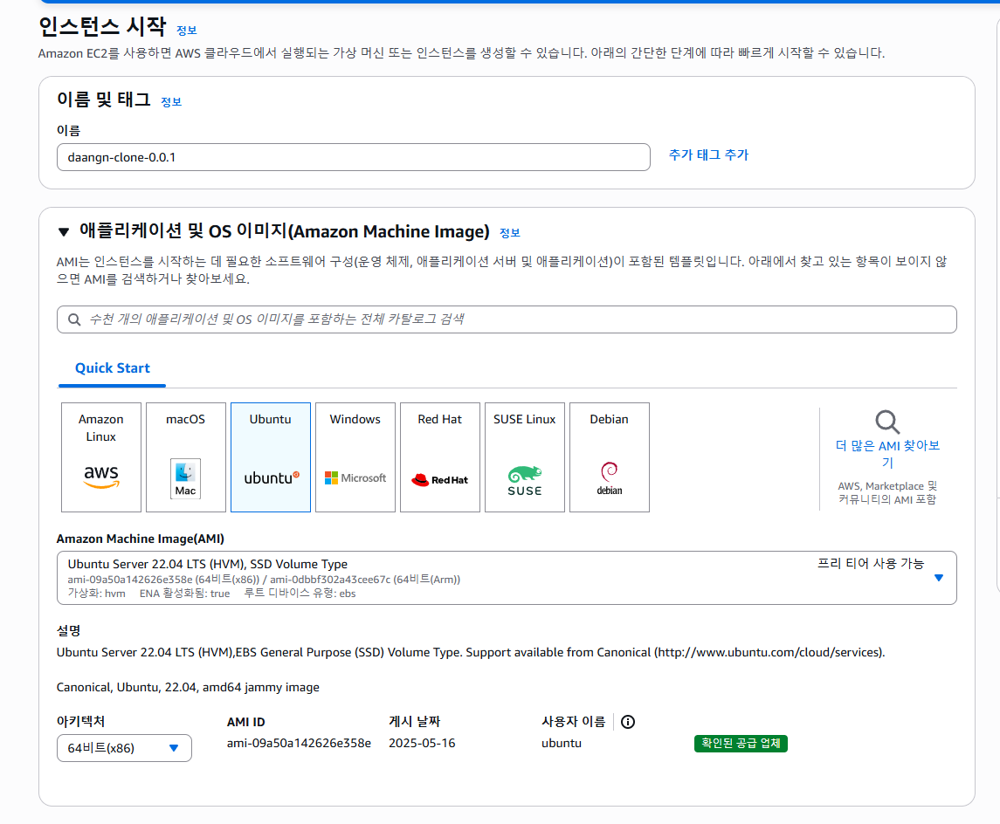
- 이름을 적고 시작해보자
- 일단 우분투로 한다고 한다
- 이미지는 22.04 버전으로 지정

- 키페어 생성하기
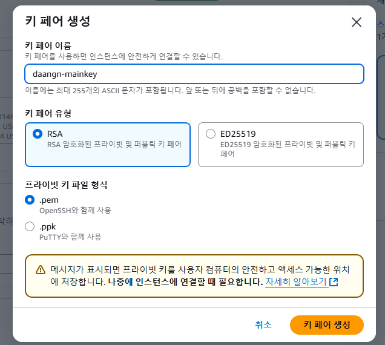
- RSA에 SSH 형식으로 사용

- 해당 키.pem에 chmod 400 권한을 준다
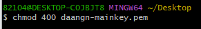
```java
ssh -i "daangn-mainkey.pem" ubuntu@ec2-52-64-23-251.ap-southeast-2.compute.amazonaws.com
```
- 해당 명령어를 입력하여 실행하고 처음 실햄하면 yes 입력해주기
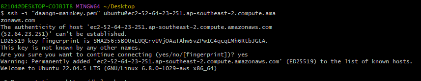
- 자바 깔려있는지 java -version 으로 확인
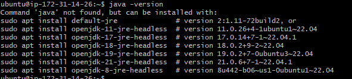
- 없으면 아래 apt 라는걸 이용해서 설치할껀데 그럴라면 apt 업데이트 진행해야함
```java
sudo apt update
```
- 설치
```java
sudo apt install openjdk-17-jre-headless
```

### 스냅샷.jar 올리기
- bash를 다시 열고
- 해당 파일 위치로 이동하고
- mainkey.pem에 400 권한을 다시 주고
```java
scp -i daangn-mainkey.pem ~/Desktop/spring-boot-0.0.1-SNAPSHOT.jar ubuntu@ec2-52-64-23-251.ap-southeast-2.compute.amazonaws.com:~/
```
- 해당 명령어를 이용해 내 컴퓨터에있는 jar 파일을 AWS로 올린다.
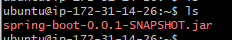
- 잘 전달이 되었다!!
- 실행을 해보자
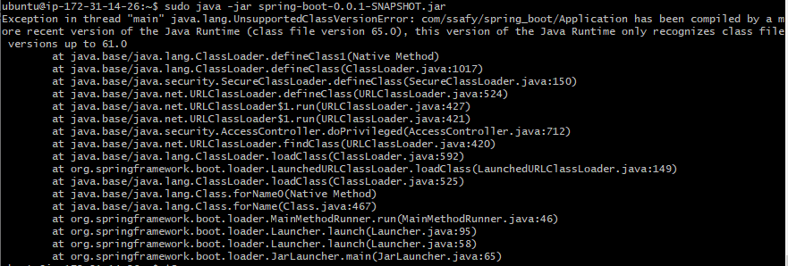
- 🔥🔥🔥 무지성으로 따라했더니 버전이 안맞는다
```java
sudo apt install openjdk-21-jre-headless 
```
- 21 버전으로 다시 깔자
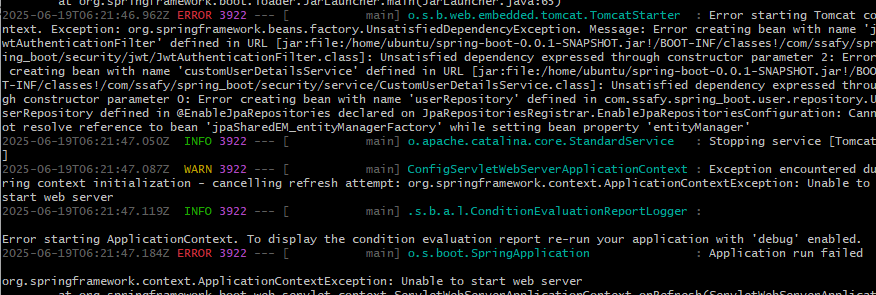
- 에러빵빵..
- .env 파일 문제이거나 DB접속 설정이 안되어서 JPA가 작동을 안했다고 한다.
- 해결해보자
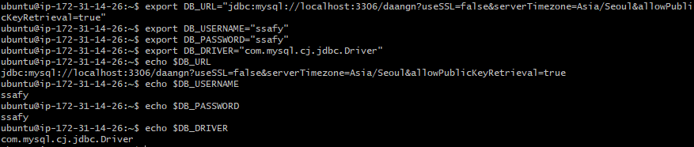
- 환경변수를 직접 export 하는 방식을 사용해 보았다
- echo 를 통해 잘 들어가있는걸 확인할 수 있었다.
- 근데 또안된다
```java
DB_URL="jdbc:mysql://localhost:3306/daangn?useSSL=false&serverTimezone=Asia/Seoul&allowPublicKeyRetrieval=true" \
DB_USERNAME="ssafy" \
DB_PASSWORD="ssafy" \
DB_DRIVER="com.mysql.cj.jdbc.Driver" \
java -jar spring-boot-0.0.1-SNAPSHOT.jar
```
- 이런식으로 실행할때 값을 넣어주는 방식이 있다해서 실행해보았다.
- JPA는 실행이 되었는데 AWS 환경에 DB가 없어서 그런거였다 
- MySQL도 따로 설치를 해야한다니..

## 와!! 이래서 Docker 쓰는거구나?
- 다 때려치고 도커로 이미지 만들어서 올려봐야겠다

# Docker 탐험기
- 먼저 프로젝트 루트 디렉토리에 Dockerfile을 만들어야한다고 한다

## ❓ Dockerfile 이 뭔데?
- Dockerfile은 이 프로젝트를 어떻게 실행 가능한 컨테이너 이미지로 만들지 정해 놓은 설정서


### Dockerfile 만들기
```dockerfile
# 1. Java 21 기반 이미지 사용
FROM openjdk:21-jdk-slim

# 2. 컨테이너 내 작업 디렉토리
WORKDIR /app

# 3. 빌드된 JAR 복사
COPY build/libs/spring-boot-0.0.1-SNAPSHOT.jar app.jar

# 4. (선택) 기본 환경 변수 설정 - 보통 Compose에서 함
ENV DB_URL=jdbc:mysql://localhost:3306/daangn?useSSL=false&serverTimezone=Asia/Seoul&allowPublicKeyRetrieval=true
ENV DB_USERNAME=ssafy
ENV DB_PASSWORD=ssafy
ENV DB_DRIVER=com.mysql.cj.jdbc.Driver

# 5. 실행
ENTRYPOINT ["java", "-jar", "app.jar"]

```
- 이제 이거걸 build/libs/ 에 snapshot 이랑 같은 위치로 이동시키는게 좋다고 한다
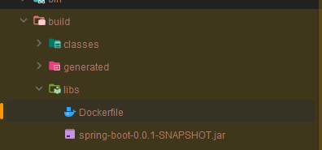
- 파일을 이동시키고
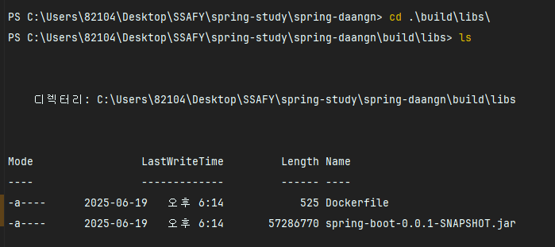
- 해당 위치로 이동해서
```dockerfile
 docker build -t spring-boot-app .
```
- 도커이미지 이름을 spring-boot-app으로 지정하고
- . : 현재 디렉토리의 Dockerfile을 기준으로 build 하겠다는 의미이다.
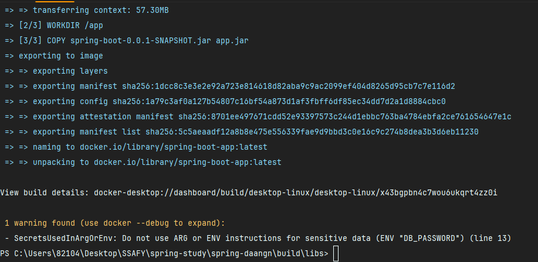


- Docker 이미지 빌드를 성공했다.
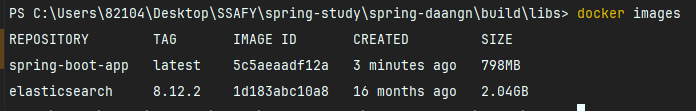


- .env 도 같은 위치에있어야 돌아간다하므로 복사해서 넣어주었다
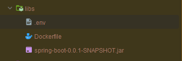

### 도커 컨테이너 실행하기

```dockerfile
 docker run -d -p 8080:8080 --name spring-app --env-file .env spring-boot-app
```
- docker run : 새로운 컨테이너를 생성해서 실행
- -d : detached 모드, 백그라운드에서 실행되도록 함
- -p 8080:8080 : 포트 포워딩 설정, 외부(호스트) 8080 -> 컨테이너 내부 8080포트로 연결
- --name spring-app : 실행할 컨테이너 이름지정
- --env-file .env : .env 파일 환경변수들을 컨테이너에 주입
- spring-boot-app : 사용할 이미지 이름 (빌드했던 도커 이미지)

### 어라 근데 안켜진다
```
docker ps
```
실행했을때 아무것도 안뜬다
```dockerfile
docker ps -a
```
로 지금까지 실행되었던걸 확인하고
```dockerfile
docker logs spring-app     
```
로 어떤 이유로 꺼졌는지 로그를 확인한다

1. .env 파일에 DB_URL
```dockerfile
DB_URL=jdbc:mysql://host.docker.internal:3306/daangn?useSSL=false&serverTimezone=Asia/Seoul&allowPublicKeyRetrieval=true
```
localhost -> host.docker.internal 으로 바꿔야 도커 컨테이너가 호스트 머신의 MySQL에 접근이 가능하다고 한다

2. 컨테이너 삭제
```dockerfile
docker rm spring-app
```

3. 다시 실행
```dockerfile
docker run -d -p 8080:8080 --name spring-app --env-file .env spring-boot-app
```

### 와우와우~
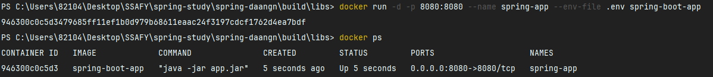
- 내가 실행을 안시키고있는데 접속이된다..


# Docker-compose
- 이제는 spring +MySQL 동시에 배포하려한다, Docker-compose 에 대해 공부해보자

## Docker Compose 란?
- 여러 개의 Docker 컨테이너를 한 번에 정의하고 실행할 수 있게 도와주는 도구

### Docker Compose 권장 폴더 구조
```dockerfile
spring-daangn/
├── build/
│   └── libs/
│       └── spring-boot-0.0.1-SNAPSHOT.jar
├── Dockerfile
├── docker-compose.yml
├── .env
└── (기타 프로젝트 소스들)
```
- 루트 디렉토리로 위치를 다시 옮기자

```
// DB_URL=jdbc:mysql://localhost:3306/daangn?useSSL=false&serverTimezone=Asia/Seoul&allowPublicKeyRetrieval=true
DB_URL=jdbc:mysql://mysql:3306/daangn?useSSL=false&serverTimezone=Asia/Seoul&allowPublicKeyRetrieval=true
```
DB_URL을 이번엔 localhost에서 mysql로 바꾸었다.

## docker-compose.yml 구성
```yaml
version: '3.8'

services:
  mysql:
    image: mysql:8.0
    container_name: mysql
    restart: always
    ports:
      - "3306:3306"
    environment:
      MYSQL_ROOT_PASSWORD: root
      MYSQL_DATABASE: daangn
      MYSQL_USER: ssafy
      MYSQL_PASSWORD: ssafy
    volumes:
      - mysql-data:/var/lib/mysql

  spring-app:
    build:
      context: .
      dockerfile: Dockerfile
    container_name: spring-app
    ports:
      - "8080:8080"
    env_file:
      - .env
    depends_on:
      - mysql

volumes:
  mysql-data:
```
- version : Compose 파일 버전을 지정
- services : 컨테이너로 실행 할 서비스들 (mysql, spring-app)
- mysql
  - image: mysql:8.0 공식 MySQL 8.0 이미지 사용
  - container_name : 컨테이너 이름을 mysql로 지정
  - restart: always : 컨테이너가 꺼져도 자동 재시작
  - environment : DB 초기 설정값 
  - volumes : DB 데이터를 컨테이너 바깥(local)에 저장
- spring-app
  - build : 이 Spring Boot 앱을 직접 Dockerfile로 이미지 빌드
    - context : . 현재 디렉토리를 기준으로 빌드
    - dockerfile : 사용할 Dockerfile 이름
  - env-file : .env 파일을 읽어서 Spring 애플리케이션에 환경변수 주입
  - depends_on : mysql이 먼저 실행된 후 Spring 앱이 실행되도록 함

## 드디어 docker-compose 실행!!
```bash
docker-compose up --build
```
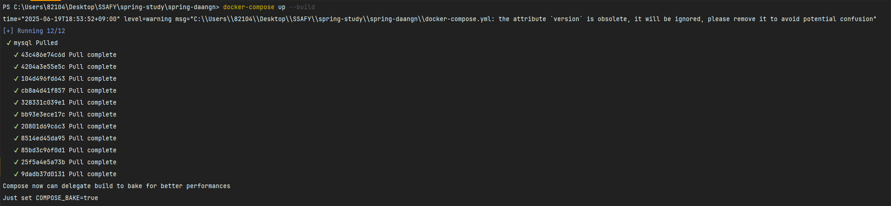

- 막 뭔가 잘돌아간다
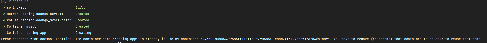
- 에러발생!!
- spring-app 이라는 이름의 컨테이너가 Docker에 잉미있어서 컨테이너를 못만든다고 한다!!
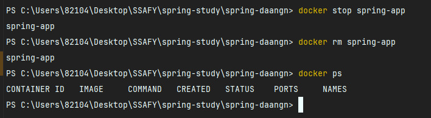
컨테이너 중지하고, 삭제!

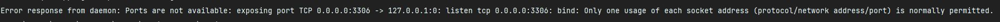
3306 포트번호 사용중! : 당연히 내컴퓨터에서 mysql 3306으로 사용중이잖아..
```dockerfile
    ports:
      - "3307:3306"
```
- docker-compose.yml에서 포트번호 변경
### 와우와우~
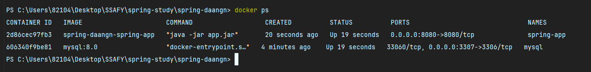
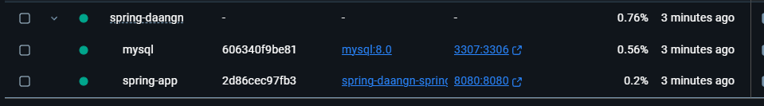

## 전에 만들어뒀던 인스턴스가 사라졌다 이유는 모르겠다
- 그래서 다시 인스턴스 만들고 
- git bash 에서
```dockerfile
ssh -i "mainkey.pem" ubuntu@ec2-13-209-76-96.ap-northeast-2.compute.amazonaws.com
sudo apt update
sudo apt install -y docker.io docker-compose
```
- 해당 컴퓨터로 접속해서~, docker-compose 설치!

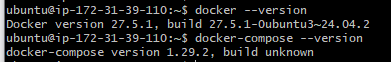
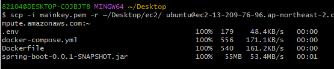

- 파일들 옮기고~

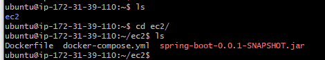

확인!!, .env 파일이 안보인다면
```dockerfile
ls -al
```
로 확인하기

```dockerfile
sudo docker-compose up --build
```
- 실행!!
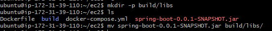
- dockerfile 에서는 .jar 파일경로가 build/libs/에있는거로 되어있어서 해당파일만들어서 넣어줌

## 맛탱이가 갔다.. 아무것도 안눌리고 접속도안된다
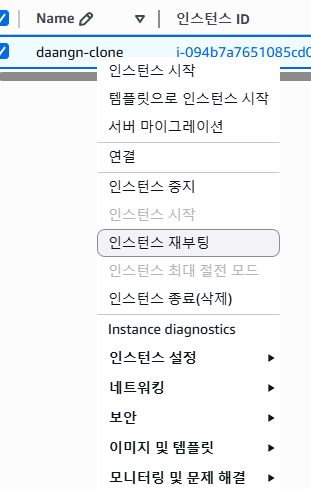
- 인스턴스 재부팅!!!
- 인스턴스 껏다키면 IP가 바뀔수 있으니 주의하기, 한대 맞았다
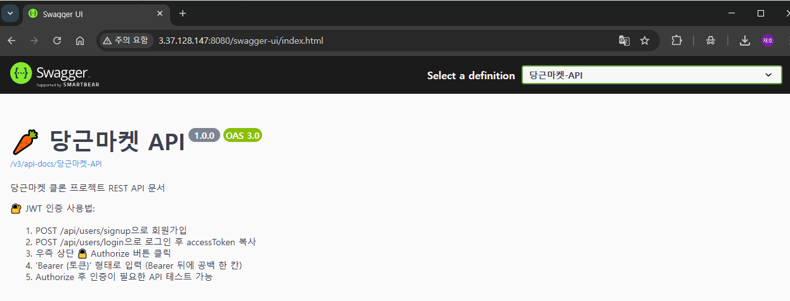
- 와우..
## 우여곡절에 서버를 열긴 했지만..

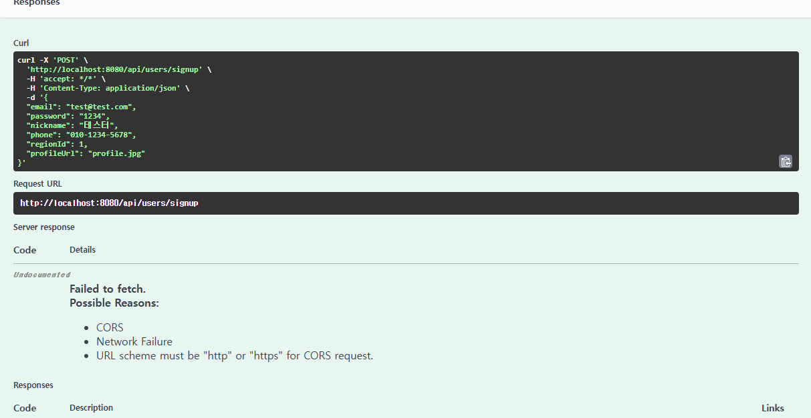
- swagger에서 쏘는 주소랑 CORS 가 문제생김

# Elastic IP
- Elastic IP는 고정(Public) IPv4 주소로, AWS가 제공하는 공인 IP 주소를 EC2 인스턴스에 고정해서 사용

## 왜 필요한가
- EC2 인스턴스 시작 : public IP 자동 할당(랜덤) -> 매번 IP가 바뀜
- Swagger 연동시 주소 바뀌면 Swagger 연동 깨짐
- Elastic IP 사용시 public IP 고정, 항상 같은 IP로 접속 가능

## 당장 해보자

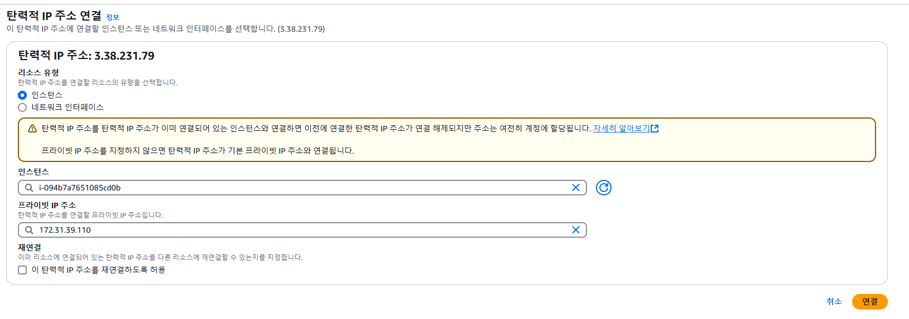
```dockerfile
ssh -i mainkey.pem ubuntu@3.38.231.79
```
- 접속도 편해졌다

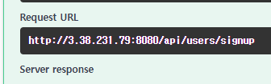
- 
- URL 이 날라간다.. 

# ✅ 6주차 배포 미션 요약


## 1. Spring Boot JAR 빌드
```bash
./gradlew bootJar
```
- `build/libs/spring-boot-0.0.1-SNAPSHOT.jar` 생성

---

## 2. Docker 이미지 만들기
```Dockerfile
# Dockerfile
FROM openjdk:21-jdk-slim
WORKDIR /app
COPY build/libs/spring-boot-0.0.1-SNAPSHOT.jar app.jar
ENV DB_URL=...
ENV DB_USERNAME=...
ENV DB_PASSWORD=...
ENTRYPOINT ["java", "-jar", "app.jar"]
```
```bash
docker build -t spring-boot-app .
```

---

## 3. Docker Compose 구성
```yaml
# docker-compose.yml
version: '3.8'

services:
  mysql:
    image: mysql:8.0
    container_name: mysql
    ports:
      - "3307:3306"
    environment:
      MYSQL_DATABASE: daangn
      MYSQL_USER: ssafy
      MYSQL_PASSWORD: ssafy
    volumes:
      - mysql-data:/var/lib/mysql

  spring-app:
    build:
      context: .
    container_name: spring-app
    ports:
      - "8080:8080"
    env_file:
      - .env
    depends_on:
      - mysql

volumes:
  mysql-data:
```
```env
# .env
DB_URL=jdbc:mysql://mysql:3306/daangn?...
DB_USERNAME=ssafy
DB_PASSWORD=ssafy
```

---

## 4. AWS EC2 서버 준비
- Ubuntu 인스턴스 생성
- 포트 **8080, 3306/3307** 인바운드 오픈
- Docker & Docker Compose 설치
```bash
sudo apt update
sudo apt install -y docker.io docker-compose
```

---

## 5. Elastic IP 할당
- EC2는 재부팅 시 IP가 바뀌므로 **고정 공인 IP (Elastic IP)** 할당 필요
- AWS 콘솔 → EC2 → Elastic IP → 생성 후 EC2 인스턴스에 연결
- 이후 고정된 IP를 기반으로 Swagger, API 테스트 가능

---

## 6. 파일 업로드 & 배포
```bash
scp -i mainkey.pem ... ubuntu@<Elastic-IP>:~/
ssh -i mainkey.pem ubuntu@<Elastic-IP>
sudo docker-compose up --build
```

---

## ✅ 한 줄 요약
> **Spring Boot 앱을 Docker로 컨테이너화하여 EC2에 배포하고, MySQL과 함께 Docker Compose로 실행 완료!**

